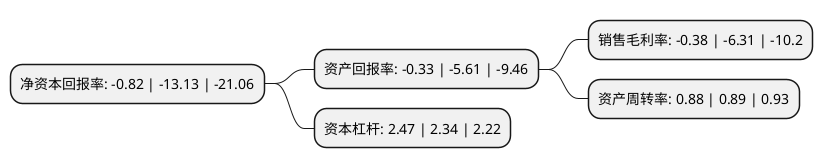

> 本页面由自动化程序生成于 2022年5月20日 01:14
> 内容可能存在错误，如有bug请提交issue至：https://github.com/Eroleice/doc-pi/issues
{.is-warning}

# 上市公司基本情况

## 基本资料

湛江国联水产开发股份有限公司（以下简称“国联水产”）成立于2001年03月08日，湛江市。于2010年07月08日在深交所创业板上市。

国联水产注册资本91,229.232万元，本公司现已构筑了集种苗，饲料，养殖，加工及销售为一体的完整产业链，主要产品包括对虾和罗非鱼种苗，水产饲料，初加工产品及深加工食品等。以下是详细信息：

- 公司名称: 湛江国联水产开发股份有限公司
- 股票代码: 300094.SZ
- 所在地: 广东 - 湛江市
- 成立日期: 2001年03月08日
- 注册资本: 91,229.232万元
- 法定代表人: 李忠
- 主营业务: 本公司现已构筑了集种苗，饲料，养殖，加工及销售为一体的完整产业链，主要产品包括对虾和罗非鱼种苗，水产饲料，初加工产品及深加工食品等
- 公司官网: www.guolian.cn
- 公司介绍: 公司创建于2001年，公司以“为人类提供健康海洋食品”为使命，专注于水产行业，现已发展成为集育苗、工厂化养殖、饲料、海洋食品加工、国内国际贸易、水产科研为一体的全产业链跨国集团企业。集团旗下的对虾工厂化养殖开创了从育苗到餐桌全程可控的全封闭式养殖模式先河；位于美国加州的全资子公司S.S.C.INC，在美国水产行业中位列前茅；国联水产、国美水产的对虾、罗非鱼等系列产品远销海内外，产品遍及全球40多个国家和地区。其中对虾出口额位居国内同行业的首位，拥有GUOLIAN、龙霸、国美、O’GOOD、O’FRESH、I’COOK、Talassa、珍渔坊、二十秒记忆等适应不同渠道和消费需求的自主品牌。公司率先在水产行业推行“2211”电子化监管模式，对虾和罗非鱼拥有BAP四星认证。先后被认定为农业产业化国家重点龙头企业、高新技术企业、海关总署“AA类企业”等。

## 股东及高管情况

上市公司第一大股东为新余国通投资管理有限公司，持股157,901,642股，占比17.31%，**疑似为**上市公司实际控制人。

截至2022年03月31日，上市公司的前十大股东中，共有5名自然人股东，3名机构股东，1个产品账户，1个海外主体，其中5%以上大股东共有2名。上市公司前十大股东明细如下：

> 未能通过持股比例判定出上市公司实际控制人（持股30%以上）
> 可能存在通过间接持股、联合持股、协议控制等方式拥有实际控制权的主体，具体请参考上市公司定期公告！
{.is-warning}

> 截至2022年03月31日，上市公司前十大股东信息如下：

| 股东名称 | 持股数量（股） | 持股比例 |
| --- | --- | --- |
| 新余国通投资管理有限公司 | 157,901,642 | 17.31% |
| 冠联国际投资有限公司 | 77,729,550 | 8.52% |
| 广东省农业供给侧结构性改革基金管理有限公司-广东省农业供给侧结构性改革基金合伙企业(有限合伙) | 33,026,270 | 3.62% |
| 李忠 | 17,938,605 | 1.97% |
| 李国通 | 11,748,000 | 1.29% |
| 陈汉 | 11,748,000 | 1.29% |
| 李经实 | 5,900,000 | 0.65% |
| 中国华融资产管理股份有限公司 | 5,343,975 | 0.59% |
| UBS AG | 4,396,086 | 0.48% |
| 刘强 | 2,804,100 | 0.31% |

## 利润表分析

上市公司2021年总收入为44.74亿元，净利润为-0.17亿元，**未实现盈利**。

## 杜邦分析

> 数据列示周期：2021年 | 2020年 | 2019年
{.is-info}

上市公司的净资产收益率在近一年有所下降，下降幅度为-93.75%，其变化情况分解如下：
- 上市公司的销售毛利率在近一年下降了-93.98%，可能是生产效率的下降、商品原材料价格上涨或商品价格的下跌所致。
- 上市公司的资产周转率在近一年下降了-1.12%，可能是源自于更慢的销售回款或库存管理效果下降。
- 上市公司的财务杠杆比率在近一年上升了5.56%，可能是增加负债扩大生产规模。

