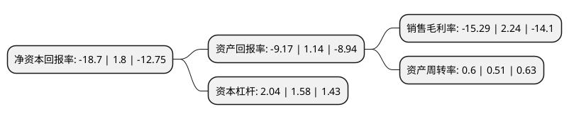

> 本页面由自动化程序生成于 2022年5月20日 01:25
> 内容可能存在错误，如有bug请提交issue至：https://github.com/Eroleice/doc-pi/issues
{.is-warning}

# 上市公司基本情况

## 基本资料

大湖水殖股份有限公司（以下简称“大湖股份”）成立于1999年01月18日，常德市。于2000年06月12日在上交所主板上市。

大湖股份注册资本48,123.719万元，主要业务:水产品养殖加工销售和中成药生产，医药贸易，白酒类产品营销。以下是详细信息：

- 公司名称: 大湖水殖股份有限公司
- 股票代码: 600257.SH
- 所在地: 湖南 - 常德市
- 成立日期: 1999年01月18日
- 注册资本: 48,123.719万元
- 法定代表人: 罗订坤
- 主营业务: 水产品养殖加工销售和中成药生产，医药贸易，白酒类产品营销
- 公司官网: www.dhszgf.com
- 公司介绍: 公司是全国第一家“水面资本化”模式的上市公司，农业产业化国家重点龙头企业。公司实施“湖面综合开发”和“体育文化产业”双主业发展战略，以水产品“天然放养、品牌营销”为特色，全面开展大湖泊水环境治理、渔光一体化、湖面生态旅游等业务，突出发展体育产业，打造有影响的体育赛事，积极开展产业链金融、酒业、医药贸易、食品加工等增值性业务。是一家利用资本市场优势，提供健康食品、体育文化服务的综合性集团公司。公司积极推行标准化生产和管理，建立并实施了完善的食品安全保证体系，通过ISO9001质量管理体系认证、ISO14001环境管理体系认证，有机产品认证，“大湖”商标为中国驰名商标。

## 股东及高管情况

上市公司第一大股东为西藏泓杉科技发展有限公司，持股104,631,211股，占比21.74%，**疑似为**上市公司实际控制人。

截至2022年03月31日，上市公司的前十大股东中，共有6名自然人股东，1名机构股东，3个产品账户，其中5%以上大股东共有1名。上市公司前十大股东明细如下：

> 未能通过持股比例判定出上市公司实际控制人（持股30%以上）
> 可能存在通过间接持股、联合持股、协议控制等方式拥有实际控制权的主体，具体请参考上市公司定期公告！
{.is-warning}

> 截至2022年03月31日，上市公司前十大股东信息如下：

| 股东名称 | 持股数量（股） | 持股比例 |
| --- | --- | --- |
| 西藏泓杉科技发展有限公司 | 104,631,211 | 21.74% |
| 范远龙 | 13,953,786 | 2.9% |
| 范远龙 | 13,953,762 | 2.9% |
| 招商银行股份有限公司-华安产业精选混合型证券投资基金 | 3,757,000 | 0.78% |
| 王长安 | 3,492,500 | 0.73% |
| 华安基金-上海银行-华安基金-新纪元2号集合资产管理计划 | 2,738,000 | 0.57% |
| 赵广莲 | 2,469,111 | 0.51% |
| 朱世国 | 2,002,928 | 0.42% |
| 华安基金-兴业银行-华安基金-新纪元1号资产管理计划 | 1,862,400 | 0.39% |
| 黄泽坚 | 1,860,000 | 0.39% |

## 杜邦分析

> 数据列示周期：2021年 | 2020年 | 2019年
{.is-info}

上市公司的净资产收益率在近一年有所下降，下降幅度为-1138.89%，其变化情况分解如下：
- 上市公司的销售毛利率在近一年下降了-782.59%，可能是生产效率的下降、商品原材料价格上涨或商品价格的下跌所致。
- 上市公司的资产周转率在近一年上升了17.65%，可能是源自于更快的销售回款或库存管理效果提升。
- 上市公司的财务杠杆比率在近一年上升了29.11%，可能是增加负债扩大生产规模。

