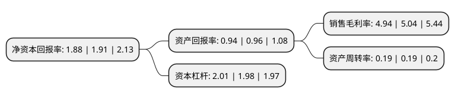

> 本页面由自动化程序生成于 2022年5月20日 01:26
> 内容可能存在错误，如有bug请提交issue至：https://github.com/Eroleice/doc-pi/issues
{.is-warning}

# 上市公司基本情况

## 基本资料

山东好当家海洋发展股份有限公司（以下简称“好当家”）成立于1993年01月07日，威海市。于2004年04月05日在上交所主板上市。

好当家注册资本146,099.43万元，主要产品有海参，牙鲆鱼，鲍鱼，海蛰等各种鲜活海产品和冷冻食品。以下是详细信息：

- 公司名称: 山东好当家海洋发展股份有限公司
- 股票代码: 600467.SH
- 所在地: 山东 - 威海市
- 成立日期: 1993年01月07日
- 注册资本: 146,099.43万元
- 法定代表人: 唐传勤
- 主营业务: 主要产品有海参，牙鲆鱼，鲍鱼，海蛰等各种鲜活海产品和冷冻食品
- 公司官网: www.sdhaodangjia.com
- 公司介绍: 公司主导产品海参、海蜇、鲍鱼、对虾、海带、文蛤、泥蚶等海珍品均属于中高档海产品，产品品质优良，营养价值高。公司形成了育苗、养成一体化，繁育着海参、海蜇、鲍鱼、对虾、海藻、扇贝等苗种，实现了公司养殖业苗种的自给自足，降低了养殖风险和生产成本，提高了整体经济效益。公司被中国水产科学研究院认定为“全国最大海珍品养殖基地”，生产规模和经济效益连续多年居山东省同行业前茅，是实施“海上山东”战略的龙头企业。公司先后获得“中国名牌”、“中国驰名商标”等称号，并成为第十一届全运会海参产品独家供应商和海洋食品供应商。

## 股东及高管情况

上市公司第一大股东为好当家集团有限公司，持股588,025,190股，占比40.25%，为上市公司实际控制人。

截至2022年03月31日，上市公司的前十大股东中，共有6名自然人股东，4名机构股东，其中5%以上大股东共有1名。上市公司前十大股东明细如下：

> 截至2022年03月31日，上市公司前十大股东信息如下：

| 股东名称 | 持股数量（股） | 持股比例 |
| --- | --- | --- |
| 好当家集团有限公司 | 588,025,190 | 40.25% |
| 中国国际金融香港资产管理有限公司-客户资金2 | 10,371,717 | 0.71% |
| 黄题龙 | 5,988,800 | 0.41% |
| 华泰证券股份有限公司 | 5,663,205 | 0.39% |
| 王春华 | 4,320,000 | 0.3% |
| 闫兆彬 | 3,921,100 | 0.27% |
| 石朋钢 | 3,700,000 | 0.25% |
| 华泰金融控股(香港)有限公司-自有资金 | 3,428,675 | 0.23% |
| 王文成 | 3,350,000 | 0.23% |
| 王宝财 | 3,215,400 | 0.22% |

## 利润表分析

上市公司2021年总收入为12.53亿元，净利润为0.61亿元，实现盈利。

## 杜邦分析

> 数据列示周期：2021年 | 2020年 | 2019年
{.is-info}

上市公司的净资产收益率在近一年有所下降，下降幅度为-1.57%，其变化情况分解如下：
- 上市公司的销售毛利率在近一年下降了-1.98%，可能是生产效率的下降、商品原材料价格上涨或商品价格的下跌所致。
- 上市公司的资产周转率在近一年下降了0%，可能是源自于更慢的销售回款或库存管理效果下降。
- 上市公司的财务杠杆比率在近一年上升了1.52%，可能是增加负债扩大生产规模。

