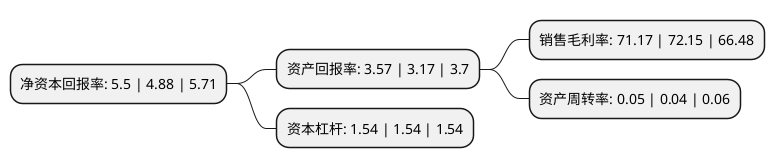

> 本页面由自动化程序生成于 2022年5月20日 01:01
> 内容可能存在错误，如有bug请提交issue至：https://github.com/Eroleice/doc-pi/issues
{.is-warning}

# 上市公司基本情况

## 基本资料

深圳市盐田港股份有限公司（以下简称“盐田港”）成立于1997年07月21日，深圳市。于1997年07月28日在深交所主板上市。

盐田港注册资本224,916.175万元，主要业务:集装箱码头装卸业务，高速公路运输业务，隧道疏港运输业务，仓储，运输业务，商品混凝土生产业务。以下是详细信息：

- 公司名称: 深圳市盐田港股份有限公司
- 股票代码: 000088.SZ
- 所在地: 广东 - 深圳市
- 成立日期: 1997年07月21日
- 注册资本: 224,916.175万元
- 法定代表人: 乔宏伟
- 主营业务: 集装箱码头装卸业务，高速公路运输业务，隧道疏港运输业务，仓储，运输业务，商品混凝土生产业务
- 公司官网: www.yantian-port.com
- 公司介绍: 公司经营范围为码头的开发和经营，货物装卸与运输，港口配套交通设施建设与经营，港口配套仓储及工业设施建设与经营，港口配套生活服务设施的建设与经营，集装箱修理，转口贸易，货物及技术进出口。公司先后荣获“中国25家最受尊敬上市公司”、“中国十佳最重分红回报上市公司”、“德勤中国风险智能榜优秀企业”称号，近6年连续获深交所信息披露优秀表彰。

## 股东及高管情况

上市公司第一大股东为深圳市盐田港集团有限公司，持股1,517,802,000股，占比67.48%，为上市公司实际控制人。

截至2022年03月31日，上市公司的前十大股东中，共有1名机构股东，9个产品账户，其中5%以上大股东共有1名。上市公司前十大股东明细如下：

> 截至2022年03月31日，上市公司前十大股东信息如下：

| 股东名称 | 持股数量（股） | 持股比例 |
| --- | --- | --- |
| 深圳市盐田港集团有限公司 | 1,517,802,000 | 67.48% |
| 银华基金-农业银行-银华中证金融资产管理计划 | 21,371,492 | 0.95% |
| 博时基金-农业银行-博时中证金融资产管理计划 | 21,361,632 | 0.95% |
| 嘉实基金-农业银行-嘉实中证金融资产管理计划 | 21,325,788 | 0.95% |
| 南方基金-农业银行-南方中证金融资产管理计划 | 21,284,028 | 0.95% |
| 易方达基金-农业银行-易方达中证金融资产管理计划 | 21,263,496 | 0.95% |
| 大成基金-农业银行-大成中证金融资产管理计划 | 21,238,788 | 0.94% |
| 中欧基金-农业银行-中欧中证金融资产管理计划 | 21,087,756 | 0.94% |
| 广发基金-农业银行-广发中证金融资产管理计划 | 20,986,836 | 0.93% |
| 工银瑞信基金-农业银行-工银瑞信中证金融资产管理计划 | 18,482,396 | 0.82% |

## 利润表分析

上市公司2021年总收入为6.79亿元，净利润为4.83亿元，实现盈利。

## 杜邦分析

> 数据列示周期：2021年 | 2020年 | 2019年
{.is-info}

上市公司的净资产收益率在近一年有所上升，上升幅度为12.7%，其变化情况分解如下：
- 上市公司的销售毛利率在近一年下降了-1.36%，可能是生产效率的下降、商品原材料价格上涨或商品价格的下跌所致。
- 上市公司的资产周转率在近一年上升了25%，可能是源自于更快的销售回款或库存管理效果提升。
- 上市公司的财务杠杆比率在近一年下降了0%，可能是减少负债降低财务费用。

