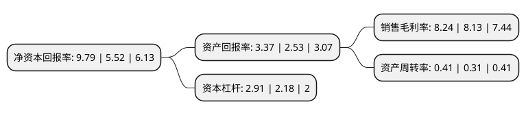

> 本页面由自动化程序生成于 2022年5月20日 01:02
> 内容可能存在错误，如有bug请提交issue至：https://github.com/Eroleice/doc-pi/issues
{.is-warning}

# 上市公司基本情况

## 基本资料

珠海港股份有限公司（以下简称“珠海港”）成立于1986年06月20日，珠海市。于1993年03月26日在深交所主板上市。

珠海港注册资本91,973.49万元，主要业务:港口航运，物流供应链，能源环保，港城建设及航运金融以下是详细信息：

- 公司名称: 珠海港股份有限公司
- 股票代码: 000507.SZ
- 所在地: 广东 - 珠海市
- 成立日期: 1986年06月20日
- 注册资本: 91,973.49万元
- 法定代表人: 冯鑫
- 主营业务: 港口航运，物流供应链，能源环保，港城建设及航运金融
- 公司官网: www.0507.com.cn
- 公司介绍: 公司是落实珠海市委、市政府提出的“以港兴市”发展战略的重要上市企业，是珠海市港口发展和资本运作的重要平台。面对国家深入推进“一带一路”战略、粤港澳大湾区建设、港珠澳大桥即将建成通车、深中通道开工建设、珠江—西江经济带加快发展等重大机遇，公司以“改革创新、转型升级”为主线，全面推进“国际化战略、西江战略、物流中心战略、智慧绿色战略”四大战略，公司着力培育港口航运、物流供应链、能源环保、港城建设、航运金融等业务板块，做大主业规模、不断提升企业自主创新能力与可持续发展能力。主要从事物流供应链、能源环保、港城建设、航运金融等业务以及港口的投资及运营，以及船舶运输等业务，致力于构建功能齐全、服务优质、运作高效的现代港口综合服务体系和区域性大型综合物流服务平台，打造珠江西岸具有综合竞争力和品牌影响力的港口服务商。

## 股东及高管情况

上市公司第一大股东为珠海港控股集团有限公司，持股275,747,150股，占比29.98%，**疑似为**上市公司实际控制人。

截至2022年03月31日，上市公司的前十大股东中，共有4名自然人股东，1名机构股东，4个产品账户，1个海外主体，其中5%以上大股东共有1名。上市公司前十大股东明细如下：

> 未能通过持股比例判定出上市公司实际控制人（持股30%以上）
> 可能存在通过间接持股、联合持股、协议控制等方式拥有实际控制权的主体，具体请参考上市公司定期公告！
{.is-warning}

> 截至2022年03月31日，上市公司前十大股东信息如下：

| 股东名称 | 持股数量（股） | 持股比例 |
| --- | --- | --- |
| 珠海港控股集团有限公司 | 275,747,150 | 29.98% |
| 珠海华金领创基金管理有限公司-珠海华金创盈六号股权投资基金合伙企业(有限合伙) | 32,436,784 | 3.53% |
| 张沐城 | 18,500,000 | 2.01% |
| 中央企业乡村产业投资基金股份有限公司 | 18,426,989 | 2% |
| 珠海科技奖励基金会 | 14,256,000 | 1.55% |
| 莫家碧 | 3,730,200 | 0.41% |
| 香港中央结算有限公司(陆股通) | 3,664,214 | 0.4% |
| 王海榕 | 3,244,712 | 0.35% |
| 陈伟 | 3,090,000 | 0.34% |
| 珠海教育基金会 | 3,088,800 | 0.34% |

## 利润表分析

上市公司2021年总收入为63.81亿元，净利润为5.25亿元，实现盈利。

## 杜邦分析

> 数据列示周期：2021年 | 2020年 | 2019年
{.is-info}

上市公司的净资产收益率在近一年有所上升，上升幅度为77.36%，其变化情况分解如下：
- 上市公司的销售毛利率在近一年上升了1.35%，可能是生产效率的提升、商品原材料价格下跌或商品价格的上涨所致。
- 上市公司的资产周转率在近一年上升了32.26%，可能是源自于更快的销售回款或库存管理效果提升。
- 上市公司的财务杠杆比率在近一年上升了33.49%，可能是增加负债扩大生产规模。

