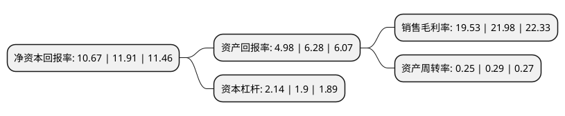

> 本页面由自动化程序生成于 2022年5月20日 01:02
> 内容可能存在错误，如有bug请提交issue至：https://github.com/Eroleice/doc-pi/issues
{.is-warning}

# 上市公司基本情况

## 基本资料

北部湾港股份有限公司（以下简称“北部湾港”）成立于1996年08月07日，北海市。于1995年11月02日在深交所主板上市。

北部湾港注册资本163,338.144万元，主要业务:装卸堆存，外轮代理，海运。以下是详细信息：

- 公司名称: 北部湾港股份有限公司
- 股票代码: 000582.SZ
- 所在地: 广西 - 北海市
- 成立日期: 1996年08月07日
- 注册资本: 163,338.144万元
- 法定代表人: 李延强
- 主营业务: 装卸堆存，外轮代理，海运
- 公司官网: www.bbwport.cn
- 公司介绍: 公司主营业务形成“一轴两翼”发展布局，集装箱业务以钦州港区为中轴，并通过“穿梭巴士”进行钦北防三港区间干支线集疏，培育区域集装箱干线港；散杂货向防城港区、北海铁山港区集聚。散杂货业务已迈入运输、仓储、贸易、交割等全供应链服务时代，拥有煤炭、矿石、粮食、硫磷、液体化工等专业化码头，装卸作业效率和服务质量不断提升。公司荣获中国上市公司综合百强奖。

## 股东及高管情况

上市公司第一大股东为广西北部湾国际港务集团有限公司，持股1,121,630,261股，占比62.96%，为上市公司实际控制人。

截至2022年05月06日，上市公司的前十大股东中，共有5名机构股东，4个产品账户，1个海外主体，其中5%以上大股东共有3名。上市公司前十大股东明细如下：

> 截至2022年05月06日，上市公司前十大股东信息如下：

| 股东名称 | 持股数量（股） | 持股比例 |
| --- | --- | --- |
| 广西北部湾国际港务集团有限公司 | 1,121,630,261 | 62.96% |
| 广西北部湾国际港务集团有限公司 | 1,030,868,617 | 63.11% |
| 上海中海码头发展有限公司 | 174,080,311 | 9.77% |
| 香港中央结算有限公司(陆股通) | 27,925,809 | 1.71% |
| 广西广投资产管理股份有限公司 | 26,709,916 | 1.64% |
| 平安基金-平安银行-中融国际信托-中融-财富1号结构化集合资金信托 | 22,473,002 | 1.38% |
| 广西宏桂资本运营集团有限公司 | 21,694,741 | 1.33% |
| 广西交通发展投资基金合伙企业(有限合伙) | 12,650,604 | 0.77% |
| 广东粤财信托有限公司-粤财信托·粤中3号集合资金信托计划 | 9,220,000 | 0.56% |
| 全国社保基金四一三组合 | 9,090,020 | 0.56% |

## 利润表分析

上市公司2021年总收入为58.98亿元，净利润为11.52亿元，实现盈利。

## 杜邦分析

> 数据列示周期：2021年 | 2020年 | 2019年
{.is-info}

上市公司的净资产收益率在近一年有所下降，下降幅度为-10.41%，其变化情况分解如下：
- 上市公司的销售毛利率在近一年下降了-11.15%，可能是生产效率的下降、商品原材料价格上涨或商品价格的下跌所致。
- 上市公司的资产周转率在近一年下降了-13.79%，可能是源自于更慢的销售回款或库存管理效果下降。
- 上市公司的财务杠杆比率在近一年上升了12.63%，可能是增加负债扩大生产规模。

