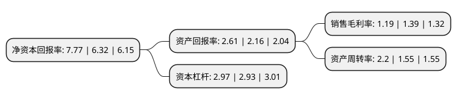

> 本页面由自动化程序生成于 2022年5月20日 01:04
> 内容可能存在错误，如有bug请提交issue至：https://github.com/Eroleice/doc-pi/issues
{.is-warning}

# 上市公司基本情况

## 基本资料

厦门港务发展股份有限公司（以下简称“厦门港务”）成立于1999年04月21日，厦门市。于1999年04月29日在深交所主板上市。

厦门港务注册资本62,519.152万元，主要业务:厦门大桥，海沧大桥过桥费的征收及经营，维护与管理;建材产品的生产和销售，工程施工。以下是详细信息：

- 公司名称: 厦门港务发展股份有限公司
- 股票代码: 000905.SZ
- 所在地: 福建 - 厦门市
- 成立日期: 1999年04月21日
- 注册资本: 62,519.152万元
- 法定代表人: 陈朝辉
- 主营业务: 厦门大桥，海沧大桥过桥费的征收及经营，维护与管理;建材产品的生产和销售，工程施工
- 公司官网: www.xmgw.com.cn
- 公司介绍: 公司以“立足港口综合物流服务，实现企业价值最大化”为宗旨，主营以港口为依托的综合物流业务以及件散杂货、内贸集装箱的装卸、堆存、仓储和助轮船靠离泊等业务。公司作为厦门港区规模最大综合物流服务商，拥有散杂货码头及后方堆场等稀缺资源、完善的港口配套与增值服务、较为完整的物流业务链条，形成了内外贸航线、海陆空物流体系。目前在厦门港区域，公司在拖轮市场处于绝对领导地位，在船舶代理、散杂货装卸、进出口拼箱、理货公证、仓储、运输、海铁联运、陆地港等港口物流领域处于主导领先地位。

## 股东及高管情况

上市公司第一大股东为厦门国际港务股份有限公司，持股386,907,522股，占比61.89%，为上市公司实际控制人。

截至2022年03月31日，上市公司的前十大股东中，共有8名自然人股东，2名机构股东，其中5%以上大股东共有1名。上市公司前十大股东明细如下：

> 截至2022年03月31日，上市公司前十大股东信息如下：

| 股东名称 | 持股数量（股） | 持股比例 |
| --- | --- | --- |
| 厦门国际港务股份有限公司 | 386,907,522 | 61.89% |
| 中国(福建)对外贸易中心集团有限责任公司 | 5,000,001 | 0.8% |
| 宋建峰 | 3,526,892 | 0.56% |
| 余章武 | 2,121,700 | 0.34% |
| 易达许 | 1,780,000 | 0.28% |
| 许兵 | 1,769,000 | 0.28% |
| 刘军锋 | 1,686,565 | 0.27% |
| 陈湖平 | 1,514,900 | 0.24% |
| 董守军 | 1,468,600 | 0.23% |
| 陈梓帆 | 1,190,793 | 0.19% |

## 利润表分析

上市公司2021年总收入为235.78亿元，净利润为2.8亿元，实现盈利。

## 杜邦分析

> 数据列示周期：2021年 | 2020年 | 2019年
{.is-info}

上市公司的净资产收益率在近一年有所上升，上升幅度为22.94%，其变化情况分解如下：
- 上市公司的销售毛利率在近一年下降了-14.39%，可能是生产效率的下降、商品原材料价格上涨或商品价格的下跌所致。
- 上市公司的资产周转率在近一年上升了41.94%，可能是源自于更快的销售回款或库存管理效果提升。
- 上市公司的财务杠杆比率在近一年上升了1.37%，可能是增加负债扩大生产规模。

