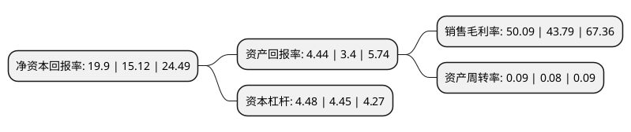

> 本页面由自动化程序生成于 2022年5月20日 01:05
> 内容可能存在错误，如有bug请提交issue至：https://github.com/Eroleice/doc-pi/issues
{.is-warning}

# 上市公司基本情况

## 基本资料

招商局港口集团股份有限公司（以下简称“招商港口”）成立于1990年07月19日，深圳市。于1993年05月05日在深交所主板上市。

招商港口注册资本192,236.512万元，主要业务:港口装卸。以下是详细信息：

- 公司名称: 招商局港口集团股份有限公司
- 股票代码: 001872.SZ
- 所在地: 广东 - 深圳市
- 成立日期: 1990年07月19日
- 注册资本: 192,236.512万元
- 法定代表人: 王秀峰
- 主营业务: 港口装卸
- 公司官网: www.cmp1872.com
- 公司介绍: 公司是大型集装箱码头和散杂货码头，主要从事集装箱、散杂货码头及港口配套业务的开发建设和经营管理。公司拥有华南地区重要的进出口港口区—赤湾港区码头。公司业务持续稳健发展，赤湾港区码头亦成为华南区域名列前茅的大型集装箱码头，也是全球集装箱吞吐量排名前五的深圳港的重要组成部分。公司一贯秉持“敬业、务实、创新、卓越”的企业精神和“以客为尊，诚信为本”的服务宗旨，进一步加强与业界各方的良好合作，在国内经济高速增长的进程中共谋发展，共同分享经济繁荣的果实。

## 股东及高管情况

上市公司第一大股东为China Merchants Port Investment Development Company Limited，持股1,148,648,648股，占比59.75%，为上市公司实际控制人。

截至2022年03月31日，上市公司的前十大股东中，共有2名自然人股东，3名机构股东，2个产品账户，3个海外主体，其中5%以上大股东共有2名。上市公司前十大股东明细如下：

> 截至2022年03月31日，上市公司前十大股东信息如下：

| 股东名称 | 持股数量（股） | 持股比例 |
| --- | --- | --- |
| China Merchants Port Investment Development Company Limited | 1,148,648,648 | 59.75% |
| 招商局港通发展(深圳)有限公司 | 370,878,000 | 19.29% |
| 深圳市基础设施投资基金管理有限责任公司-深圳市基础设施投资基金合伙企业(有限合伙) | 64,850,182 | 3.37% |
| 中非发展基金有限公司 | 64,102,564 | 3.33% |
| 布罗德福国际有限公司 | 55,314,208 | 2.88% |
| 朱晖 | 2,958,003 | 0.15% |
| 招商证券香港有限公司 | 2,585,555 | 0.13% |
| ARROWSTREET EMERGING MARKET ALPHA EXTENSION TRUST FUND | 2,192,691 | 0.11% |
| 麦淑青 | 2,129,247 | 0.11% |
| 香港中央结算有限公司(陆股通) | 2,070,402 | 0.11% |

## 利润表分析

上市公司2021年总收入为152.83亿元，净利润为76.55亿元，实现盈利。

## 杜邦分析

> 数据列示周期：2021年 | 2020年 | 2019年
{.is-info}

上市公司的净资产收益率在近一年有所上升，上升幅度为31.61%，其变化情况分解如下：
- 上市公司的销售毛利率在近一年上升了14.39%，可能是生产效率的提升、商品原材料价格下跌或商品价格的上涨所致。
- 上市公司的资产周转率在近一年上升了12.5%，可能是源自于更快的销售回款或库存管理效果提升。
- 上市公司的财务杠杆比率在近一年上升了0.67%，可能是增加负债扩大生产规模。

