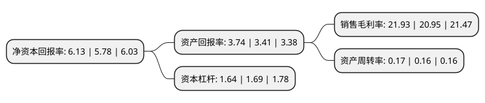

> 本页面由自动化程序生成于 2022年5月20日 01:05
> 内容可能存在错误，如有bug请提交issue至：https://github.com/Eroleice/doc-pi/issues
{.is-warning}

# 上市公司基本情况

## 基本资料

南京港股份有限公司（以下简称“南京港”）成立于2001年09月21日，南京市。于2005年03月25日在深交所中小板上市。

南京港注册资本48,396.68万元，主要从事原油，成品油，液体化工产品的装卸，储存等港口服务。以下是详细信息：

- 公司名称: 南京港股份有限公司
- 股票代码: 002040.SZ
- 所在地: 江苏 - 南京市
- 成立日期: 2001年09月21日
- 注册资本: 48,396.68万元
- 法定代表人: 熊俊
- 主营业务: 主要从事原油，成品油，液体化工产品的装卸，储存等港口服务
- 公司官网: www.nj-port.com
- 公司介绍: 公司是我国内河最大的石油、液体化工产品中转储存的港口运输企业，主要从事管道原油和内外贸海轮进江原油、液体化工产品的储存、中转。现已发展成为集管道原油、成品油、乙二醇、环已醇、环已烷、环已酮、对二甲苯、苯乙烯、萘、硫酸、磷酸、液碱、沥青、糖蜜等多种石油、化工中转储存的综合港区，是长江中下游地区理想的石油及液体化工原料集疏换装基地。

## 股东及高管情况

上市公司第一大股东为南京港(集团)有限公司，持股277,855,062股，占比57.41%，为上市公司实际控制人。

截至2022年03月31日，上市公司的前十大股东中，共有7名自然人股东，2名机构股东，1个产品账户，其中5%以上大股东共有2名。上市公司前十大股东明细如下：

> 截至2022年03月31日，上市公司前十大股东信息如下：

| 股东名称 | 持股数量（股） | 持股比例 |
| --- | --- | --- |
| 南京港(集团)有限公司 | 277,855,062 | 57.41% |
| 上海国际港务(集团)股份有限公司 | 49,749,609 | 10.28% |
| 俞雄华 | 2,325,100 | 0.48% |
| 徐开东 | 2,210,000 | 0.46% |
| 许喆 | 1,660,000 | 0.34% |
| 黄长标 | 1,226,000 | 0.25% |
| 中国民生银行股份有限公司-金元顺安元启灵活配置混合型证券投资基金 | 1,199,500 | 0.25% |
| 陈怀清 | 1,191,600 | 0.25% |
| 陈海钿 | 1,186,770 | 0.25% |
| 张素英 | 1,170,000 | 0.24% |

## 利润表分析

上市公司2021年总收入为7.96亿元，净利润为1.74亿元，实现盈利。

## 杜邦分析

> 数据列示周期：2021年 | 2020年 | 2019年
{.is-info}

上市公司的净资产收益率在近一年有所上升，上升幅度为6.06%，其变化情况分解如下：
- 上市公司的销售毛利率在近一年上升了4.68%，可能是生产效率的提升、商品原材料价格下跌或商品价格的上涨所致。
- 上市公司的资产周转率在近一年上升了6.25%，可能是源自于更快的销售回款或库存管理效果提升。
- 上市公司的财务杠杆比率在近一年下降了-2.96%，可能是减少负债降低财务费用。

