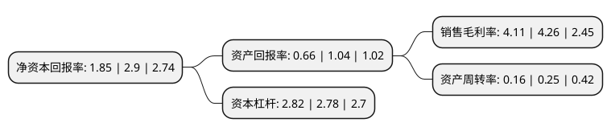

> 本页面由自动化程序生成于 2022年5月20日 01:24
> 内容可能存在错误，如有bug请提交issue至：https://github.com/Eroleice/doc-pi/issues
{.is-warning}

# 上市公司基本情况

## 基本资料

锦州港股份有限公司（以下简称“锦州港”）成立于1993年02月09日，锦州市。于1999年06月09日在上交所主板上市。

锦州港注册资本200,229.15万元，主要业务:油品化工品类(原油，成品油及液体化工品)，大宗散杂货(煤炭，粮食，矿石)及其他散杂货类(钢材，化肥，氧化铝等)货物的装卸，运输，堆存，仓储等港口物流服务。以下是详细信息：

- 公司名称: 锦州港股份有限公司
- 股票代码: 600190.SH
- 所在地: 辽宁 - 锦州市
- 成立日期: 1993年02月09日
- 注册资本: 200,229.15万元
- 法定代表人: 徐健
- 主营业务: 油品化工品类(原油，成品油及液体化工品)，大宗散杂货(煤炭，粮食，矿石)及其他散杂货类(钢材，化肥，氧化铝等)货物的装卸，运输，堆存，仓储等港口物流服务
- 公司官网: WWW.JINZHOUPORT.COM
- 公司介绍: 公司是辽宁省重点发展的北方区域性港口，是国家辽宁沿海经济带建设战略中的重要节点之一；是辽宁省构建的“辽蒙欧”、“辽满欧”等三大通道的重要节点，是辽西乃至东北开辟欧洲航运市场，打造安全、高效、便捷的全新物流通道的新起点。公司主要经营业务包括油品化工品类(原油、成品油及液体化工品)、大宗散杂货(煤炭、粮食、矿石)及其他散杂货类(钢材、化肥、氧化铝等)货物的装卸、运输、堆存、仓储等港口物流服务。公司先后取得了国家质检总局“全国进境粮食指定口岸”资质、辽宁省检验检疫局的“出口粮仓储企业”资质、商务部获批的原油仓储经营许可和东北地区第一家具有原油仓储经营资格等资质，满足了各货种客户多样化的需求，为客户提供更为全面、专业、高效和优质的服务。通过扩大港城、港铁、港航、港港、港企合作，延伸业务触角，通过不断新增航线和班列提高货运能力，充分发挥港口运输枢纽效应。

## 股东及高管情况

上市公司第一大股东为大连港投融资控股集团有限公司，持股382,110,546股，占比19.08%，**疑似为**上市公司实际控制人。

截至2022年03月31日，上市公司的前十大股东中，共有2名自然人股东，6名机构股东，2个产品账户，其中5%以上大股东共有6名。上市公司前十大股东明细如下：

> 未能通过持股比例判定出上市公司实际控制人（持股30%以上）
> 可能存在通过间接持股、联合持股、协议控制等方式拥有实际控制权的主体，具体请参考上市公司定期公告！
{.is-warning}

> 截至2022年03月31日，上市公司前十大股东信息如下：

| 股东名称 | 持股数量（股） | 持股比例 |
| --- | --- | --- |
| 大连港投融资控股集团有限公司 | 382,110,546 | 19.08% |
| 东方集团股份有限公司 | 308,178,001 | 15.39% |
| 西藏海涵交通发展有限公司 | 300,343,725 | 15% |
| 西藏天圣交通发展投资有限公司 | 140,160,405 | 7% |
| 中国石油天然气集团有限公司 | 118,170,000 | 5.9% |
| 锦州港国有资产经营管理有限公司 | 101,442,095 | 5.07% |
| 锦州港股份有限公司-第二期员工持股计划 | 10,299,990 | 0.51% |
| 锦州港股份有限公司-第一期员工持股计划 | 8,723,288 | 0.44% |
| 徐凤慧 | 4,128,000 | 0.21% |
| 方奕忠 | 2,894,594 | 0.14% |

## 利润表分析

上市公司2021年总收入为29.32亿元，净利润为1.2亿元，实现盈利。

## 杜邦分析

> 数据列示周期：2021年 | 2020年 | 2019年
{.is-info}

上市公司的净资产收益率在近一年有所下降，下降幅度为-36.21%，其变化情况分解如下：
- 上市公司的销售毛利率在近一年下降了-3.52%，可能是生产效率的下降、商品原材料价格上涨或商品价格的下跌所致。
- 上市公司的资产周转率在近一年下降了-36%，可能是源自于更慢的销售回款或库存管理效果下降。
- 上市公司的财务杠杆比率在近一年上升了1.44%，可能是增加负债扩大生产规模。

