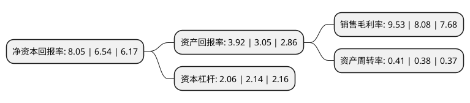

> 本页面由自动化程序生成于 2022年5月20日 01:28
> 内容可能存在错误，如有bug请提交issue至：https://github.com/Eroleice/doc-pi/issues
{.is-warning}

# 上市公司基本情况

## 基本资料

天津港股份有限公司（以下简称“天津港”）成立于1982年09月29日，天津市。于1996年06月14日在上交所主板上市。

天津港注册资本289,400.104万元，主营业务为商品储存，中转联运，汽车运输;装卸搬运;集装箱搬运，拆装箱及相关业务;货运代理;劳务服务;商业及各类物资的批发，零售;经济信息咨询服务(以上范围内国家有专营专项的按规定办理);自有房屋，货场，机械，设备的租赁业务(以上范围内国家有专营专项的按规定办理)。以下是详细信息：

- 公司名称: 天津港股份有限公司
- 股票代码: 600717.SH
- 所在地: 天津 - 天津市
- 成立日期: 1982年09月29日
- 注册资本: 289,400.104万元
- 法定代表人: 焦广军
- 主营业务: 主营业务为商品储存，中转联运，汽车运输;装卸搬运;集装箱搬运，拆装箱及相关业务;货运代理;劳务服务;商业及各类物资的批发，零售;经济信息咨询服务(以上范围内国家有专营专项的按规定办理);自有房屋，货场，机械，设备的租赁业务(以上范围内国家有专营专项的按规定办理)
- 公司官网: www.tianjin-port.com
- 公司介绍: 公司是集货物装卸、港口物流及其它相关港口服务为一体的大型港口综合服务商，具有全国沿海港口中唯一集五大战略机遇于一身，在北方沿海港口中独具自贸区比较优势。公司积极顺应船舶大型化发展趋势，主动适应腹地经济结构优化调整，高标准地推进港口基础设施建设和功能开发，吞吐量稳定增长，盈利能力稳步提升，始终保持在全国沿海港口公司的前列。公司拥有多个先进的集装箱、原油、煤炭焦炭、滚装、矿石等现代化、专业化码头，是沿海港口码头功能最齐全的港口之一。公司拥有特定的货物运输群体和市场，集装箱、原油及制品、矿石、煤炭焦炭是公司的四大支柱业务。

## 股东及高管情况

上市公司第一大股东为显创投资有限公司，持股1,644,213,619股，占比56.81%，为上市公司实际控制人。

截至2022年03月31日，上市公司的前十大股东中，共有2名自然人股东，2名机构股东，4个产品账户，2个海外主体，其中5%以上大股东共有1名。上市公司前十大股东明细如下：

> 截至2022年03月31日，上市公司前十大股东信息如下：

| 股东名称 | 持股数量（股） | 持股比例 |
| --- | --- | --- |
| 显创投资有限公司 | 1,644,213,619 | 56.81% |
| 保宁资本有限公司-保宁新兴市场基金(美国) | 19,427,033 | 0.67% |
| 中国电子系统技术有限公司 | 17,418,240 | 0.6% |
| 郭登海 | 17,344,656 | 0.6% |
| UBS AG | 15,171,386 | 0.52% |
| UBS      AG | 15,171,386 | 0.52% |
| 工银瑞信基金-农业银行-工银瑞信中证金融资产管理计划 | 9,307,699 | 0.32% |
| 叶孙兴 | 9,242,509 | 0.32% |
| 大成基金-农业银行-大成中证金融资产管理计划 | 8,519,092 | 0.29% |
| 嘉实基金-农业银行-嘉实中证金融资产管理计划 | 8,307,131 | 0.29% |

## 利润表分析

上市公司2021年总收入为144.68亿元，净利润为13.78亿元，实现盈利。

## 杜邦分析

> 数据列示周期：2021年 | 2020年 | 2019年
{.is-info}

上市公司的净资产收益率在近一年有所上升，上升幅度为23.09%，其变化情况分解如下：
- 上市公司的销售毛利率在近一年上升了17.95%，可能是生产效率的提升、商品原材料价格下跌或商品价格的上涨所致。
- 上市公司的资产周转率在近一年上升了7.89%，可能是源自于更快的销售回款或库存管理效果提升。
- 上市公司的财务杠杆比率在近一年下降了-3.74%，可能是减少负债降低财务费用。

