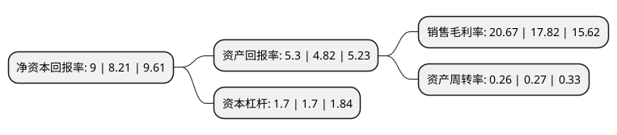

> 本页面由自动化程序生成于 2022年5月20日 01:30
> 内容可能存在错误，如有bug请提交issue至：https://github.com/Eroleice/doc-pi/issues
{.is-warning}

# 上市公司基本情况

## 基本资料

宁波舟山港股份有限公司（以下简称“宁波港”）成立于2008年03月31日，宁波市。于2010年09月28日在上交所主板上市。

宁波港注册资本1,580,741.737万元，主要业务:集装箱，铁矿石，原油，煤炭，液体化工，粮食及其他货种装卸及相关业务，同时从事综合物流，贸易销售等其他业务。以下是详细信息：

- 公司名称: 宁波舟山港股份有限公司
- 股票代码: 601018.SH
- 所在地: 浙江 - 宁波市
- 成立日期: 2008年03月31日
- 注册资本: 1,580,741.737万元
- 法定代表人: 毛剑宏
- 主营业务: 集装箱，铁矿石，原油，煤炭，液体化工，粮食及其他货种装卸及相关业务，同时从事综合物流，贸易销售等其他业务
- 公司官网: www.nbport.com.cn
- 公司介绍: 公司是中国大陆重点开发建设的四大国际深水中转港之一，在区位、航道水深、岸线资源、陆域依托、发展潜力等方面均具有较大的优势，是世界航线最密集的港口之一，也是世界各大船公司必靠母港之一。公司坚持以码头经营为核心，以港口物流和资本经营为重点的经营模式，主营业务主要包括集装箱、铁矿石、原油、煤炭、液体化工、粮食及其他货种装卸及相关业务，同时从事综合物流、贸易销售等其他业务。公司拥有健全和完备的水陆交通运输体系，多条高速公路、铁路直达港区，水路转运体系发达，能为客户提供便捷、高效、多元的优质运输服务。经过十余年地不懈努力，公司已经发展成为世界重要的集装箱远洋干线港、国内重要的铁矿石中转基地和原油转运基地、国内重要的液体化工储运基地和华东地区重要的煤炭、粮食储运基地，也是国家的主枢纽港之一。同时，浙江已形成了以公司港口为主体，以浙东南沿海温州、台州两港和浙北环杭州湾嘉兴港等为两翼，联动发展义乌陆港和其他内河港口的“一体两翼多联”的港口发展新格局。公司将全面融入“一带一路”、长江经济带建设，积极投身浙江省海洋港口战略布局，充分发挥“大龙头”作用，为推进国际一流强港和海洋强国建设贡献力量。

## 股东及高管情况

上市公司第一大股东为宁波舟山港集团有限公司，持股11,896,859,498股，占比75.26%，为上市公司实际控制人。

截至2022年03月31日，上市公司的前十大股东中，共有7名机构股东，2个产品账户，1个海外主体，其中5%以上大股东共有1名。上市公司前十大股东明细如下：

> 截至2022年03月31日，上市公司前十大股东信息如下：

| 股东名称 | 持股数量（股） | 持股比例 |
| --- | --- | --- |
| 宁波舟山港集团有限公司 | 11,896,859,498 | 75.26% |
| 上海国际港务(集团)股份有限公司 | 790,370,868 | 5% |
| 招商局港口集团股份有限公司 | 434,894,092 | 2.75% |
| 招商局国际码头(宁波)有限公司 | 407,609,124 | 2.58% |
| 中国证券金融股份有限公司 | 371,829,530 | 2.35% |
| 宁波宁兴(集团)有限公司 | 105,885,835 | 0.67% |
| 中央汇金资产管理有限责任公司 | 62,704,814 | 0.4% |
| 香港中央结算有限公司(陆股通) | 61,396,571 | 0.39% |
| 博时基金-农业银行-博时中证金融资产管理计划 | 46,239,700 | 0.29% |
| 易方达基金-农业银行-易方达中证金融资产管理计划 | 46,239,700 | 0.29% |

## 利润表分析

上市公司2021年总收入为231.27亿元，净利润为47.8亿元，实现盈利。

## 杜邦分析

> 数据列示周期：2021年 | 2020年 | 2019年
{.is-info}

上市公司的净资产收益率在近一年有所上升，上升幅度为9.62%，其变化情况分解如下：
- 上市公司的销售毛利率在近一年上升了15.99%，可能是生产效率的提升、商品原材料价格下跌或商品价格的上涨所致。
- 上市公司的资产周转率在近一年下降了-3.7%，可能是源自于更慢的销售回款或库存管理效果下降。
- 上市公司的财务杠杆比率在近一年下降了0%，可能是减少负债降低财务费用。

