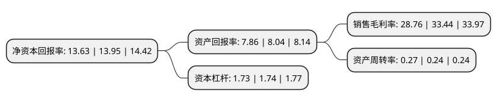

> 本页面由自动化程序生成于 2022年5月20日 01:31
> 内容可能存在错误，如有bug请提交issue至：https://github.com/Eroleice/doc-pi/issues
{.is-warning}

# 上市公司基本情况

## 基本资料

青岛港国际股份有限公司（以下简称“青岛港”）成立于2013年11月15日，青岛市。于2019年01月21日在上交所主板上市。

青岛港注册资本649,110万元，本公司主营业务为集装箱，金属矿石，煤炭，原油等各类货物的装卸和配套服务，物流及港口增值服务，港口配套服务等多种业务。以下是详细信息：

- 公司名称: 青岛港国际股份有限公司
- 股票代码: 601298.SH
- 所在地: 山东 - 青岛市
- 成立日期: 2013年11月15日
- 注册资本: 649,110万元
- 法定代表人: 苏建光
- 主营业务: 本公司主营业务为集装箱，金属矿石，煤炭，原油等各类货物的装卸和配套服务，物流及港口增值服务，港口配套服务等多种业务
- 公司官网: www.qingdao-port.com
- 公司介绍: 公司主营青岛港于1892年开埠，位于中国环渤海港口群及长江三角洲港口群的中心地带，占有东北亚港口圈的中心位置，是西太平洋重要的国际贸易枢纽，目前是世界最大综合性港口之一。青港国际是青岛港的主要经营者，在青岛港的业务涵盖四个港区，即大港港区、前湾港区、黄岛油港区和董家口港区。青港国际提供全面的港口相关服务，范围从装卸及仓储服务等港口基本服务到物流及融资相关服务等配套及延伸服务。公司能处理包括集装箱、金属矿石、煤炭、石油、粮食、钢材、汽车及其它液体散货、干散货及一般货物在内的多种货物。公司与由铁路、公路、水路及管道组成的发达的联运运输系统相连。凭借公司通过港区实现的货物及信息流通的中心位置，公司致力于增加现代物流服务价值链的服务种类，例如公路运输服务、代理及清关服务与保税区服务。

## 股东及高管情况

上市公司第一大股东为山东港口青岛港集团有限公司，持股3,521,347,000股，占比54.25%，为上市公司实际控制人。

截至2022年03月31日，上市公司的前十大股东中，共有1名自然人股东，6名机构股东，2个产品账户，1个海外主体，其中5%以上大股东共有3名。上市公司前十大股东明细如下：

> 截至2022年03月31日，上市公司前十大股东信息如下：

| 股东名称 | 持股数量（股） | 持股比例 |
| --- | --- | --- |
| 山东港口青岛港集团有限公司 | 3,521,347,000 | 54.25% |
| 香港中央结算(代理人)有限公司 | 1,098,761,930 | 16.92% |
| 上海中海码头发展有限公司 | 1,015,520,000 | 15.64% |
| 码来仓储(深圳)有限公司 | 112,000,000 | 1.73% |
| 中远海运(青岛)有限公司 | 96,000,000 | 1.48% |
| 中海码头发展有限公司 | 96,000,000 | 1.48% |
| 青岛国际投资有限公司 | 47,480,000 | 0.73% |
| 何新海 | 13,529,512 | 0.21% |
| 中国工商银行股份有限公司-诺安低碳经济股票型证券投资基金 | 4,198,548 | 0.06% |
| 基本养老保险基金一一零一组合 | 3,514,000 | 0.05% |

## 利润表分析

上市公司2021年总收入为160.99亿元，净利润为46.29亿元，实现盈利。

## 杜邦分析

> 数据列示周期：2021年 | 2020年 | 2019年
{.is-info}

上市公司的净资产收益率在近一年有所下降，下降幅度为-2.29%，其变化情况分解如下：
- 上市公司的销售毛利率在近一年下降了-14%，可能是生产效率的下降、商品原材料价格上涨或商品价格的下跌所致。
- 上市公司的资产周转率在近一年上升了12.5%，可能是源自于更快的销售回款或库存管理效果提升。
- 上市公司的财务杠杆比率在近一年下降了-0.57%，可能是减少负债降低财务费用。

