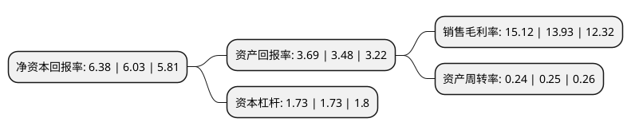

> 本页面由自动化程序生成于 2022年5月20日 01:31
> 内容可能存在错误，如有bug请提交issue至：https://github.com/Eroleice/doc-pi/issues
{.is-warning}

# 上市公司基本情况

## 基本资料

秦皇岛港股份有限公司（以下简称“秦港股份”）成立于2008年03月31日，秦皇岛市。于2017年08月16日在上交所主板上市。

秦港股份注册资本558,741.2万元，主要业务:高度一体化的综合港口服务，包括装卸，堆存，仓储，运输及物流服务。以下是详细信息：

- 公司名称: 秦皇岛港股份有限公司
- 股票代码: 601326.SH
- 所在地: 河北 - 秦皇岛市
- 成立日期: 2008年03月31日
- 注册资本: 558,741.2万元
- 法定代表人: 曹子玉
- 主营业务: 高度一体化的综合港口服务，包括装卸，堆存，仓储，运输及物流服务
- 公司官网: www.portqhd.com
- 公司介绍: 公司是河北港口集团控股子公司，全球最大大宗干散货公众码头运营商之一，分别于2013年，2017年在中国香港联交所，上海证券交易所上市，成为河北省首家布局A+H股双资本平台的国有企业。公司为客户提供高度一体化的综合港口服务，包括装卸、堆存、仓储、运输及物流服务，经营货种主要包括煤炭、金属矿石、油品及液体化工、集装箱、杂货及其他货品。近年来，公司积极融入“一带一路”建设、京津冀协同发展，坚持港产城互动，深化与大企业强强合作，统筹布局津冀港口项目，业务涵盖秦皇岛港、唐山曹妃甸港区、沧州黄骅港区三大港区，拥有煤炭、杂货矿石、油品、集装箱等现代化专业泊位，已形成包括货物装卸、堆存、仓储、运输等基础服务以及货运代理、多式联运在内的港口物流链。作为能源输出为主的多功能综合性国际贸易大港，秦皇岛港与大秦铁路无缝对接，是我国能源运输的主枢纽港，发挥着国家“煤炭价格稳定器”和“北煤南运蓄水池”作用。公司建立了一套专业化、高效率的运输组织和管理体系，不断推进港口转型升级，建立了以价值创造为导向的服务模式，港口装卸增值服务能力不断提升。

## 股东及高管情况

上市公司第一大股东为河北港口集团有限公司，持股3,032,528,078股，占比54.27%，为上市公司实际控制人。

截至2022年03月31日，上市公司的前十大股东中，共有1名自然人股东，5名机构股东，2个海外主体，2名其他股东，其中5%以上大股东共有3名。上市公司前十大股东明细如下：

> 截至2022年03月31日，上市公司前十大股东信息如下：

| 股东名称 | 持股数量（股） | 持股比例 |
| --- | --- | --- |
| 河北港口集团有限公司 | 3,032,528,078 | 54.27% |
| 香港中央结算(代理人)有限公司 | 827,379,882 | 14.81% |
| 秦皇岛市人民政府国有资产监督管理委员会 | 621,455,485 | 11.12% |
| 河北建投交通投资有限责任公司 | 209,402,757 | 3.75% |
| 大秦铁路股份有限公司 | 42,750,000 | 0.77% |
| 晋能控股煤业集团有限公司 | 41,437,588 | 0.74% |
| 中远海运(天津)有限公司 | 41,437,588 | 0.74% |
| 李国 | 40,000,000 | 0.72% |
| 山西省人民政府驻秦皇岛港务管理办公室 | 30,538,764 | 0.55% |
| 香港中央结算有限公司(陆股通) | 16,983,333 | 0.3% |

## 利润表分析

上市公司2021年总收入为65.94亿元，净利润为9.97亿元，实现盈利。

## 杜邦分析

> 数据列示周期：2021年 | 2020年 | 2019年
{.is-info}

上市公司的净资产收益率在近一年有所上升，上升幅度为5.8%，其变化情况分解如下：
- 上市公司的销售毛利率在近一年上升了8.54%，可能是生产效率的提升、商品原材料价格下跌或商品价格的上涨所致。
- 上市公司的资产周转率在近一年下降了-4%，可能是源自于更慢的销售回款或库存管理效果下降。
- 上市公司的财务杠杆比率在近一年下降了0%，可能是减少负债降低财务费用。

