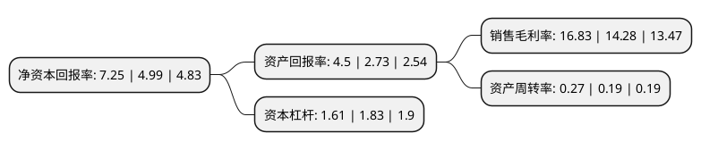

> 本页面由自动化程序生成于 2022年5月20日 01:31
> 内容可能存在错误，如有bug请提交issue至：https://github.com/Eroleice/doc-pi/issues
{.is-warning}

# 上市公司基本情况

## 基本资料

辽宁港口股份有限公司（以下简称“辽港股份”）成立于2005年11月16日，大连市。于2010年12月06日在上交所主板上市。

辽港股份注册资本2,398,706.582万元，主要业务:油品/液体化工品码头及相关物流业务(油品部分);集装箱码头及相关物流业务(集装箱部分);汽车码头及相关物流，贸易业务(汽车码头部分);矿石码头及相关物流业务(矿石部分);杂货码头及相关物流，贸易业务(杂货部分);散粮码头及相关物流，贸易业务(散粮部分);客运滚装码头及相关物流业务(客运滚装部分)及港口增值与支持业务(增值服务部分)。以下是详细信息：

- 公司名称: 辽宁港口股份有限公司
- 股票代码: 601880.SH
- 所在地: 辽宁 - 大连市
- 成立日期: 2005年11月16日
- 注册资本: 2,398,706.582万元
- 法定代表人: 王志贤
- 主营业务: 油品/液体化工品码头及相关物流业务(油品部分);集装箱码头及相关物流业务(集装箱部分);汽车码头及相关物流，贸易业务(汽车码头部分);矿石码头及相关物流业务(矿石部分);杂货码头及相关物流，贸易业务(杂货部分);散粮码头及相关物流，贸易业务(散粮部分);客运滚装码头及相关物流业务(客运滚装部分)及港口增值与支持业务(增值服务部分)
- 公司官网: www.liaoganggf.cn
- 公司介绍: 公司是亚洲最先进的散装液体化工产品转运基地之一。公司所从事的主要业务包括：油品/液体化工品码头及相关物流业务(油品部分)；集装箱码头及相关物流业务(集装箱部分)；汽车码头及相关物流、贸易业务(汽车码头部分)；矿石码头及相关物流业务(矿石部分)；杂货码头及相关物流、贸易业务(杂货部分)；散粮码头及相关物流、贸易业务(散粮部分)；客运滚装码头及相关物流业务(客运滚装部分)及港口增值与支持业务(增值服务部分)。公司以转型提质为主线，以抓创新、谋合作为重点，延伸服务领域，拓展服务功能，实现了生产经营的稳定增长，在港口业中继续保持着较强的竞争能力。公司目前拥有80余家海内外投资企业以及油品码头公司、矿石码头公司、杂货码头公司、散粮码头公司、轮驳公司等分公司。作为大连港港口物流业务的统一运作平台，公司是东北地区最大的综合性码头营运商之一。

## 股东及高管情况

上市公司第一大股东为营口港务集团有限公司，持股6,916,185,012股，占比28.83%，**疑似为**上市公司实际控制人。

截至2022年03月31日，上市公司的前十大股东中，共有8名机构股东，2个海外主体，其中5%以上大股东共有3名。上市公司前十大股东明细如下：

> 未能通过持股比例判定出上市公司实际控制人（持股30%以上）
> 可能存在通过间接持股、联合持股、协议控制等方式拥有实际控制权的主体，具体请参考上市公司定期公告！
{.is-warning}

> 截至2022年03月31日，上市公司前十大股东信息如下：

| 股东名称 | 持股数量（股） | 持股比例 |
| --- | --- | --- |
| 营口港务集团有限公司 | 6,916,185,012 | 28.83% |
| 大连港集团有限公司 | 5,310,255,162 | 22.14% |
| 香港中央结算(代理人)有限公司 | 5,122,065,507 | 21.35% |
| 攀钢集团有限公司 | 474,140,302 | 1.98% |
| 鞍山钢铁集团有限公司 | 448,701,298 | 1.87% |
| 中交一航局第一工程有限公司 | 389,610,389 | 1.62% |
| 中交天津航道局有限公司 | 224,675,328 | 0.94% |
| 国泰君安证券股份有限公司 | 129,282,893 | 0.54% |
| 香港中央结算有限公司(陆股通) | 95,785,946 | 0.4% |
| 辽宁港湾金融控股集团有限公司 | 67,309,590 | 0.28% |

## 利润表分析

上市公司2021年总收入为123.47亿元，净利润为20.78亿元，实现盈利。

## 杜邦分析

> 数据列示周期：2021年 | 2020年 | 2019年
{.is-info}

上市公司的净资产收益率在近一年有所上升，上升幅度为45.29%，其变化情况分解如下：
- 上市公司的销售毛利率在近一年上升了17.86%，可能是生产效率的提升、商品原材料价格下跌或商品价格的上涨所致。
- 上市公司的资产周转率在近一年上升了42.11%，可能是源自于更快的销售回款或库存管理效果提升。
- 上市公司的财务杠杆比率在近一年下降了-12.02%，可能是减少负债降低财务费用。

