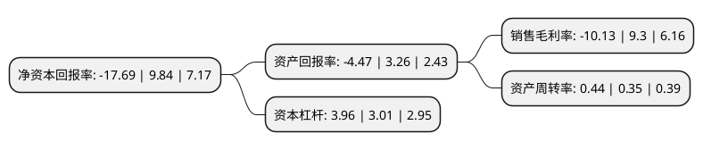

> 本页面由自动化程序生成于 2022年5月20日 01:02
> 内容可能存在错误，如有bug请提交issue至：https://github.com/Eroleice/doc-pi/issues
{.is-warning}

# 上市公司基本情况

## 基本资料

广东电力发展股份有限公司（以下简称“粤电力A”）成立于1996年02月05日，广州市。于1993年11月26日在深交所主板上市。

粤电力A注册资本525,028.399万元，主要产品:电力项目的投资，建设和经营管理，电力的生产和销售业务。以下是详细信息：

- 公司名称: 广东电力发展股份有限公司
- 股票代码: 000539.SZ
- 所在地: 广东 - 广州市
- 成立日期: 1996年02月05日
- 注册资本: 525,028.399万元
- 法定代表人: 王进
- 主营业务: 主要产品:电力项目的投资，建设和经营管理，电力的生产和销售业务
- 公司官网: www.ged.com.cn
- 公司介绍: 公司为一家同时拥有A、B股的大型电力公司，是广东省内最大的电力上市公司之一。公司主要从事电力项目的投资、建设和经营管理，电力的生产和销售业务。公司坚持“办电为主，多元发展”，专注于电力主业，电源结构呈多元化发展，除从事大型燃煤发电厂的开发、建设和运营外，还拥有LNG发电、风力发电和水力发电等清洁能源项目，通过电网公司向用户提供可靠、清洁的能源。公司一直坚持“取资于民，用资于电，惠之于众”的经营宗旨和“办电为主，多元发展”的经营方针，充分发挥证券市场的融资功能，致力于广东省的电力建设。经过多年的奋斗，公司实现了电力主业规模化、能源结构多元化、企业管理规范化，成为主营业务鲜明、规模效益突出、财务实力雄厚、持续发展能力强的优质电力上市公司。公司荣获“中国上市公司100强”、“广东上市公司最具成长性10强”、“中国财经风云榜-最佳投资者关系上市公司”。同时，公司还连续多次入选“沪深300”、“深证100”、“中证红利”等重要指数样本股。

## 股东及高管情况

上市公司第一大股东为广东省能源集团有限公司，持股3,538,005,285股，占比67.39%，为上市公司实际控制人。

截至2022年03月31日，上市公司的前十大股东中，共有1名自然人股东，4名机构股东，4个产品账户，1个海外主体，其中5%以上大股东共有1名。上市公司前十大股东明细如下：

> 截至2022年03月31日，上市公司前十大股东信息如下：

| 股东名称 | 持股数量（股） | 持股比例 |
| --- | --- | --- |
| 广东省能源集团有限公司 | 3,538,005,285 | 67.39% |
| 广州发展集团股份有限公司 | 116,693,602 | 2.22% |
| 广东省电力开发公司 | 94,367,341 | 1.8% |
| 中国工商银行股份有限公司-前海开源新经济灵活配置混合型证券投资基金 | 40,088,618 | 0.76% |
| 全国社保基金一零二组合 | 36,986,590 | 0.7% |
| 中国证券金融股份有限公司 | 28,639,545 | 0.55% |
| 郑建祥 | 25,514,900 | 0.49% |
| 宁波银行股份有限公司-博时成长优势混合型证券投资基金 | 18,915,500 | 0.36% |
| 中国农业银行股份有限公司-博时裕隆灵活配置混合型证券投资基金 | 16,055,400 | 0.31% |
| VANGUARD TOTAL INTERNATIONAL STOCK INDEX FUND | 15,855,512 | 0.3% |

## 杜邦分析

> 数据列示周期：2021年 | 2020年 | 2019年
{.is-info}

上市公司的净资产收益率在近一年有所下降，下降幅度为-279.78%，其变化情况分解如下：
- 上市公司的销售毛利率在近一年下降了-208.92%，可能是生产效率的下降、商品原材料价格上涨或商品价格的下跌所致。
- 上市公司的资产周转率在近一年上升了25.71%，可能是源自于更快的销售回款或库存管理效果提升。
- 上市公司的财务杠杆比率在近一年上升了31.56%，可能是增加负债扩大生产规模。

