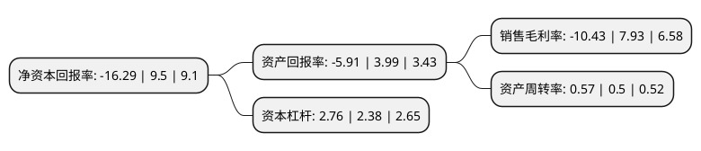

> 本页面由自动化程序生成于 2022年5月20日 01:02
> 内容可能存在错误，如有bug请提交issue至：https://github.com/Eroleice/doc-pi/issues
{.is-warning}

# 上市公司基本情况

## 基本资料

安徽省皖能股份有限公司（以下简称“皖能电力”）成立于1993年12月13日，合肥市。于1993年12月20日在深交所主板上市。

皖能电力注册资本226,686.333万元，主要业务:电力，节能及相关项目投资，经营。以下是详细信息：

- 公司名称: 安徽省皖能股份有限公司
- 股票代码: 000543.SZ
- 所在地: 安徽 - 合肥市
- 成立日期: 1993年12月13日
- 注册资本: 226,686.333万元
- 法定代表人: 李明
- 主营业务: 电力，节能及相关项目投资，经营
- 公司官网: www.wenergy.cn
- 公司介绍: 公司是安徽省第一批规范化改制的上市公司之一，具有多年的电厂管理和运营经验。公司主要营业范围为：电力、节能及相关项目投资、经营。与电力建设相关的原材料开发，高新技术和出口创汇项目开发、投资、经营。公司主要以投资、建设、运营管理电力生产为主的能源项目，公司电力业务以燃煤火力发电为主，同时涉及核电、风电、供热等能源项目。公司作为皖能集团电力板块专业化管理公司，面对电力行业经营与发展遭遇史无前例的严峻挑战，公司深入贯彻实施“三个战略转移”战略部署，充分利用国家出台的“上大压小”政策，通过新建、扩建一批大机组，加快公司从小机组、高能耗向大容量、高参数、低能耗机组的转变，不断优化发电资产结构，为公司可持续发展注入活力，增强后劲。

## 股东及高管情况

上市公司第一大股东为安徽省能源集团有限公司，持股1,245,208,342股，占比54.93%，为上市公司实际控制人。

截至2022年03月31日，上市公司的前十大股东中，共有5名自然人股东，3名机构股东，1个产品账户，1个海外主体，其中5%以上大股东共有1名。上市公司前十大股东明细如下：

> 截至2022年03月31日，上市公司前十大股东信息如下：

| 股东名称 | 持股数量（股） | 持股比例 |
| --- | --- | --- |
| 安徽省能源集团有限公司 | 1,245,208,342 | 54.93% |
| 安徽省皖能能源物资有限公司 | 41,021,000 | 1.81% |
| 香港中央结算有限公司(陆股通) | 25,411,635 | 1.12% |
| 陈维恩 | 19,075,400 | 0.84% |
| 李丽 | 10,928,882 | 0.48% |
| 柯志勇 | 10,759,437 | 0.47% |
| 上海汇海投资有限公司 | 10,427,837 | 0.46% |
| 深圳前海新禾富基金管理有限公司-新禾富融固价值发现私募证券投资基金 | 8,974,400 | 0.4% |
| 杨艺辉 | 8,705,094 | 0.38% |
| 古广秀 | 6,897,000 | 0.3% |

## 利润表分析

上市公司2021年总收入为210.32亿元，净利润为-21.95亿元，**未实现盈利**。

## 杜邦分析

> 数据列示周期：2021年 | 2020年 | 2019年
{.is-info}

上市公司的净资产收益率在近一年有所下降，下降幅度为-271.47%，其变化情况分解如下：
- 上市公司的销售毛利率在近一年下降了-231.53%，可能是生产效率的下降、商品原材料价格上涨或商品价格的下跌所致。
- 上市公司的资产周转率在近一年上升了14%，可能是源自于更快的销售回款或库存管理效果提升。
- 上市公司的财务杠杆比率在近一年上升了15.97%，可能是增加负债扩大生产规模。

