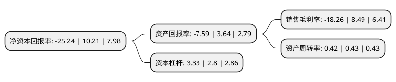

> 本页面由自动化程序生成于 2022年5月20日 01:02
> 内容可能存在错误，如有bug请提交issue至：https://github.com/Eroleice/doc-pi/issues
{.is-warning}

# 上市公司基本情况

## 基本资料

河北建投能源投资股份有限公司（以下简称“建投能源”）成立于1994年01月18日，石家庄市。于1996年06月06日在深交所主板上市。

建投能源注册资本179,162.638万元，主要产品:为投资，建设，运营管理以电力生产为主的能源项目。以下是详细信息：

- 公司名称: 河北建投能源投资股份有限公司
- 股票代码: 000600.SZ
- 所在地: 河北 - 石家庄市
- 成立日期: 1994年01月18日
- 注册资本: 179,162.638万元
- 法定代表人: 王双海
- 主营业务: 主要产品:为投资，建设，运营管理以电力生产为主的能源项目
- 公司官网: www.jei.com.cn
- 公司介绍: 公司是河北省的能源投资主体，主营业务为投资、建设、运营管理以电力生产为主的能源项目，公司电力业务以燃煤火力发电和供热为主，同时涉及核电、风电、水电等新能源项目投资。公司坚持以市场为导向，以保障河北省用电需求，促进区域经济发展，维护全体股东利益为宗旨，以价值最大化为经营理念，依托区域市场用电需求稳定增长、控股股东建投集团鼎力支持的优势，通过内生与外延发展并重的方式，实现规模扩张，并不断提高经济效益，逐步发展成为具有竞争实力和发展活力的大型专业化能源投资公司，实现了公司价值和股东价值的共同增长。公司培养了一支高素质、专业化的管理团队，具有较强的专业知识、领导能力、敬业精神和卓越视野。同时公司积累了大批专业技术人才，具有能源项目开发、企业运营管理方面的成功经验，能够为公司的专业化、市场化、国际化发展提供人才和技术支持。

## 股东及高管情况

上市公司第一大股东为河北建设投资集团有限责任公司，持股1,175,905,950股，占比65.63%，为上市公司实际控制人。

截至2022年03月31日，上市公司的前十大股东中，共有4名自然人股东，2名机构股东，3个产品账户，1个海外主体，其中5%以上大股东共有1名。上市公司前十大股东明细如下：

> 截至2022年03月31日，上市公司前十大股东信息如下：

| 股东名称 | 持股数量（股） | 持股比例 |
| --- | --- | --- |
| 河北建设投资集团有限责任公司 | 1,175,905,950 | 65.63% |
| 中央汇金资产管理有限责任公司 | 23,593,600 | 1.32% |
| 中国工商银行股份有限公司-交银施罗德趋势优先混合型证券投资基金 | 21,623,765 | 1.21% |
| 倪晶 | 9,505,697 | 0.53% |
| 香港中央结算有限公司(陆股通) | 8,694,443 | 0.49% |
| 招商银行股份有限公司-华安安华灵活配置混合型证券投资基金 | 7,800,200 | 0.44% |
| 中国农业银行股份有限公司-交银施罗德定期支付双息平衡混合型证券投资基金 | 3,908,000 | 0.22% |
| 张学荣 | 3,347,922 | 0.19% |
| 林君平 | 2,832,300 | 0.16% |
| 邱进森 | 2,705,879 | 0.15% |

## 利润表分析

上市公司2021年总收入为150.4亿元，净利润为-27.47亿元，**未实现盈利**。

## 杜邦分析

> 数据列示周期：2021年 | 2020年 | 2019年
{.is-info}

上市公司的净资产收益率在近一年有所下降，下降幅度为-347.21%，其变化情况分解如下：
- 上市公司的销售毛利率在近一年下降了-315.08%，可能是生产效率的下降、商品原材料价格上涨或商品价格的下跌所致。
- 上市公司的资产周转率在近一年下降了-2.33%，可能是源自于更慢的销售回款或库存管理效果下降。
- 上市公司的财务杠杆比率在近一年上升了18.93%，可能是增加负债扩大生产规模。

