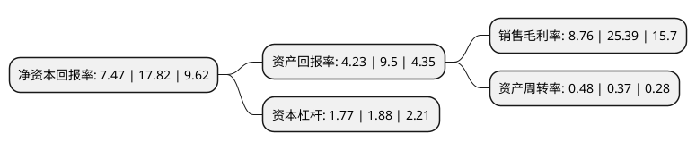

> 本页面由自动化程序生成于 2022年5月20日 01:03
> 内容可能存在错误，如有bug请提交issue至：https://github.com/Eroleice/doc-pi/issues
{.is-warning}

# 上市公司基本情况

## 基本资料

广东宝丽华新能源股份有限公司（以下简称“宝新能源”）成立于1997年01月20日，梅州市。于1997年01月28日在深交所主板上市。

宝新能源注册资本217,588.786万元，主营业务:洁净煤燃烧技术发电和可再生能源发电，新能源电力生产，销售，开发。以下是详细信息：

- 公司名称: 广东宝丽华新能源股份有限公司
- 股票代码: 000690.SZ
- 所在地: 广东 - 梅州市
- 成立日期: 1997年01月20日
- 注册资本: 217,588.786万元
- 法定代表人: 邹锦开
- 主营业务: 主营业务:洁净煤燃烧技术发电和可再生能源发电，新能源电力生产，销售，开发
- 公司官网: www.baolihua.com.cn
- 公司介绍: 公司是中国证券市场中的新能源电力龙头上市公司，是广东省首家采用先进循环硫化床洁净燃烧技术，以及全国规模最大的资源综合利用电厂。公司主营业务包括：洁净煤燃烧技术发电和可再生能源发电，新能源电力生产、销售、开发，新能源电力生产技术咨询、服务；房屋建筑、公路、桥梁、市政等基础设施工程的设计、承揽与施工；新能源产业投资，对外直接股权投资、创业投资、受托投资、受托管理投资、投资咨询、财务咨询。经过多年努力，公司先后入选上证300、深证100等多个重要指数样本股，连年名列“中国上市公司综合绩效百强榜”、“上市公司整体价值百强排行榜”、“最佳成长上市公司50强”、“中国新能源行业最具影响力品牌”，多次获得“广东十大和谐企业”、“广东省模范集体”、“广东省先进集体”、“中国上市公司董事会金圆桌奖——十佳董事会”、“中国上市公司董事会金圆桌奖——董事会建设特别贡献奖”等荣誉称号。

## 股东及高管情况

上市公司第一大股东为广东宝丽华集团有限公司，持股348,142,058股，占比16%，**疑似为**上市公司实际控制人。

截至2022年03月31日，上市公司的前十大股东中，共有1名自然人股东，1名机构股东，7个产品账户，1个海外主体，其中5%以上大股东共有1名。上市公司前十大股东明细如下：

> 未能通过持股比例判定出上市公司实际控制人（持股30%以上）
> 可能存在通过间接持股、联合持股、协议控制等方式拥有实际控制权的主体，具体请参考上市公司定期公告！
{.is-warning}

> 截至2022年03月31日，上市公司前十大股东信息如下：

| 股东名称 | 持股数量（股） | 持股比例 |
| --- | --- | --- |
| 广东宝丽华集团有限公司 | 348,142,058 | 16% |
| 宁远喜 | 42,878,200 | 1.97% |
| 香港中央结算有限公司(陆股通) | 41,773,939 | 1.92% |
| 大成基金-农业银行-大成中证金融资产管理计划 | 20,075,300 | 0.92% |
| 南方基金-农业银行-南方中证金融资产管理计划 | 20,075,300 | 0.92% |
| 中欧基金-农业银行-中欧中证金融资产管理计划 | 20,075,300 | 0.92% |
| 广发基金-农业银行-广发中证金融资产管理计划 | 20,075,300 | 0.92% |
| 易方达基金-农业银行-易方达中证金融资产管理计划 | 20,075,300 | 0.92% |
| 博时基金-农业银行-博时中证金融资产管理计划 | 20,075,300 | 0.92% |
| 工银瑞信基金-农业银行-工银瑞信中证金融资产管理计划 | 20,075,300 | 0.92% |

## 利润表分析

上市公司2021年总收入为94.1亿元，净利润为8.24亿元，实现盈利。

## 杜邦分析

> 数据列示周期：2021年 | 2020年 | 2019年
{.is-info}

上市公司的净资产收益率在近一年有所下降，下降幅度为-58.08%，其变化情况分解如下：
- 上市公司的销售毛利率在近一年下降了-65.5%，可能是生产效率的下降、商品原材料价格上涨或商品价格的下跌所致。
- 上市公司的资产周转率在近一年上升了29.73%，可能是源自于更快的销售回款或库存管理效果提升。
- 上市公司的财务杠杆比率在近一年下降了-5.85%，可能是减少负债降低财务费用。

