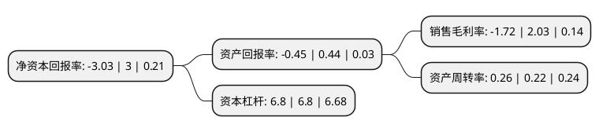

> 本页面由自动化程序生成于 2022年5月20日 01:03
> 内容可能存在错误，如有bug请提交issue至：https://github.com/Eroleice/doc-pi/issues
{.is-warning}

# 上市公司基本情况

## 基本资料

晋能控股山西电力股份有限公司（以下简称“晋控电力”）成立于1993年02月08日，太原市。于1997年06月09日在深交所主板上市。

晋控电力注册资本307,694.222万元，主要业务:电力商品，热力商品生产和销售。燃料，材料，电力高新技术，电力物资的开发销售。以下是详细信息：

- 公司名称: 晋能控股山西电力股份有限公司
- 股票代码: 000767.SZ
- 所在地: 山西 - 太原市
- 成立日期: 1993年02月08日
- 注册资本: 307,694.222万元
- 法定代表人: 刘文彦
- 主营业务: 电力商品，热力商品生产和销售燃料，材料，电力高新技术，电力物资的开发销售
- 公司官网: www.zhangzepower.com
- 公司介绍: 公司总部位于山西太原，是一家以火电为主营业务的能源上市公司，2012年公司与同煤集团进行重大资产重组，开辟了国内以资本市场为纽带，实现煤电一体化资源整合的先河，为破解国内长期形成的煤电矛盾问题，实现煤电协调可持续发展提供了成功典范。公司主要营业范围为：电力商品、热力商品生产和销售，燃料、材料、电力高新技术、电力物资的开发销售。在山西省委、省政府和同煤集团的正确领导下，以“建设新同煤、打造新生活”为战略愿景，按照“电力做大、资本做活”的总体要求，公司努力打造成为国内一流、国际先进大型煤电一体化能源上市公司。公司曾获得“全国五一劳动奖章”、“中国上市公司百强企业”、“全国投资者关系十强”、“中国证券市场金凤凰奖”、“中国主板诚信50强”、“中国证券市场龙鼎奖”、“山西省先进基层党组织”、“山西省模范企业”、“山西省上市公司五强之首”等荣誉称号，为国家经济建设和社会发展做出了巨大贡献。

## 股东及高管情况

上市公司第一大股东为晋能控股煤业集团有限公司，持股905,653,810股，占比29.43%，**疑似为**上市公司实际控制人。

截至2022年03月31日，上市公司的前十大股东中，共有2名自然人股东，3名机构股东，3个产品账户，1个海外主体，1名其他股东，其中5%以上大股东共有3名。上市公司前十大股东明细如下：

> 未能通过持股比例判定出上市公司实际控制人（持股30%以上）
> 可能存在通过间接持股、联合持股、协议控制等方式拥有实际控制权的主体，具体请参考上市公司定期公告！
{.is-warning}

> 截至2022年03月31日，上市公司前十大股东信息如下：

| 股东名称 | 持股数量（股） | 持股比例 |
| --- | --- | --- |
| 晋能控股煤业集团有限公司 | 905,653,810 | 29.43% |
| 山西省人民政府国有资产监督管理委员会 | 299,130,000 | 9.72% |
| 国电投华泽(天津)资产管理有限公司 | 226,842,900 | 7.37% |
| 中投知本汇(北京)资产管理有限公司-晋商1号私募投资基金 | 138,121,547 | 4.49% |
| 中投知本汇(北京)资产管理有限公司-晋商2号私募投资基金 | 138,121,546 | 4.49% |
| 华安未来资产-工商银行-中航信托-天顺(2016)322号华安未来定增投资单一资金信托 | 127,391,546 | 4.14% |
| 山西晋信汇承企业管理咨询合伙企业(有限合伙) | 107,352,146 | 3.49% |
| 钱密林 | 59,284,992 | 1.93% |
| 赵志海 | 46,300,000 | 1.5% |
| 国开泰富基金-光大银行-华鑫国际信托-华鑫信托·专户投资2号单一资金信托 | 36,956,228 | 1.2% |

## 利润表分析

上市公司2021年总收入为152.74亿元，净利润为-2.64亿元，**未实现盈利**。

## 杜邦分析

> 数据列示周期：2021年 | 2020年 | 2019年
{.is-info}

上市公司的净资产收益率在近一年有所下降，下降幅度为-201%，其变化情况分解如下：
- 上市公司的销售毛利率在近一年下降了-184.73%，可能是生产效率的下降、商品原材料价格上涨或商品价格的下跌所致。
- 上市公司的资产周转率在近一年上升了18.18%，可能是源自于更快的销售回款或库存管理效果提升。
- 上市公司的财务杠杆比率在近一年下降了0%，可能是减少负债降低财务费用。

