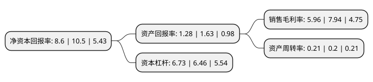

> 本页面由自动化程序生成于 2022年5月20日 01:04
> 内容可能存在错误，如有bug请提交issue至：https://github.com/Eroleice/doc-pi/issues
{.is-warning}

# 上市公司基本情况

## 基本资料

吉林电力股份有限公司（以下简称“吉电股份”）成立于1997年11月20日，长春市。于2002年09月26日在深交所主板上市。

吉电股份注册资本279,020.817万元，主要业务:发电(火电，水电，风电，太阳能，分布式能源，气电，生物质，核能)，供热(民用，工业)，清洁能源投资开发，电站检修，科技项目研发，配售电等业务。其中:发电，供热是本公司的核心业务。以下是详细信息：

- 公司名称: 吉林电力股份有限公司
- 股票代码: 000875.SZ
- 所在地: 吉林 - 长春市
- 成立日期: 1997年11月20日
- 注册资本: 279,020.817万元
- 法定代表人: 牛国君
- 主营业务: 发电(火电，水电，风电，太阳能，分布式能源，气电，生物质，核能)，供热(民用，工业)，清洁能源投资开发，电站检修，科技项目研发，配售电等业务其中:发电，供热是本公司的核心业务
- 公司官网: www.spicjl.com
- 公司介绍: 公司是国家电力投资集团有限公司控制的上市公司，主要业务涉及新能源、综合智慧能源、氢能、储能充换电及火电、供热、生物质能、电站服务等领域。公司以清洁能源为主线，打造了东北、西北、华东、江西、华北5个区域新能源基地，发展项目已遍及30个省市自治区，并积极拓展海外业务。展望未来，公司围绕“持续大力发展新能源，高质量发展综合智慧能源，创新发展氢能产业集群，全面拓展储能充换电业务”四条发展主线，致力于建成为世界一流清洁能源上市公司，为广大投资者提供更加稳定的回报，为促进国民经济发展和社会进步做出应有的贡献。

## 股东及高管情况

上市公司第一大股东为国家电投集团吉林能源投资有限公司，持股730,872,327股，占比26.19%，**疑似为**上市公司实际控制人。

截至2022年03月31日，上市公司的前十大股东中，共有5名机构股东，4个产品账户，1个海外主体，其中5%以上大股东共有2名。上市公司前十大股东明细如下：

> 未能通过持股比例判定出上市公司实际控制人（持股30%以上）
> 可能存在通过间接持股、联合持股、协议控制等方式拥有实际控制权的主体，具体请参考上市公司定期公告！
{.is-warning}

> 截至2022年03月31日，上市公司前十大股东信息如下：

| 股东名称 | 持股数量（股） | 持股比例 |
| --- | --- | --- |
| 国家电投集团吉林能源投资有限公司 | 730,872,327 | 26.19% |
| 国家电力投资集团有限公司 | 158,884,995 | 5.69% |
| 香港中央结算有限公司(陆股通) | 35,849,874 | 1.28% |
| 国家电投集团财务有限公司 | 34,482,758 | 1.24% |
| 上海浦东发展银行股份有限公司-中欧创新未来18个月封闭运作混合型证券投资基金 | 29,975,161 | 1.07% |
| 吉林省投资集团有限公司 | 29,700,000 | 1.06% |
| 中国人寿保险-(集团)公司-传统-普通保险产品-港股通(创新策略) | 28,537,730 | 1.02% |
| 中国电能成套设备有限公司 | 24,430,700 | 0.88% |
| 中国银行股份有限公司-华泰柏瑞中证光伏产业交易型开放式指数证券投资基金 | 19,570,000 | 0.7% |
| 中国农业银行股份有限公司-宝盈鸿利收益灵活配置混合型证券投资基金 | 18,499,950 | 0.66% |

## 利润表分析

上市公司2021年总收入为131.77亿元，净利润为7.85亿元，实现盈利。

## 杜邦分析

> 数据列示周期：2021年 | 2020年 | 2019年
{.is-info}

上市公司的净资产收益率在近一年有所下降，下降幅度为-18.1%，其变化情况分解如下：
- 上市公司的销售毛利率在近一年下降了-24.94%，可能是生产效率的下降、商品原材料价格上涨或商品价格的下跌所致。
- 上市公司的资产周转率在近一年上升了5%，可能是源自于更快的销售回款或库存管理效果提升。
- 上市公司的财务杠杆比率在近一年上升了4.18%，可能是增加负债扩大生产规模。

