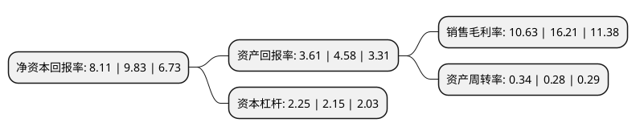

> 本页面由自动化程序生成于 2022年5月20日 01:04
> 内容可能存在错误，如有bug请提交issue至：https://github.com/Eroleice/doc-pi/issues
{.is-warning}

# 上市公司基本情况

## 基本资料

湖北能源集团股份有限公司（以下简称“湖北能源”）成立于1993年03月09日，武汉市。于1998年05月19日在深交所主板上市。

湖北能源注册资本656,975.089万元，主要业务:能源投资，开发与管理，从事或投资的主要业务包括水电，火电，核电，新能源发电，天然气输配，煤炭贸易和金融投资。以下是详细信息：

- 公司名称: 湖北能源集团股份有限公司
- 股票代码: 000883.SZ
- 所在地: 湖北 - 武汉市
- 成立日期: 1993年03月09日
- 注册资本: 656,975.089万元
- 法定代表人: 朱承军
- 主营业务: 能源投资，开发与管理，从事或投资的主要业务包括水电，火电，核电，新能源发电，天然气输配，煤炭贸易和金融投资
- 公司官网: www.hbny.com.cn
- 公司介绍: 公司主营业务为能源投资、开发与管理，从事或投资的主要业务包括水电、火电、核电、新能源发电、天然气输配、煤炭贸易和金融投资。目前已初步建成鄂西水电、鄂东火电及恩施齐岳山风电场等主要电力能源基地，逐步构建起湖北省天然气供应保障和煤炭储配网络，同时还投资参股长江证券、长源电力、湖北银行、长江财险等多家上市公司或金融企业。公司拥有水电、火电、风电和光伏发电等多种类型的发电机组，可发挥“水火互济”优势，平滑电力业务业绩受气候、季节影响的波动，保证了公司经营业绩的稳定。公司努力打造完整的产业价值链，抢占市场资源，降低生产成本，规避市场风险。通过股权置换、项目合作等多种方式，积极引入战略投资者，形成了煤炭储运、销售、发电，天然气上游开发、中游输配、下游发电、终端供热的完整产业链，提升了公司的核心竞争能力。近年来，公司先后荣获“全国五一劳动奖状”、“全国优秀基层党组织”、“中国服务业企业500强”、“湖北百强企业”、“湖北省工业先进企业”、“湖北省国有企业改革先进单位”、“湖北省守合同重信用企业”、“湖北省国有企业改革发展30周年优秀企业”、“湖北省最佳文明单位”等荣誉称号。

## 股东及高管情况

上市公司第一大股东为湖北省宏泰国有资本投资运营集团有限公司，持股1,776,634,330股，占比27.0426%，**疑似为**上市公司实际控制人。

截至2022年04月27日，上市公司的前十大股东中，共有9名机构股东，1个海外主体，其中5%以上大股东共有3名。上市公司前十大股东明细如下：

> 未能通过持股比例判定出上市公司实际控制人（持股30%以上）
> 可能存在通过间接持股、联合持股、协议控制等方式拥有实际控制权的主体，具体请参考上市公司定期公告！
{.is-warning}

> 截至2022年04月27日，上市公司前十大股东信息如下：

| 股东名称 | 持股数量（股） | 持股比例 |
| --- | --- | --- |
| 湖北省宏泰国有资本投资运营集团有限公司 | 1,776,634,330 | 27.0426% |
| 中国长江电力股份有限公司 | 1,649,828,593 | 25.1125% |
| 中国长江三峡集团有限公司 | 1,021,097,405 | 15.5424% |
| 国家能源投资集团有限责任公司 | 231,912,060 | 3.53% |
| 长电资本控股有限责任公司 | 212,328,040 | 3.2319% |
| 陕西煤业化工集团有限责任公司 | 202,676,864 | 3.085% |
| 三环集团有限公司 | 80,390,536 | 1.2236% |
| 中央汇金资产管理有限责任公司 | 46,223,800 | 0.7036% |
| 香港中央结算有限公司(陆股通) | 37,295,807 | 0.5677% |
| 长电投资管理有限责任公司 | 28,109,229 | 0.4279% |

## 利润表分析

上市公司2021年总收入为226.18亿元，净利润为24.04亿元，实现盈利。

## 杜邦分析

> 数据列示周期：2021年 | 2020年 | 2019年
{.is-info}

上市公司的净资产收益率在近一年有所下降，下降幅度为-17.5%，其变化情况分解如下：
- 上市公司的销售毛利率在近一年下降了-34.42%，可能是生产效率的下降、商品原材料价格上涨或商品价格的下跌所致。
- 上市公司的资产周转率在近一年上升了21.43%，可能是源自于更快的销售回款或库存管理效果提升。
- 上市公司的财务杠杆比率在近一年上升了4.65%，可能是增加负债扩大生产规模。

