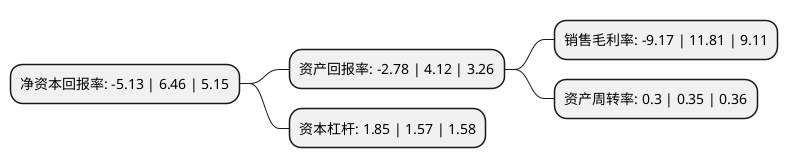

> 本页面由自动化程序生成于 2022年5月20日 01:04
> 内容可能存在错误，如有bug请提交issue至：https://github.com/Eroleice/doc-pi/issues
{.is-warning}

# 上市公司基本情况

## 基本资料

江西赣能股份有限公司（以下简称“赣能股份”）成立于1997年11月04日，南昌市。于1997年11月26日在深交所主板上市。

赣能股份注册资本97,567.776万元，主要业务:火力，水力发电。以下是详细信息：

- 公司名称: 江西赣能股份有限公司
- 股票代码: 000899.SZ
- 所在地: 江西 - 南昌市
- 成立日期: 1997年11月04日
- 注册资本: 97,567.776万元
- 法定代表人: 陈万波
- 主营业务: 火力，水力发电
- 公司官网: www.000899.com
- 公司介绍: 公司于1997年11月4日登记注册，公司主营业务为火力、水力发电，目前公司所属已投产运营火电厂一家、水电厂两家，总装机容量达上百万千瓦。公司所属火电厂丰城二期发电厂装机容量2×70万千瓦，位于江西省丰城市，两家水电厂居龙潭水电厂、抱子石水电厂装机容量分别为2×3万千瓦和2×2万千瓦，分别位于江西省赣州市和九江市修水县。公司丰电二期发电机组资产质量优良，技术先进，机组煤耗水平及发电效率等指标均处于江西省前列。近年来，丰电二期两台机组已陆续实施完毕脱硫、脱硝、电除尘、通流及超低排放改造，相关技术指标符合国家最新环保要求，位于江西省同类型火电机组的领先水平。

## 股东及高管情况

上市公司第一大股东为江西省投资集团有限公司，持股387,495,562股，占比39.72%，为上市公司实际控制人。

截至2022年03月31日，上市公司的前十大股东中，共有6名自然人股东，3名机构股东，1个海外主体，其中5%以上大股东共有2名。上市公司前十大股东明细如下：

> 截至2022年03月31日，上市公司前十大股东信息如下：

| 股东名称 | 持股数量（股） | 持股比例 |
| --- | --- | --- |
| 江西省投资集团有限公司 | 387,495,562 | 39.72% |
| 国投电力控股股份有限公司 | 329,000,000 | 33.72% |
| 陈杰锋 | 2,603,801 | 0.27% |
| 中信中证资本管理有限公司 | 2,210,770 | 0.23% |
| 谢润芳 | 2,033,800 | 0.21% |
| 欧阳克氙 | 2,023,700 | 0.21% |
| 杨子辉 | 1,880,000 | 0.19% |
| 孙妮 | 1,834,600 | 0.19% |
| MORGAN STANLEY & CO. INTERNATIONAL PLC. | 1,730,995 | 0.18% |
| 韩华勋 | 1,700,000 | 0.17% |

## 利润表分析

上市公司2021年总收入为26.99亿元，净利润为-2.48亿元，**未实现盈利**。

## 杜邦分析

> 数据列示周期：2021年 | 2020年 | 2019年
{.is-info}

上市公司的净资产收益率在近一年有所下降，下降幅度为-179.41%，其变化情况分解如下：
- 上市公司的销售毛利率在近一年下降了-177.65%，可能是生产效率的下降、商品原材料价格上涨或商品价格的下跌所致。
- 上市公司的资产周转率在近一年下降了-14.29%，可能是源自于更慢的销售回款或库存管理效果下降。
- 上市公司的财务杠杆比率在近一年上升了17.83%，可能是增加负债扩大生产规模。

