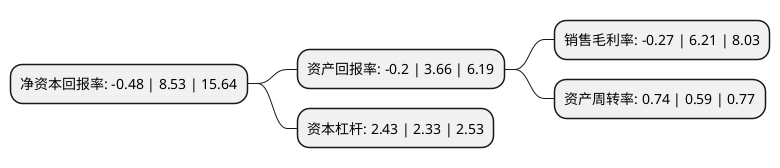

> 本页面由自动化程序生成于 2022年5月20日 01:04
> 内容可能存在错误，如有bug请提交issue至：https://github.com/Eroleice/doc-pi/issues
{.is-warning}

# 上市公司基本情况

## 基本资料

国家能源集团长源电力股份有限公司（以下简称“长源电力”）成立于1995年04月07日，武汉市。于2000年03月16日在深交所主板上市。

长源电力注册资本274,932.77万元，主要业务:电力，热力生产和销售。以下是详细信息：

- 公司名称: 国家能源集团长源电力股份有限公司
- 股票代码: 000966.SZ
- 所在地: 湖北 - 武汉市
- 成立日期: 1995年04月07日
- 注册资本: 274,932.77万元
- 法定代表人: 赵虎
- 主营业务: 电力，热力生产和销售
- 公司官网: www.cydl.com.cn
- 公司介绍: 公司是国家能源集团控股的上市公司。公司主营业务为电力、热力生产和销售，业务板块主要包括火电、风电和生物质耦合发电，所生产的电力全部输入湖北电网，热力主要供给当地企事业单位。目前公司的火力发电机组全部为300MW以上机组，经过技术改造，各机组能耗指标处于区域内先进水平并已全部具备供热能力。控股子公司生物质公司通过专利授权等方式积极开展生物质气化-再燃发电项目的推广、应用工作，该项目创新了国内生物质能的利用方式，技术达到了国际先进水平，具有良好的发展前景。公司连续多年荣获湖北省文明单位称号，深交所2017年度上市公司信息披露考核A级。

## 股东及高管情况

上市公司第一大股东为国家能源投资集团有限责任公司，持股1,855,817,730股，占比67.5%，为上市公司实际控制人。

截至2022年03月31日，上市公司的前十大股东中，共有1名自然人股东，7名机构股东，1个产品账户，1个海外主体，其中5%以上大股东共有1名。上市公司前十大股东明细如下：

> 截至2022年03月31日，上市公司前十大股东信息如下：

| 股东名称 | 持股数量（股） | 持股比例 |
| --- | --- | --- |
| 国家能源投资集团有限责任公司 | 1,855,817,730 | 67.5% |
| 湖北能源集团股份有限公司 | 68,651,925 | 2.5% |
| 中国华融资产管理股份有限公司 | 33,277,870 | 1.21% |
| 海通证券股份有限公司 | 33,111,480 | 1.2% |
| 上海斯诺波投资管理有限公司-鑫鑫三号私募证券投资基金 | 16,638,935 | 0.61% |
| 中国国际金融股份有限公司 | 11,980,032 | 0.44% |
| 湖北正源电力集团有限公司 | 10,006,242 | 0.36% |
| UBS AG | 9,183,979 | 0.33% |
| 王梓煜 | 8,319,467 | 0.3% |
| 国信证券股份有限公司 | 5,939,827 | 0.22% |

## 利润表分析

上市公司2021年总收入为121.63亿元，净利润为-0.33亿元，**未实现盈利**。

## 杜邦分析

> 数据列示周期：2021年 | 2020年 | 2019年
{.is-info}

上市公司的净资产收益率在近一年有所下降，下降幅度为-105.63%，其变化情况分解如下：
- 上市公司的销售毛利率在近一年下降了-104.35%，可能是生产效率的下降、商品原材料价格上涨或商品价格的下跌所致。
- 上市公司的资产周转率在近一年上升了25.42%，可能是源自于更快的销售回款或库存管理效果提升。
- 上市公司的财务杠杆比率在近一年上升了4.29%，可能是增加负债扩大生产规模。

