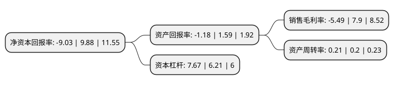

> 本页面由自动化程序生成于 2022年5月20日 01:23
> 内容可能存在错误，如有bug请提交issue至：https://github.com/Eroleice/doc-pi/issues
{.is-warning}

# 上市公司基本情况

## 基本资料

上海电力股份有限公司（以下简称“上海电力”）成立于1998年06月04日，上海市。于2003年10月29日在上交所主板上市。

上海电力注册资本261,716.42万元，主营业务:发电，供热，电力服务等。以下是详细信息：

- 公司名称: 上海电力股份有限公司
- 股票代码: 600021.SH
- 所在地: 上海 - 上海市
- 成立日期: 1998年06月04日
- 注册资本: 261,716.42万元
- 法定代表人: 胡建东
- 主营业务: 主营业务:发电，供热，电力服务等
- 公司官网: www.shanghaipower.com
- 公司介绍: 公司是国家电力投资集团有限公司最主要的上市公司之一，是上海最主要的电力能源企业之一，也是中国电力诞生的见证者，是中国电力大发展的参与者，是“奉献绿色能源，服务社会公众”的倡导者。公司致力于能源高效利用、清洁能源、新能源、综合智慧能源科技研发、电力供应和服务业等领域的发展。通过不断开拓、改革和创新，公司业务涵盖高效燃煤火力发电、燃气发电和风电、太阳能发电及分布式供能等领域；产业布局遍及全国，并逐步向海外开拓。公司主营业务包括发电、供热、电力服务等。公司产业辐射全国，上海漕泾电厂、安徽田集电厂等已经成为当地名牌发电企业，公司的新能源项目覆盖江苏、安徽、内蒙古等地区，电力服务市场已经开拓到山西、新疆、内蒙古等地。公司积极围绕上海卓越全球城市建设、保障电力清洁低碳安全高效供应、满足上海高品质能源转型需求，初步构建了以应用性技术创新为主的科创体系，展开超前性、实用性、产业性科技创新。公司除获得中诚信AAA最高等级信用评级外，国际三大信用评级机构惠誉、标普、穆迪分别给予公司BBB+、BBB和Baa2的主体国际信用投资级评级。

## 股东及高管情况

上市公司第一大股东为国家电力投资集团有限公司，持股1,052,008,626股，占比40.2%，为上市公司实际控制人。

截至2022年03月31日，上市公司的前十大股东中，共有4名机构股东，6个产品账户，其中5%以上大股东共有3名。上市公司前十大股东明细如下：

> 截至2022年03月31日，上市公司前十大股东信息如下：

| 股东名称 | 持股数量（股） | 持股比例 |
| --- | --- | --- |
| 国家电力投资集团有限公司 | 1,052,008,626 | 40.2% |
| 中国电力国际发展有限公司 | 363,292,165 | 13.88% |
| 中国长江三峡集团有限公司 | 160,852,800 | 6.15% |
| 中央汇金资产管理有限责任公司 | 33,874,600 | 1.29% |
| 广发基金-农业银行-广发中证金融资产管理计划 | 13,989,100 | 0.53% |
| 南方基金-农业银行-南方中证金融资产管理计划 | 13,989,100 | 0.53% |
| 银华基金-农业银行-银华中证金融资产管理计划 | 13,989,100 | 0.53% |
| 易方达基金-农业银行-易方达中证金融资产管理计划 | 13,989,100 | 0.53% |
| 中欧基金-农业银行-中欧中证金融资产管理计划 | 13,989,100 | 0.53% |
| 博时基金-农业银行-博时中证金融资产管理计划 | 13,989,100 | 0.53% |

## 利润表分析

上市公司2021年总收入为306.31亿元，净利润为-16.82亿元，**未实现盈利**。

## 杜邦分析

> 数据列示周期：2021年 | 2020年 | 2019年
{.is-info}

上市公司的净资产收益率在近一年有所下降，下降幅度为-191.4%，其变化情况分解如下：
- 上市公司的销售毛利率在近一年下降了-169.49%，可能是生产效率的下降、商品原材料价格上涨或商品价格的下跌所致。
- 上市公司的资产周转率在近一年上升了5%，可能是源自于更快的销售回款或库存管理效果提升。
- 上市公司的财务杠杆比率在近一年上升了23.51%，可能是增加负债扩大生产规模。

