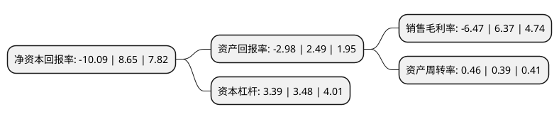

> 本页面由自动化程序生成于 2022年5月20日 01:23
> 内容可能存在错误，如有bug请提交issue至：https://github.com/Eroleice/doc-pi/issues
{.is-warning}

# 上市公司基本情况

## 基本资料

华电国际电力股份有限公司（以下简称“华电国际”）成立于1994年06月28日，济南市。于2005年02月03日在上交所主板上市。

华电国际注册资本986,985.822万元，利用现代化设备和技术，在全国范围内从事发电厂的开发，建设和运营，通过电厂所在电网电力公司和当地热力公司向用户提供可靠的电力和热力。以下是详细信息：

- 公司名称: 华电国际电力股份有限公司
- 股票代码: 600027.SH
- 所在地: 山东 - 济南市
- 成立日期: 1994年06月28日
- 注册资本: 986,985.822万元
- 法定代表人: 丁焕德
- 主营业务: 利用现代化设备和技术，在全国范围内从事发电厂的开发，建设和运营，通过电厂所在电网电力公司和当地热力公司向用户提供可靠的电力和热力
- 公司官网: www.hdpi.com.cn
- 公司介绍: 公司是中国最大型的综合性能源公司之一,主要业务为建设、经营发电厂和其它与发电相关的产业。本公司通过新建和收购，装机容量不断扩大.公司发电资产遍布全国多个省、市、自治区，主要处于电力、热力负荷中心或煤炭资源丰富区域。

## 股东及高管情况

上市公司第一大股东为中国华电集团有限公司，持股4,620,061,224股，占比46.81%，为上市公司实际控制人。

截至2022年03月31日，上市公司的前十大股东中，共有6名机构股东，3个产品账户，1个海外主体，其中5%以上大股东共有3名。上市公司前十大股东明细如下：

> 截至2022年03月31日，上市公司前十大股东信息如下：

| 股东名称 | 持股数量（股） | 持股比例 |
| --- | --- | --- |
| 中国华电集团有限公司 | 4,620,061,224 | 46.81% |
| 香港中央结算(代理人)有限公司 | 1,812,781,534 | 18.37% |
| 山东发展投资控股集团有限公司 | 757,226,729 | 7.67% |
| 中国证券金融股份有限公司 | 383,961,140 | 3.89% |
| 申能股份有限公司 | 130,510,000 | 1.32% |
| 兴业银行股份有限公司-兴全趋势投资混合型证券投资基金 | 83,894,224 | 0.85% |
| 中国工艺集团有限公司 | 80,145,600 | 0.81% |
| 中国农业银行股份有限公司-广发均衡优选混合型证券投资基金 | 77,016,296 | 0.78% |
| 中央汇金资产管理有限责任公司 | 76,249,700 | 0.77% |
| 兴业银行股份有限公司-广发稳健优选六个月持有期混合型证券投资基金 | 44,167,878 | 0.45% |

## 利润表分析

上市公司2021年总收入为1,044.22亿元，净利润为-67.55亿元，**未实现盈利**。

## 杜邦分析

> 数据列示周期：2021年 | 2020年 | 2019年
{.is-info}

上市公司的净资产收益率在近一年有所下降，下降幅度为-216.65%，其变化情况分解如下：
- 上市公司的销售毛利率在近一年下降了-201.57%，可能是生产效率的下降、商品原材料价格上涨或商品价格的下跌所致。
- 上市公司的资产周转率在近一年上升了17.95%，可能是源自于更快的销售回款或库存管理效果提升。
- 上市公司的财务杠杆比率在近一年下降了-2.59%，可能是减少负债降低财务费用。

