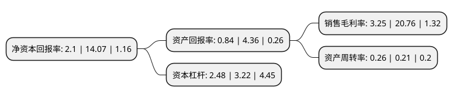

> 本页面由自动化程序生成于 2022年5月20日 01:24
> 内容可能存在错误，如有bug请提交issue至：https://github.com/Eroleice/doc-pi/issues
{.is-warning}

# 上市公司基本情况

## 基本资料

永泰能源股份有限公司（以下简称“永泰能源”）成立于1992年07月30日，晋中市。于1998年05月13日在上交所主板上市。

永泰能源注册资本2,221,776.415万元，主营业务:煤矿及其他矿山投资，煤炭洗选加工，电厂投资，新能源开发与投资等。以下是详细信息：

- 公司名称: 永泰能源股份有限公司
- 股票代码: 600157.SH
- 所在地: 山西 - 晋中市
- 成立日期: 1992年07月30日
- 注册资本: 2,221,776.415万元
- 法定代表人: 王广西
- 主营业务: 主营业务:煤矿及其他矿山投资，煤炭洗选加工，电厂投资，新能源开发与投资等
- 公司官网: www.wtecl.com/www.永泰能源.中国
- 公司介绍: 公司是一家在上海证券交易所上市的综合能源类企业，公司的主营业务为：电力业务和煤炭业务。公司已实现了由单一煤炭产业向综合能源企业的转型，产业布局已完成由山西、陕西等中西部地区向广东、江苏等沿海地区跨区域、全国性拓展，有力的提升了公司盈利能力和核心竞争力。公司先后获得了“山西省资本市场先进单位”、“山西省社会责任先进单位”、“山西上市公司金飞翼奖”等荣誉称号。

## 股东及高管情况

上市公司第一大股东为永泰集团有限公司，持股4,027,292,382股，占比18.13%，**疑似为**上市公司实际控制人。

截至2022年03月31日，上市公司的前十大股东中，共有9名机构股东，1个产品账户，其中5%以上大股东共有1名。上市公司前十大股东明细如下：

> 未能通过持股比例判定出上市公司实际控制人（持股30%以上）
> 可能存在通过间接持股、联合持股、协议控制等方式拥有实际控制权的主体，具体请参考上市公司定期公告！
{.is-warning}

> 截至2022年03月31日，上市公司前十大股东信息如下：

| 股东名称 | 持股数量（股） | 持股比例 |
| --- | --- | --- |
| 永泰集团有限公司 | 4,027,292,382 | 18.13% |
| 永泰能源股份有限公司破产企业财产处置专用账户 | 861,428,518 | 3.88% |
| 平安银行股份有限公司 | 659,898,476 | 2.97% |
| 襄垣县襄银投资合伙企业(有限合伙) | 417,865,240 | 1.88% |
| 中信银行股份有限公司 | 397,102,307 | 1.79% |
| 嘉兴民安投资合伙企业(有限合伙) | 351,758,793 | 1.58% |
| 青岛诺德能源有限公司 | 329,949,240 | 1.49% |
| 中国东方资产管理股份有限公司江西省分公司 | 318,568,480 | 1.43% |
| 国海证券股份有限公司 | 250,804,792 | 1.13% |
| 中国邮政储蓄银行股份有限公司 | 144,808,365 | 0.65% |

## 利润表分析

上市公司2021年总收入为270.8亿元，净利润为8.8亿元，实现盈利。

## 杜邦分析

> 数据列示周期：2021年 | 2020年 | 2019年
{.is-info}

上市公司的净资产收益率在近一年有所下降，下降幅度为-85.07%，其变化情况分解如下：
- 上市公司的销售毛利率在近一年下降了-84.34%，可能是生产效率的下降、商品原材料价格上涨或商品价格的下跌所致。
- 上市公司的资产周转率在近一年上升了23.81%，可能是源自于更快的销售回款或库存管理效果提升。
- 上市公司的财务杠杆比率在近一年下降了-22.98%，可能是减少负债降低财务费用。

