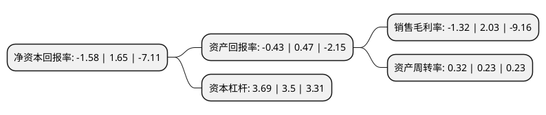

> 本页面由自动化程序生成于 2022年5月20日 01:27
> 内容可能存在错误，如有bug请提交issue至：https://github.com/Eroleice/doc-pi/issues
{.is-warning}

# 上市公司基本情况

## 基本资料

新疆天富能源股份有限公司（以下简称“天富能源”）成立于1999年03月28日，石河子市。于2002年02月28日在上交所主板上市。

天富能源注册资本115,141.502万元，主要产品:电，热。以下是详细信息：

- 公司名称: 新疆天富能源股份有限公司
- 股票代码: 600509.SH
- 所在地: 新疆 - 石河子市
- 成立日期: 1999年03月28日
- 注册资本: 115,141.502万元
- 法定代表人: 刘伟
- 主营业务: 主要产品:电，热
- 公司官网: www.tfny.com
- 公司介绍: 公司主营电、热、天然气生产供应，作为新疆石河子市地区的基础能源支柱企业，公司在实现自身超常规跨越式发展，做大做强电热市场的同时，围绕公司资源优势，积极调整产业结构，全力推进电热源(网)、多元化产业、高科技以及循环经济四大项目建设，形成了“电热为主，多元发展、控股管理、自主经营”的经营格局。公司拥有经国家人事部批准设立的企业博士后科研工作站，与中科院物理所、华东理工大学、石河子大学等国内多所著名高等院校、科研院所建立了技术交流与合作关系。未来，公司将以满足师市及周边地区经济发展需求为重点，大力加快电、热源建设项目。

## 股东及高管情况

上市公司第一大股东为新疆天富集团有限责任公司，持股459,231,020股，占比39.88%，为上市公司实际控制人。

截至2022年03月31日，上市公司的前十大股东中，共有1名自然人股东，5名机构股东，4个产品账户，其中5%以上大股东共有1名。上市公司前十大股东明细如下：

> 截至2022年03月31日，上市公司前十大股东信息如下：

| 股东名称 | 持股数量（股） | 持股比例 |
| --- | --- | --- |
| 新疆天富集团有限责任公司 | 459,231,020 | 39.88% |
| 石河子城市建设投资集团有限公司 | 25,310,206 | 2.2% |
| 金石期货有限公司-中新建招商股权投资有限公司 | 21,770,704 | 1.89% |
| 石河子市天信投资发展有限公司 | 14,044,720 | 1.22% |
| 蒋安奕 | 9,022,037 | 0.78% |
| 珠海回声资产管理有限公司-回声1号私募基金 | 8,300,000 | 0.72% |
| 八师石河子现代农业投资有限公司 | 7,893,888 | 0.69% |
| 博时基金-农业银行-博时中证金融资产管理计划 | 6,823,400 | 0.59% |
| 中欧基金-农业银行-中欧中证金融资产管理计划 | 6,823,400 | 0.59% |
| 南方基金-农业银行-南方中证金融资产管理计划 | 6,155,500 | 0.53% |

## 利润表分析

上市公司2021年总收入为70.65亿元，净利润为-0.94亿元，**未实现盈利**。

## 杜邦分析

> 数据列示周期：2021年 | 2020年 | 2019年
{.is-info}

上市公司的净资产收益率在近一年有所下降，下降幅度为-195.76%，其变化情况分解如下：
- 上市公司的销售毛利率在近一年下降了-165.02%，可能是生产效率的下降、商品原材料价格上涨或商品价格的下跌所致。
- 上市公司的资产周转率在近一年上升了39.13%，可能是源自于更快的销售回款或库存管理效果提升。
- 上市公司的财务杠杆比率在近一年上升了5.43%，可能是增加负债扩大生产规模。

