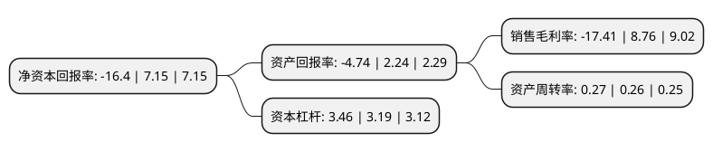

> 本页面由自动化程序生成于 2022年5月20日 01:27
> 内容可能存在错误，如有bug请提交issue至：https://github.com/Eroleice/doc-pi/issues
{.is-warning}

# 上市公司基本情况

## 基本资料

北京京能电力股份有限公司（以下简称“京能电力”）成立于2000年03月10日，北京市。于2002年05月10日在上交所主板上市。

京能电力注册资本668,374.739万元，主要产品:发电量，供热量，脱硫副产品(石膏)。以下是详细信息：

- 公司名称: 北京京能电力股份有限公司
- 股票代码: 600578.SH
- 所在地: 北京 - 北京市
- 成立日期: 2000年03月10日
- 注册资本: 668,374.739万元
- 法定代表人: 任启贵
- 主营业务: 主要产品:发电量，供热量，脱硫副产品(石膏)
- 公司官网: www.jingnengpower.com
- 公司介绍: 公司是北京地区最大的火力发电企业之一，主营生产、销售电力、热力产品、电力设备运行，发电设备检测、修理、脱硫石膏销售等，产品为电力和热力。公司具有独立完整的业务及面向市场独立经营的能力，拥有独立的采购、生产及辅助系统和相关配套设施，电力产品直接输送到京津唐电网。公司将继续抓住煤炭市场相对缓和的有利时机，提高库存，努力降低标煤单价，确保燃料供应稳定。公司将继续依托京能集团的强力支持，发挥装机规模化、设备健康及区域布局合理等优势，继续完善治理结构、内控体系，积极拓展项目资源，以持续提升的业绩确保公司市值的稳步增长。

## 股东及高管情况

上市公司第一大股东为北京京能国际能源股份有限公司，持股2,869,161,970股，占比42.92%，为上市公司实际控制人。

截至2022年03月31日，上市公司的前十大股东中，共有1名自然人股东，6名机构股东，3个产品账户，其中5%以上大股东共有4名。上市公司前十大股东明细如下：

> 截至2022年03月31日，上市公司前十大股东信息如下：

| 股东名称 | 持股数量（股） | 持股比例 |
| --- | --- | --- |
| 北京京能国际能源股份有限公司 | 2,869,161,970 | 42.92% |
| 北京能源集团有限责任公司 | 1,598,336,144 | 23.91% |
| 中国人寿保险股份有限公司-分红-个人分红-005L-FH002沪 | 431,432,509 | 6.45% |
| 山西国际电力集团有限公司 | 424,686,128 | 6.35% |
| 中国人寿保险股份有限公司-传统-普通保险产品-005L-CT001沪 | 299,589,763 | 4.48% |
| 李卓 | 96,703,098 | 1.45% |
| 国泰君安证券资管-申能股份有限公司-国君资管3012单一资产管理计划 | 72,340,000 | 1.08% |
| 哈尔滨市道里区慈善基金会 | 32,314,871 | 0.48% |
| 中央汇金资产管理有限责任公司 | 26,063,300 | 0.39% |
| 哈尔滨哈道投资管理有限公司 | 18,841,700 | 0.28% |

## 利润表分析

上市公司2021年总收入为222.36亿元，净利润为-38.73亿元，**未实现盈利**。

## 杜邦分析

> 数据列示周期：2021年 | 2020年 | 2019年
{.is-info}

上市公司的净资产收益率在近一年有所下降，下降幅度为-329.37%，其变化情况分解如下：
- 上市公司的销售毛利率在近一年下降了-298.74%，可能是生产效率的下降、商品原材料价格上涨或商品价格的下跌所致。
- 上市公司的资产周转率在近一年上升了3.85%，可能是源自于更快的销售回款或库存管理效果提升。
- 上市公司的财务杠杆比率在近一年上升了8.46%，可能是增加负债扩大生产规模。

