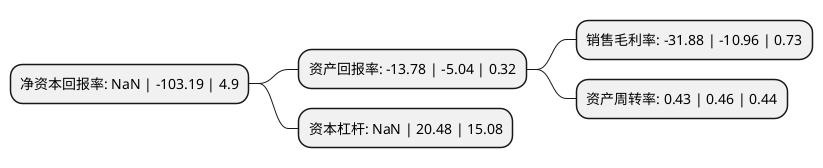

> 本页面由自动化程序生成于 2022年5月20日 01:28
> 内容可能存在错误，如有bug请提交issue至：https://github.com/Eroleice/doc-pi/issues
{.is-warning}

# 上市公司基本情况

## 基本资料

华电能源股份有限公司（以下简称“*ST华源”）成立于1996年10月28日，哈尔滨市。于1996年07月01日在上交所主板上市。

*ST华源注册资本196,667.515万元，主要产品:电力，热力以下是详细信息：

- 公司名称: 华电能源股份有限公司
- 股票代码: 600726.SH
- 所在地: 黑龙江 - 哈尔滨市
- 成立日期: 1996年10月28日
- 注册资本: 196,667.515万元
- 法定代表人: 董凤亮
- 主营业务: 主要产品:电力，热力
- 公司官网: www.hdenergy.com
- 公司介绍: 公司是中国华电集团公司控股拥有的国内最早的国有大型电力上市公司，是黑龙江省和电力工业部的股份制试点企业，主营业务为发电、供热和电表销售，是哈尔滨市、齐齐哈尔市、牡丹江市和佳木斯市等主要大中城市的供热主体。在龙江地区占据较大的发电、供热市场份额，具有较强的整体竞争优势。公司加快推进结构调整和战略转型，确立了“电热为主、煤为基础、工程技术、产业协同”的发展战略。通过几年来的调整优化，目前公司已全面形成了发电、供热、煤炭、工程技术等支柱产业协同发展的良好格局。各产业协同效应和整体优势初步显现，有效地促进了公司系统管理效益双提升。

## 股东及高管情况

上市公司第一大股东为中国华电集团有限公司，持股881,126,465股，占比44.8%，为上市公司实际控制人。

截至2022年04月22日，上市公司的前十大股东中，共有8名自然人股东，2名机构股东，其中5%以上大股东共有1名。上市公司前十大股东明细如下：

> 截至2022年04月22日，上市公司前十大股东信息如下：

| 股东名称 | 持股数量（股） | 持股比例 |
| --- | --- | --- |
| 中国华电集团有限公司 | 881,126,465 | 44.8% |
| 林文新 | 16,979,212 | 0.86% |
| 赵睿 | 12,860,800 | 0.65% |
| 李小妹 | 12,012,009 | 0.61% |
| 李革 | 10,561,790 | 0.54% |
| 黑龙江省新产业投资集团有限公司 | 8,986,134 | 0.46% |
| 徐莉蓉 | 6,358,400 | 0.32% |
| 何强 | 5,551,100 | 0.28% |
| 刘小东 | 5,225,800 | 0.27% |
| 陈才林 | 5,210,737 | 0.26% |

## 利润表分析

上市公司2021年总收入为98.01亿元，净利润为-31.26亿元，**未实现盈利**。

## 杜邦分析

> 数据列示周期：2021年 | 2020年 | 2019年
{.is-info}

上市公司的净资产收益率在近一年有所下降，下降幅度为NaN%，其变化情况分解如下：
- 上市公司的销售毛利率在近一年上升了190.88%，可能是生产效率的提升、商品原材料价格下跌或商品价格的上涨所致。
- 上市公司的资产周转率在近一年下降了-6.52%，可能是源自于更慢的销售回款或库存管理效果下降。
- 上市公司的财务杠杆比率在近一年下降了NaN%，可能是减少负债降低财务费用。

