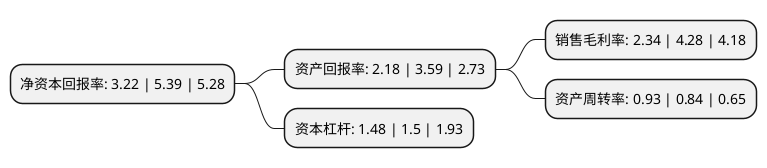

> 本页面由自动化程序生成于 2022年5月20日 01:29
> 内容可能存在错误，如有bug请提交issue至：https://github.com/Eroleice/doc-pi/issues
{.is-warning}

# 上市公司基本情况

## 基本资料

山西通宝能源股份有限公司（以下简称“通宝能源”）成立于1992年08月28日，太原市。于1996年12月05日在上交所主板上市。

通宝能源注册资本114,650.252万元，主营业务包括:火力发电，配电业务及燃气业务等。以下是详细信息：

- 公司名称: 山西通宝能源股份有限公司
- 股票代码: 600780.SH
- 所在地: 山西 - 太原市
- 成立日期: 1992年08月28日
- 注册资本: 114,650.252万元
- 法定代表人: 宣宏斌
- 主营业务: 主营业务包括:火力发电，配电业务及燃气业务等
- 公司官网: www.600780.com.cn
- 公司介绍: 公司主营火力发电，是国内大型综合能源企业之一。通过多年发展公司由单一火电业务转型为综合能源公司，控股股东拥有的燃气、新能源等政策支持的节能环保项目将成为公司盈利增长来源。公司通过股权变更、资产重组、股权分置、市场再融资等各种资本运作方式，逐步成长为主营业务明确、公司治理优良、业务稳健运行的能源类企业。公司被中国电力企业联合会评为“中国电力优秀企业”；公司股票入选上海证券交易所上证380指数样本股；公司荣获山西证监局“山西资本市场优秀上市公司”等多个奖项；公司持续入选上证公司治理板块样本股。

## 股东及高管情况

上市公司第一大股东为中央汇金资产管理有限责任公司，持股14,836,600股，占比1.29%，**疑似为**上市公司实际控制人。

截至2022年03月31日，上市公司的前十大股东中，共有1名自然人股东，2名机构股东，7个产品账户。上市公司前十大股东明细如下：

> 未能通过持股比例判定出上市公司实际控制人（持股30%以上）
> 可能存在通过间接持股、联合持股、协议控制等方式拥有实际控制权的主体，具体请参考上市公司定期公告！
{.is-warning}

> 上市公司第一大股东持股不超过10%，请检查是否存在公司控制权风险！
{.is-danger}

> 截至2022年03月31日，上市公司前十大股东信息如下：

| 股东名称 | 持股数量（股） | 持股比例 |
| --- | --- | --- |
| 中央汇金资产管理有限责任公司 | 14,836,600 | 1.29% |
| 山西统配煤炭经销有限公司 | 11,973,658 | 1.04% |
| 北京默名资产管理有限公司-默名融智阳光12期基金 | 5,367,000 | 0.47% |
| 梁玉丽 | 5,142,400 | 0.45% |
| 银华基金-农业银行-银华中证金融资产管理计划 | 4,968,800 | 0.43% |
| 广发基金-农业银行-广发中证金融资产管理计划 | 4,968,800 | 0.43% |
| 中欧基金-农业银行-中欧中证金融资产管理计划 | 4,968,800 | 0.43% |
| 南方基金-农业银行-南方中证金融资产管理计划 | 4,968,800 | 0.43% |
| 易方达基金-农业银行-易方达中证金融资产管理计划 | 4,968,800 | 0.43% |
| 博时基金-农业银行-博时中证金融资产管理计划 | 4,968,800 | 0.43% |

## 利润表分析

上市公司2021年总收入为78.3亿元，净利润为1.83亿元，实现盈利。

## 杜邦分析

> 数据列示周期：2021年 | 2020年 | 2019年
{.is-info}

上市公司的净资产收益率在近一年有所下降，下降幅度为-40.26%，其变化情况分解如下：
- 上市公司的销售毛利率在近一年下降了-45.33%，可能是生产效率的下降、商品原材料价格上涨或商品价格的下跌所致。
- 上市公司的资产周转率在近一年上升了10.71%，可能是源自于更快的销售回款或库存管理效果提升。
- 上市公司的财务杠杆比率在近一年下降了-1.33%，可能是减少负债降低财务费用。

