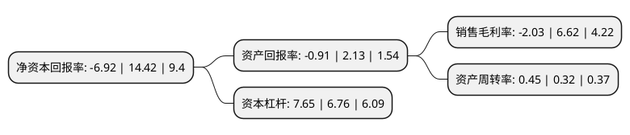

> 本页面由自动化程序生成于 2022年5月20日 01:29
> 内容可能存在错误，如有bug请提交issue至：https://github.com/Eroleice/doc-pi/issues
{.is-warning}

# 上市公司基本情况

## 基本资料

国电电力发展股份有限公司（以下简称“国电电力”）成立于1992年12月31日，大连市。于1997年03月18日在上交所主板上市。

国电电力注册资本1,783,561.908万元，主要产品:电力。以下是详细信息：

- 公司名称: 国电电力发展股份有限公司
- 股票代码: 600795.SH
- 所在地: 辽宁 - 大连市
- 成立日期: 1992年12月31日
- 注册资本: 1,783,561.908万元
- 法定代表人: 刘国跃
- 主营业务: 主要产品:电力
- 公司官网: www.600795.com.cn
- 公司介绍: 公司是中国国电集团公司控股的全国性上市发电公司，是中国国电集团公司在资本市场的直接融资窗口和实施整体改制的平台。公司资产结构优良，所属企业分布东北、华北、华东、华南、西南、西北等多个省、市、自治区。近年来，国电电力始终坚持科学发展，突出质量效益，做强做优主业，推动转型升级，公司电源结构和布局得到持续优化。公司近年来先后入选上证50指数、上证180指数、沪深300指数和《福布斯》首批世界最受信赖公司榜单，保持着国内A股绩优蓝筹股地位，先后荣获中国上市公司百强、金牛上市公司百强、典型并购重组案例奖、上海证券交易所年度董事会奖、最受投资者尊重的上市公司等资本市场重要奖项、全国电力行业优秀企业、企业信用评价AAA级信用企业、中国电力信息化标杆企业、中国电力信息化推进示范单位等荣誉称号。

## 股东及高管情况

上市公司第一大股东为国家能源投资集团有限责任公司，持股9,038,709,571股，占比50.68%，为上市公司实际控制人。

截至2022年03月31日，上市公司的前十大股东中，共有3名机构股东，6个产品账户，1个海外主体，其中5%以上大股东共有2名。上市公司前十大股东明细如下：

> 截至2022年03月31日，上市公司前十大股东信息如下：

| 股东名称 | 持股数量（股） | 持股比例 |
| --- | --- | --- |
| 国家能源投资集团有限责任公司 | 9,038,709,571 | 50.68% |
| 中国证券金融股份有限公司 | 896,934,967 | 5.03% |
| 香港中央结算有限公司(陆股通) | 304,867,776 | 1.71% |
| 中央汇金资产管理有限责任公司 | 209,375,400 | 1.17% |
| 华夏基金-农业银行-华夏中证金融资产管理计划 | 142,500,300 | 0.8% |
| 南方基金-农业银行-南方中证金融资产管理计划 | 142,500,300 | 0.8% |
| 易方达基金-农业银行-易方达中证金融资产管理计划 | 142,500,300 | 0.8% |
| 工银瑞信基金-农业银行-工银瑞信中证金融资产管理计划 | 142,500,300 | 0.8% |
| 中欧基金-农业银行-中欧中证金融资产管理计划 | 142,500,300 | 0.8% |
| 嘉实基金-农业银行-嘉实中证金融资产管理计划 | 142,500,300 | 0.8% |

## 利润表分析

上市公司2021年总收入为1,681.85亿元，净利润为-34.18亿元，**未实现盈利**。

## 杜邦分析

> 数据列示周期：2021年 | 2020年 | 2019年
{.is-info}

上市公司的净资产收益率在近一年有所下降，下降幅度为-147.99%，其变化情况分解如下：
- 上市公司的销售毛利率在近一年下降了-130.66%，可能是生产效率的下降、商品原材料价格上涨或商品价格的下跌所致。
- 上市公司的资产周转率在近一年上升了40.63%，可能是源自于更快的销售回款或库存管理效果提升。
- 上市公司的财务杠杆比率在近一年上升了13.17%，可能是增加负债扩大生产规模。

