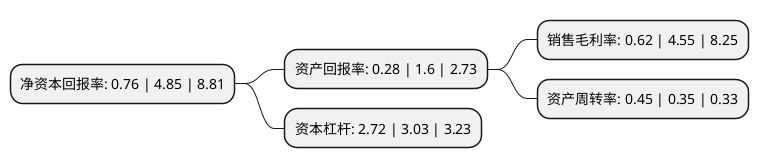

> 本页面由自动化程序生成于 2022年5月20日 01:29
> 内容可能存在错误，如有bug请提交issue至：https://github.com/Eroleice/doc-pi/issues
{.is-warning}

# 上市公司基本情况

## 基本资料

内蒙古蒙电华能热电股份有限公司（以下简称“内蒙华电”）成立于1994年05月12日，呼和浩特市。于1994年05月20日在上交所主板上市。

内蒙华电注册资本652,688.781万元，电力，热力以下是详细信息：

- 公司名称: 内蒙古蒙电华能热电股份有限公司
- 股票代码: 600863.SH
- 所在地: 内蒙古 - 呼和浩特市
- 成立日期: 1994年05月12日
- 注册资本: 652,688.781万元
- 法定代表人: 高原
- 主营业务: 电力，热力
- 公司官网: www.nmhdwz.com
- 公司介绍: 公司是1993年经内蒙古自治区人民政府批准以包头第二热电厂为基础改制，由内蒙古电力(集团)有限责任公司、中国华能集团公司等作为发起人以社会募集方式设立，是内蒙古自治区第一家上市公司。公司主营火力发电、供应，蒸汽、热水的生产、供应、销售维护和管理；风力发电以及其他新能源发电和供应；对煤炭铁路及配套基础设施项目的投资、对煤化工、煤炭深加工行业投资、建设、运营管理，对石灰石等与电力生产相关的原材投资。公司涉足风电项目的开发，目前已开始风电项目建设，并规划储备了后续风电项目。

## 股东及高管情况

上市公司第一大股东为北方联合电力有限责任公司，持股3,305,473,803股，占比50.64%，为上市公司实际控制人。

截至2022年03月31日，上市公司的前十大股东中，共有2名机构股东，8个产品账户，其中5%以上大股东共有1名。上市公司前十大股东明细如下：

> 截至2022年03月31日，上市公司前十大股东信息如下：

| 股东名称 | 持股数量（股） | 持股比例 |
| --- | --- | --- |
| 北方联合电力有限责任公司 | 3,305,473,803 | 50.64% |
| 天津华人投资管理有限公司-华能结构调整1号证券投资私募基金 | 129,740,140 | 1.99% |
| 中国农业银行股份有限公司-广发均衡优选混合型证券投资基金 | 82,561,665 | 1.26% |
| 中国建设银行股份有限公司-前海开源公用事业行业股票型证券投资基金 | 70,801,102 | 1.08% |
| 中国工商银行股份有限公司-广发价值优势混合型证券投资基金 | 50,591,615 | 0.78% |
| 中信证券股份有限公司-社保基金1106组合 | 49,589,300 | 0.76% |
| 中国工商银行股份有限公司-前海开源新经济灵活配置混合型证券投资基金 | 47,804,851 | 0.73% |
| 兴业银行股份有限公司-广发稳健优选六个月持有期混合型证券投资基金 | 46,665,983 | 0.71% |
| 中国工商银行股份有限公司-广发瑞誉一年持有期混合型证券投资基金 | 46,457,789 | 0.71% |
| 中央汇金资产管理有限责任公司 | 41,648,800 | 0.64% |

## 利润表分析

上市公司2021年总收入为189.33亿元，净利润为1.17亿元，实现盈利。

## 杜邦分析

> 数据列示周期：2021年 | 2020年 | 2019年
{.is-info}

上市公司的净资产收益率在近一年有所下降，下降幅度为-84.33%，其变化情况分解如下：
- 上市公司的销售毛利率在近一年下降了-86.37%，可能是生产效率的下降、商品原材料价格上涨或商品价格的下跌所致。
- 上市公司的资产周转率在近一年上升了28.57%，可能是源自于更快的销售回款或库存管理效果提升。
- 上市公司的财务杠杆比率在近一年下降了-10.23%，可能是减少负债降低财务费用。

