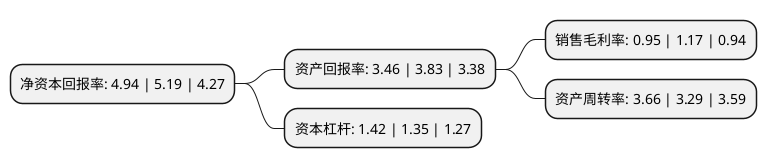

> 本页面由自动化程序生成于 2022年5月20日 01:28
> 内容可能存在错误，如有bug请提交issue至：https://github.com/Eroleice/doc-pi/issues
{.is-warning}

# 上市公司基本情况

## 基本资料

云南云维股份有限公司（以下简称“云维股份”）成立于1996年06月26日，昆明市。于1996年07月02日在上交所主板上市。

云维股份注册资本123,247万元，聚乙烯醇，醋酸乙烯，电石，焦炭，甲醇，煤焦油及深加工产品，纯碱，氯化铵，水泥等。以下是详细信息：

- 公司名称: 云南云维股份有限公司
- 股票代码: 600725.SH
- 所在地: 云南 - 昆明市
- 成立日期: 1996年06月26日
- 注册资本: 123,247万元
- 法定代表人: 蔡大为
- 主营业务: 聚乙烯醇，醋酸乙烯，电石，焦炭，甲醇，煤焦油及深加工产品，纯碱，氯化铵，水泥等
- 公司官网: null
- 公司介绍: 公司主营有机化工，公司拥有年产400万吨焦炭、40万吨甲醇、15万吨炭焦和5万顺酐的生产装置，公司物流设施齐备，装置装备基础条件好，在侧装大容积焦炉炼焦综合技术、气体净化转化合成技术、循环流化床锅炉热电联产技术等方面具有一定实力和优势，5.5米侧装捣固焦炉炼焦和焦炉气纯氧转化制甲醇等技术为国内首家规模化生产企业。公司产品广泛应用于化工、纺织、建材、造纸、医药、涂料等行业。“云维”牌聚乙烯醇(PVA)和“珠源”牌纯碱为“云南名牌产品”,且“云维”牌聚乙烯醇(PVA)荣获“湖北市场畅销产品”及“质量信得过产品”证书。公司致力发展乙炔化工，企业名列“中国最大化纤企业100强”，是云南省重要的有机化工生产基地。

## 股东及高管情况

上市公司第一大股东为云南省能源投资集团有限公司，持股357,258,744股，占比28.99%，**疑似为**上市公司实际控制人。

截至2022年03月31日，上市公司的前十大股东中，共有1名自然人股东，8名机构股东，1个产品账户，其中5%以上大股东共有1名。上市公司前十大股东明细如下：

> 未能通过持股比例判定出上市公司实际控制人（持股30%以上）
> 可能存在通过间接持股、联合持股、协议控制等方式拥有实际控制权的主体，具体请参考上市公司定期公告！
{.is-warning}

> 截至2022年03月31日，上市公司前十大股东信息如下：

| 股东名称 | 持股数量（股） | 持股比例 |
| --- | --- | --- |
| 云南省能源投资集团有限公司 | 357,258,744 | 28.99% |
| 中国农业银行股份有限公司云南省分行 | 52,396,372 | 4.25% |
| 张光武 | 32,400,000 | 2.63% |
| 云南煤化工集团有限公司破产企业专用财产处置账户 | 24,517,376 | 1.99% |
| 华夏银行股份有限公司昆明分行 | 20,773,000 | 1.69% |
| 中国建设银行股份有限公司云南省分行 | 18,933,485 | 1.54% |
| 交通银行股份有限公司 | 18,925,836 | 1.54% |
| 上海浦东发展银行股份有限公司昆明分行 | 16,511,204 | 1.34% |
| 云南省投资控股集团有限公司 | 14,793,683 | 1.2% |
| 中国工商银行股份有限公司沾益支行 | 13,797,526 | 1.12% |

## 杜邦分析

> 数据列示周期：2021年 | 2020年 | 2019年
{.is-info}

上市公司的净资产收益率在近一年有所下降，下降幅度为-4.82%，其变化情况分解如下：
- 上市公司的销售毛利率在近一年下降了-18.8%，可能是生产效率的下降、商品原材料价格上涨或商品价格的下跌所致。
- 上市公司的资产周转率在近一年上升了11.25%，可能是源自于更快的销售回款或库存管理效果提升。
- 上市公司的财务杠杆比率在近一年上升了5.19%，可能是增加负债扩大生产规模。

