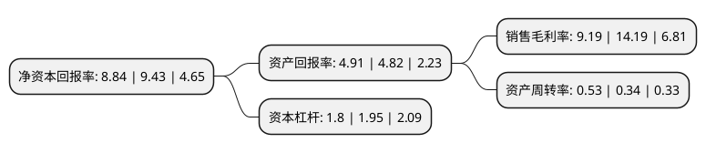

> 本页面由自动化程序生成于 2022年5月20日 01:28
> 内容可能存在错误，如有bug请提交issue至：https://github.com/Eroleice/doc-pi/issues
{.is-warning}

# 上市公司基本情况

## 基本资料

山西焦化股份有限公司（以下简称“山西焦化”）成立于1996年08月02日，临汾市。于1996年08月08日在上交所主板上市。

山西焦化注册资本256,212.115万元，焦炭，其他化工产品。以下是详细信息：

- 公司名称: 山西焦化股份有限公司
- 股票代码: 600740.SH
- 所在地: 山西 - 临汾市
- 成立日期: 1996年08月02日
- 注册资本: 256,212.115万元
- 法定代表人: 李峰
- 主营业务: 焦炭，其他化工产品
- 公司官网: www.sxjh.com.cn
- 公司介绍: 公司是一家对煤进行深加工，集炼焦生产、煤焦油及苯类加工、化肥、甲醇、精细化工、电子科技、化工设计、建筑安装、对外参股等为一体的煤炭综合利用企业，是全国82家循环经济试点企业和山西省重点发展优势企业。公司产品先后通过ISO9001质量体系认证及ISO9002换证、ISO14001环境管理体系认证和OHSMS职业健康安全管理体系认证、并获得英国皇家认可委员会认可的UKAS证书。一直以来，公司规范企业运作，先后获得了“全国‘五·一’劳动奖状”、“全国现场管理先进企业”、“全国环境保护先进企业”、“全国煤炭综合利用与多种经营先进企业”、“中国AAA级重质量守信誉企业”、“全国思想政治工作优秀企业”、“全国模范职工之家”和“山西省管理示范企业”、“山西省最佳企业”等荣誉称号。公司努力建设资源节约型、环境友好型企业，实现煤化工产业的转型和升级，全力打造煤焦化循环经济园区。2018年公司收购中煤华晋49%股权,获得上游优质煤炭企业的长期股权投资收益，实现公司经营业绩从焦化行业扩展到煤焦行业联动，体现行业协同效应，分散公司行业经营风险，提升公司运营效率和盈利水平。

## 股东及高管情况

上市公司第一大股东为山西焦化集团有限公司，持股1,310,317,574股，占比51.14%，为上市公司实际控制人。

截至2022年03月31日，上市公司的前十大股东中，共有1名自然人股东，2名机构股东，6个产品账户，1个海外主体，其中5%以上大股东共有2名。上市公司前十大股东明细如下：

> 截至2022年03月31日，上市公司前十大股东信息如下：

| 股东名称 | 持股数量（股） | 持股比例 |
| --- | --- | --- |
| 山西焦化集团有限公司 | 1,310,317,574 | 51.14% |
| 山西焦煤能源集团股份有限公司 | 148,796,880 | 5.81% |
| 香港中央结算有限公司(陆股通) | 35,507,992 | 1.39% |
| 上海珺容资产管理有限公司-珺容中子星2号私募证券投资基金 | 23,595,000 | 0.92% |
| 上海珺容资产管理有限公司-珺容珺越东启3号私募证券投资基金 | 23,595,000 | 0.92% |
| 李国辉 | 21,143,430 | 0.83% |
| 上海珺容资产管理有限公司-珺容珺越东启4号私募证券投资基金 | 18,525,000 | 0.72% |
| 上海珺容资产管理有限公司-珺容聚金4号私募证券投资基金 | 18,525,000 | 0.72% |
| 上海珺容资产管理有限公司-珺容中子星3号私募证券投资基金 | 9,405,029 | 0.37% |
| 上海珺容资产管理有限公司-珺容中子星5号私募证券投资基金 | 9,405,000 | 0.37% |

## 利润表分析

上市公司2021年总收入为112.26亿元，净利润为10.31亿元，实现盈利。

## 杜邦分析

> 数据列示周期：2021年 | 2020年 | 2019年
{.is-info}

上市公司的净资产收益率在近一年有所下降，下降幅度为-6.26%，其变化情况分解如下：
- 上市公司的销售毛利率在近一年下降了-35.24%，可能是生产效率的下降、商品原材料价格上涨或商品价格的下跌所致。
- 上市公司的资产周转率在近一年上升了55.88%，可能是源自于更快的销售回款或库存管理效果提升。
- 上市公司的财务杠杆比率在近一年下降了-7.69%，可能是减少负债降低财务费用。

