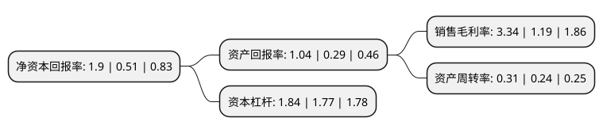

> 本页面由自动化程序生成于 2022年5月20日 01:30
> 内容可能存在错误，如有bug请提交issue至：https://github.com/Eroleice/doc-pi/issues
{.is-warning}

# 上市公司基本情况

## 基本资料

宝泰隆新材料股份有限公司（以下简称“宝泰隆”）成立于2003年06月24日，七台河市。于2011年03月09日在上交所主板上市。

宝泰隆注册资本191,566.454万元，主营业务为炼焦，焦炉煤气制甲醇，煤焦油加氢3(试生产阶段)。主要产品是焦炭及其他焦化产品，甲醇。以下是详细信息：

- 公司名称: 宝泰隆新材料股份有限公司
- 股票代码: 601011.SH
- 所在地: 黑龙江 - 七台河市
- 成立日期: 2003年06月24日
- 注册资本: 191,566.454万元
- 法定代表人: 焦云
- 主营业务: 主营业务为炼焦，焦炉煤气制甲醇，煤焦油加氢3(试生产阶段)主要产品是焦炭及其他焦化产品，甲醇
- 公司官网: www.btlgf.com
- 公司介绍: 公司是集新能源、纳米新材料、煤基石油化工、化工、发电、供热、煤炭开采和洗选加工于一体的大型股份制企业。公司现已形成以量产“原煤、焦炭、粗苯、煤焦油”为基础，以衍生“水泥、砌块、发电、供热”为辅助、以“甲醇、汽柴油、针状焦、精蒽、咔唑、吲哚”为战略延伸的化工循环经济产业链条。公司通过了ISO9001质量管理体系认证和ISO14001环境管理体系认证，跻身于全国化工企业400强、黑龙江省企业50强。先后被评为“全国节能减排标准化技术联盟成员单位”、“全国煤炭标准化技术委员会煤质与资源评价分技术委员会成员单位”、“国家循环经济标准化试点单位”、“全国二十佳节能减排企业”，连续多年被金融机构评为AAA级信用企业。

## 股东及高管情况

上市公司第一大股东为宝泰隆集团有限公司，持股445,891,693股，占比23.28%，**疑似为**上市公司实际控制人。

截至2022年03月31日，上市公司的前十大股东中，共有4名自然人股东，3名机构股东，2个产品账户，1个海外主体，其中5%以上大股东共有1名。上市公司前十大股东明细如下：

> 未能通过持股比例判定出上市公司实际控制人（持股30%以上）
> 可能存在通过间接持股、联合持股、协议控制等方式拥有实际控制权的主体，具体请参考上市公司定期公告！
{.is-warning}

> 截至2022年03月31日，上市公司前十大股东信息如下：

| 股东名称 | 持股数量（股） | 持股比例 |
| --- | --- | --- |
| 宝泰隆集团有限公司 | 445,891,693 | 23.28% |
| 焦云 | 87,350,352 | 4.56% |
| 焦阳洋 | 29,377,202 | 1.53% |
| 焦岩岩 | 26,623,843 | 1.39% |
| 海通证券股份有限公司 | 23,618,090 | 1.23% |
| UBS AG | 23,017,110 | 1.2% |
| 国泰君安证券股份有限公司 | 19,230,877 | 1% |
| 招商银行股份有限公司-华夏磐锐一年定期开放混合型证券投资基金 | 17,085,427 | 0.89% |
| 诺德基金-华泰证券股份有限公司-诺德基金浦江120号单一资产管理计划 | 16,834,171 | 0.88% |
| 唐艳媛 | 15,829,145 | 0.83% |

## 利润表分析

上市公司2021年总收入为35.78亿元，净利润为1.19亿元，实现盈利。

## 杜邦分析

> 数据列示周期：2021年 | 2020年 | 2019年
{.is-info}

上市公司的净资产收益率在近一年有所上升，上升幅度为272.55%，其变化情况分解如下：
- 上市公司的销售毛利率在近一年上升了180.67%，可能是生产效率的提升、商品原材料价格下跌或商品价格的上涨所致。
- 上市公司的资产周转率在近一年上升了29.17%，可能是源自于更快的销售回款或库存管理效果提升。
- 上市公司的财务杠杆比率在近一年上升了3.95%，可能是增加负债扩大生产规模。

