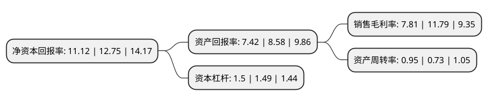

> 本页面由自动化程序生成于 2022年5月20日 01:32
> 内容可能存在错误，如有bug请提交issue至：https://github.com/Eroleice/doc-pi/issues
{.is-warning}

# 上市公司基本情况

## 基本资料

金能科技股份有限公司（以下简称“金能科技”）成立于2004年11月18日，德州市。于2017年05月11日在上交所主板上市。

金能科技注册资本85,507.193万元，公司是一家资源综合利用型，经济循环式化工企业。主要产品包括焦炭，炭黑，白炭黑，山梨酸及山梨酸钾，对甲基苯酚等，下游涉及钢铁，轮胎，食品，塑料，化纤，医药等行业。以下是详细信息：

- 公司名称: 金能科技股份有限公司
- 股票代码: 603113.SH
- 所在地: 山东 - 德州市
- 成立日期: 2004年11月18日
- 注册资本: 85,507.193万元
- 法定代表人: 秦庆平
- 主营业务: 公司是一家资源综合利用型，经济循环式化工企业主要产品包括焦炭，炭黑，白炭黑，山梨酸及山梨酸钾，对甲基苯酚等，下游涉及钢铁，轮胎，食品，塑料，化纤，医药等行业
- 公司官网: www.jncoke.com
- 公司介绍: 公司是一家资源综合利用型、经济循环式的综合性化工企业。主要产品有对甲酚、山梨酸(钾)、炭黑、白炭黑、甲醇、焦炭、丙烯、聚丙烯等，应用于医药、食品、钢铁、汽车、塑料、化纤等多个领域。公司建有国家级企业技术中心及国家级实验室，是全球对甲酚、山梨酸(钾)的重要生产基地，连续多年跻身中国化工企业500强，先后荣获“山东省企业技术创新奖”“山东省首批循环经济示范单位”“山东省品牌建设示范企业”“山东省先进民营企业”“全国技术创新型煤焦化企业”“国家级绿色工厂”“国际热电联产奖”等荣誉称号。公司先后通过了ISO9001、ISO14001、IATF16949、FSSC22000等认证，产品在占领国内市场的同时，远销欧、美、日、韩等国家和地区。

## 股东及高管情况

上市公司第一大股东为秦庆平，持股327,905,244股，占比38.35%，为上市公司实际控制人。

截至2022年03月31日，上市公司的前十大股东中，共有6名自然人股东，1名机构股东，2个产品账户，1个海外主体，其中5%以上大股东共有2名。上市公司前十大股东明细如下：

> 截至2022年03月31日，上市公司前十大股东信息如下：

| 股东名称 | 持股数量（股） | 持股比例 |
| --- | --- | --- |
| 秦庆平 | 327,905,244 | 38.35% |
| 秦璐 | 96,500,000 | 11.29% |
| 王咏梅 | 16,545,000 | 1.93% |
| 中国对外经济贸易信托有限公司-外贸信托-睿郡稳享私募证券投资基金 | 10,105,300 | 1.18% |
| 林旭燕 | 10,000,000 | 1.17% |
| 李建国 | 8,200,000 | 0.96% |
| 金能科技股份有限公司回购专用证券账户 | 7,141,951 | 0.84% |
| 陈维焕 | 6,768,700 | 0.79% |
| 齐河君和股权投资合伙企业(有限合伙) | 6,679,500 | 0.78% |
| 香港中央结算有限公司(陆股通) | 6,572,488 | 0.77% |

## 利润表分析

上市公司2021年总收入为119.76亿元，净利润为9.34亿元，实现盈利。

## 杜邦分析

> 数据列示周期：2021年 | 2020年 | 2019年
{.is-info}

上市公司的净资产收益率在近一年有所下降，下降幅度为-12.78%，其变化情况分解如下：
- 上市公司的销售毛利率在近一年下降了-33.76%，可能是生产效率的下降、商品原材料价格上涨或商品价格的下跌所致。
- 上市公司的资产周转率在近一年上升了30.14%，可能是源自于更快的销售回款或库存管理效果提升。
- 上市公司的财务杠杆比率在近一年上升了0.67%，可能是增加负债扩大生产规模。

