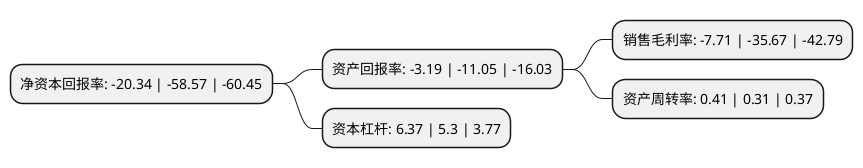

> 本页面由自动化程序生成于 2022年5月20日 01:02
> 内容可能存在错误，如有bug请提交issue至：https://github.com/Eroleice/doc-pi/issues
{.is-warning}

# 上市公司基本情况

## 基本资料

新大洲控股股份有限公司（以下简称“ST大洲”）成立于1992年12月30日，海口市。于1994年05月25日在深交所主板上市。

ST大洲注册资本81,406.4万元，主要业务:牛肉食品，煤炭，物流产业以下是详细信息：

- 公司名称: 新大洲控股股份有限公司
- 股票代码: 000571.SZ
- 所在地: 海南 - 海口市
- 成立日期: 1992年12月30日
- 注册资本: 81,406.4万元
- 法定代表人: 韩东丰
- 主营业务: 牛肉食品，煤炭，物流产业
- 公司官网: www.sundiro.com
- 公司介绍: 公司原是一家以摩托车产业经营为主体的大型股份制企业，现已形成了集牛肉食品、煤炭、物流产业为一体的产业格局，公司的产品远销五大洲56个国家和地区。公司一直秉承“尊重个性、三种喜悦”的基本理念，为中国和全世界的用户提供品质卓越、安全可靠、节能环保的绿色摩托车。近年来公司连续被评为“摩托车行业排头兵企业”。公司通过并购重组内蒙古五九煤炭集团，获得大量煤炭资源。公司将秉承“创业、创新、创造”的经营理念，不断提升企业的核心竞争能力，在摩托车和煤电化产业中拓展事业发展的宏图。2017年公司收购了乌拉圭屠宰厂Rondatel S.A.、Lirtix S.A.的100%股权，保证了优质牛源的供应。Rondatel S.A.主要从事肉牛屠宰、分割，牛肉制品及副产品的生产、储藏、冷藏、包装、贸易、经销和进出口业务。

## 股东及高管情况

上市公司第一大股东为大连和升控股集团有限公司，持股107,847,136股，占比13.25%，**疑似为**上市公司实际控制人。

截至2022年03月31日，上市公司的前十大股东中，共有5名自然人股东，4名机构股东，1个产品账户，其中5%以上大股东共有3名。上市公司前十大股东明细如下：

> 未能通过持股比例判定出上市公司实际控制人（持股30%以上）
> 可能存在通过间接持股、联合持股、协议控制等方式拥有实际控制权的主体，具体请参考上市公司定期公告！
{.is-warning}

> 截至2022年03月31日，上市公司前十大股东信息如下：

| 股东名称 | 持股数量（股） | 持股比例 |
| --- | --- | --- |
| 大连和升控股集团有限公司 | 107,847,136 | 13.25% |
| 深圳市尚衡冠通投资企业(有限合伙) | 89,481,652 | 10.99% |
| 富立财富投资管理有限公司-富立澜沧江十四号私募投资基金 | 60,990,000 | 7.49% |
| 大连通运投资有限公司 | 30,010,011 | 3.69% |
| 北京京粮和升食品发展有限责任公司 | 23,203,244 | 2.85% |
| 彭浩 | 10,673,758 | 1.31% |
| 孙仓琴 | 8,526,963 | 1.05% |
| 俞元省 | 7,705,800 | 0.95% |
| 王东俊 | 6,145,869 | 0.75% |
| 王毅 | 4,555,018 | 0.56% |

## 利润表分析

上市公司2021年总收入为11.87亿元，净利润为-0.92亿元，**未实现盈利**。

## 杜邦分析

> 数据列示周期：2021年 | 2020年 | 2019年
{.is-info}

上市公司的净资产收益率在近一年有所下降，下降幅度为-65.27%，其变化情况分解如下：
- 上市公司的销售毛利率在近一年下降了-78.39%，可能是生产效率的下降、商品原材料价格上涨或商品价格的下跌所致。
- 上市公司的资产周转率在近一年上升了32.26%，可能是源自于更快的销售回款或库存管理效果提升。
- 上市公司的财务杠杆比率在近一年上升了20.19%，可能是增加负债扩大生产规模。

