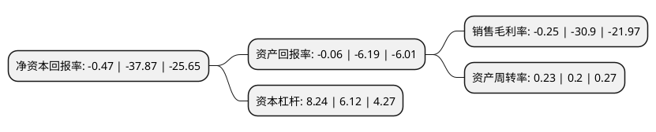

> 本页面由自动化程序生成于 2022年5月20日 01:24
> 内容可能存在错误，如有bug请提交issue至：https://github.com/Eroleice/doc-pi/issues
{.is-warning}

# 上市公司基本情况

## 基本资料

郑州煤电股份有限公司（以下简称“郑州煤电”）成立于1997年11月13日，郑州市。于1998年01月07日在上交所主板上市。

郑州煤电注册资本121,841.204万元，主要产品:煤炭，电力。以下是详细信息：

- 公司名称: 郑州煤电股份有限公司
- 股票代码: 600121.SH
- 所在地: 河南 - 郑州市
- 成立日期: 1997年11月13日
- 注册资本: 121,841.204万元
- 法定代表人: 于泽阳
- 主营业务: 主要产品:煤炭，电力
- 公司官网: www.zzce.com.cn
- 公司介绍: 公司是国有重点煤炭企业境内第一家上市公司，河南省第一家上市的原中央企业。公司主营煤炭生产及销售，发电及输变电。拥有生产矿井6对，火力发电厂1座，年煤炭生产能力近千万吨，发电量4亿千瓦时。主导产品为中灰、低硫、高发热量、可磨性好的贫煤、贫瘦煤和无烟煤，是优质的工业动力煤。除主营业务外，还投资成立有物资供销、铁路运输等领域的控股公司。公司拥有强大的科技研发力量，独立研发的豫西“三软”不稳定煤层一次采全高技术和“三软”不稳定煤层高产、高效矿井的研究成果，分获河南省科技创新一等奖和二等奖等，并在全国推广应用，其技术特点在全国处于领先水平。公司秉承“科学发展、规范运作，精细管理、强化执行，开拓创新、做优做强，提高效益、回报社会”的经营管理理念，依托“中原经济区”国家战略，以产业运营为基础、以资本运作促发展，内抓管理、外树形象，全面实施煤炭资源综合开发与利用，从而把郑州煤电打造成为规范诚信、核心竞争力强、充满活力的新型能源上市公司。

## 股东及高管情况

上市公司第一大股东为郑州煤炭工业(集团)有限责任公司，持股702,439,280股，占比57.65%，为上市公司实际控制人。

截至2022年03月31日，上市公司的前十大股东中，共有5名自然人股东，2名机构股东，3个产品账户，其中5%以上大股东共有2名。上市公司前十大股东明细如下：

> 截至2022年03月31日，上市公司前十大股东信息如下：

| 股东名称 | 持股数量（股） | 持股比例 |
| --- | --- | --- |
| 郑州煤炭工业(集团)有限责任公司 | 702,439,280 | 57.65% |
| 中国平煤神马能源化工集团有限责任公司 | 63,231,776 | 5.19% |
| 中国银行股份有限公司-招商中证煤炭等权指数分级证券投资基金 | 9,487,523 | 0.78% |
| 施美容 | 3,628,800 | 0.3% |
| 中国工商银行股份有限公司-国泰中证煤炭交易型开放式指数证券投资基金 | 3,576,620 | 0.29% |
| 蔡华强 | 3,459,433 | 0.28% |
| 国泰君安证券股份有限公司-富国中证煤炭指数型证券投资基金 | 2,283,820 | 0.19% |
| 项黎丽 | 1,865,300 | 0.15% |
| 刘洁 | 1,720,000 | 0.14% |
| 何萍 | 1,500,000 | 0.12% |

## 杜邦分析

> 数据列示周期：2021年 | 2020年 | 2019年
{.is-info}

上市公司的净资产收益率在近一年有所下降，下降幅度为-98.76%，其变化情况分解如下：
- 上市公司的销售毛利率在近一年下降了-99.19%，可能是生产效率的下降、商品原材料价格上涨或商品价格的下跌所致。
- 上市公司的资产周转率在近一年上升了15%，可能是源自于更快的销售回款或库存管理效果提升。
- 上市公司的财务杠杆比率在近一年上升了34.64%，可能是增加负债扩大生产规模。

