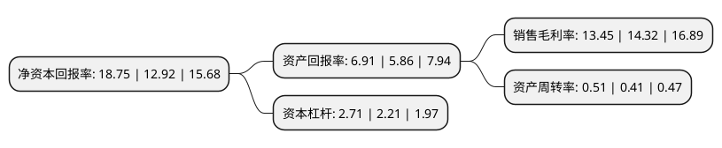

> 本页面由自动化程序生成于 2022年5月20日 01:26
> 内容可能存在错误，如有bug请提交issue至：https://github.com/Eroleice/doc-pi/issues
{.is-warning}

# 上市公司基本情况

## 基本资料

贵州盘江精煤股份有限公司（以下简称“盘江股份”）成立于1999年10月29日，六盘水市。于2001年05月31日在上交所主板上市。

盘江股份注册资本165,505.186万元，主要产品:精煤，混煤。以下是详细信息：

- 公司名称: 贵州盘江精煤股份有限公司
- 股票代码: 600395.SH
- 所在地: 贵州 - 六盘水市
- 成立日期: 1999年10月29日
- 注册资本: 165,505.186万元
- 法定代表人: 朱家道
- 主营业务: 主要产品:精煤，混煤
- 公司官网: www.pjgf.cn
- 公司介绍: 公司是以原煤生产、洗选加工为主导，融资本营运、发电、安装、矿建、机械加工及维修、仪器仪表、质检化验为一体的生产能力超千万吨的大型煤炭工业企业，也是中国长江以南唯一一家上市煤炭企业。公司拥有丰富的煤炭资源，是中国南方地区重要的大型炼焦煤和动力煤生产基地。矿区煤炭储量丰富，煤种齐全，主要有气煤、肥煤、1/3焦煤、主焦煤、瘦煤、贫煤、无烟煤，储量和煤种在长江以南地区得天独厚；交通便利，贵昆铁路、南昆铁路威红段、水红铁路、沪昆高速公路、水盘高速公路以及在建设的沪昆高铁贯穿矿区，是北通巴渝、南接粤桂，西进云南，东连黔中的西南及西部地区交通、能源输出重镇。盘江煤具有“质量好、品种全、低灰、低硫、微磷、发热量高”的显著特点，是理想的冶金、化工和动力用煤。

## 股东及高管情况

上市公司第一大股东为贵州盘江煤电集团有限责任公司，持股961,050,600股，占比44.77%，为上市公司实际控制人。

截至2022年04月25日，上市公司的前十大股东中，共有7名机构股东，2个产品账户，1个海外主体，其中5%以上大股东共有7名。上市公司前十大股东明细如下：

> 截至2022年04月25日，上市公司前十大股东信息如下：

| 股东名称 | 持股数量（股） | 持股比例 |
| --- | --- | --- |
| 贵州盘江煤电集团有限责任公司 | 961,050,600 | 44.77% |
| 贵州盘江煤电集团有限责任公司 | 961,050,600 | 44.77% |
| 贵州盘江煤电集团有限责任公司 | 961,050,600 | 58.07% |
| 贵州盘江煤电集团有限责任公司 | 961,050,600 | 58.07% |
| 山东能源集团有限公司 | 152,530,503 | 9.22% |
| 山东能源集团有限公司 | 144,478,503 | 6.73% |
| 山东能源集团有限公司 | 142,880,703 | 6.6561% |
| 香港中央结算有限公司(陆股通) | 39,768,630 | 2.4% |
| 中国建设银行股份有限公司-浙商丰利增强债券型证券投资基金 | 8,000,000 | 0.48% |
| 中国银行股份有限公司-招商中证煤炭等权指数分级证券投资基金 | 5,367,063 | 0.32% |

## 利润表分析

上市公司2021年总收入为97.25亿元，净利润为13.07亿元，实现盈利。

## 杜邦分析

> 数据列示周期：2021年 | 2020年 | 2019年
{.is-info}

上市公司的净资产收益率在近一年有所上升，上升幅度为45.12%，其变化情况分解如下：
- 上市公司的销售毛利率在近一年下降了-6.08%，可能是生产效率的下降、商品原材料价格上涨或商品价格的下跌所致。
- 上市公司的资产周转率在近一年上升了24.39%，可能是源自于更快的销售回款或库存管理效果提升。
- 上市公司的财务杠杆比率在近一年上升了22.62%，可能是增加负债扩大生产规模。

