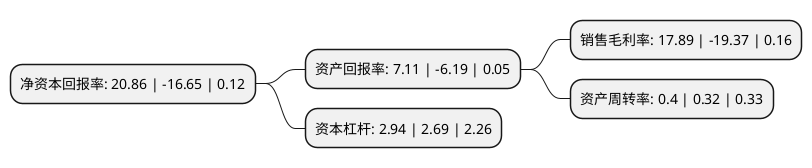

> 本页面由自动化程序生成于 2022年5月20日 01:26
> 内容可能存在错误，如有bug请提交issue至：https://github.com/Eroleice/doc-pi/issues
{.is-warning}

# 上市公司基本情况

## 基本资料

河南大有能源股份有限公司（以下简称“大有能源”）成立于1998年01月15日，三门峡市。于2003年10月09日在上交所主板上市。

大有能源注册资本239,081.24万元，主营业务:煤炭生产与经营以下是详细信息：

- 公司名称: 河南大有能源股份有限公司
- 股票代码: 600403.SH
- 所在地: 河南 - 三门峡市
- 成立日期: 1998年01月15日
- 注册资本: 239,081.24万元
- 法定代表人: 任春星
- 主营业务: 主营业务:煤炭生产与经营
- 公司官网: www.hndayou.com.cn
- 公司介绍: 公司主营煤炭生产与经营。公司矿区储量丰富，煤种齐全，地跨三门峡市所辖的义马、渑池、陕县以及洛阳市所辖的宜阳、新安、孟津等县(市)，现有11座生产矿井和7个生产辅助单位，所产优质长焰煤、焦煤、贫煤、洗精煤广泛应用于发电、造气、工业锅炉、炼焦、建材等行业，产品广销河南、湖北、华东等20个省区。未来，公司将根据企业发展要求，实现企业不断增值，打造千亿级企业集团，为建设中原经济区，推进中原崛起、河南振兴做出更大的贡献。

## 股东及高管情况

上市公司第一大股东为义马煤业集团股份有限公司，持股1,507,183,566股，占比63.04%，为上市公司实际控制人。

截至2022年03月31日，上市公司的前十大股东中，共有4名自然人股东，5名机构股东，1名其他股东，其中5%以上大股东共有2名。上市公司前十大股东明细如下：

> 截至2022年03月31日，上市公司前十大股东信息如下：

| 股东名称 | 持股数量（股） | 持股比例 |
| --- | --- | --- |
| 义马煤业集团股份有限公司 | 1,507,183,566 | 63.04% |
| 义马煤业集团青海义海能源有限责任公司 | 560,300,845 | 23.44% |
| 中国华融资产管理股份有限公司 | 15,242,802 | 0.64% |
| 中广有线信息网络有限公司 | 12,627,784 | 0.53% |
| 徐开东 | 8,423,000 | 0.35% |
| 徐小蓉 | 6,380,100 | 0.27% |
| 上海富欣通信技术发展有限公司 | 3,318,606 | 0.14% |
| 陈杰 | 3,121,800 | 0.13% |
| 殷红叶 | 2,815,500 | 0.12% |
| 法国兴业银行 | 2,348,500 | 0.1% |

## 利润表分析

上市公司2021年总收入为79.1亿元，净利润为14.15亿元，实现盈利。

## 杜邦分析

> 数据列示周期：2021年 | 2020年 | 2019年
{.is-info}

上市公司的净资产收益率在近一年有所下降，下降幅度为-225.29%，其变化情况分解如下：
- 上市公司的销售毛利率在近一年下降了-192.36%，可能是生产效率的下降、商品原材料价格上涨或商品价格的下跌所致。
- 上市公司的资产周转率在近一年上升了25%，可能是源自于更快的销售回款或库存管理效果提升。
- 上市公司的财务杠杆比率在近一年上升了9.29%，可能是增加负债扩大生产规模。

