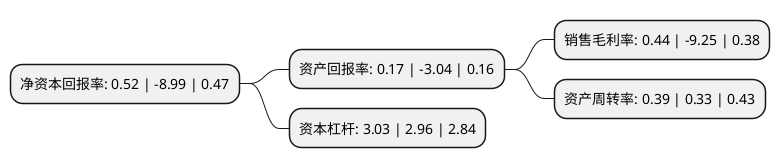

> 本页面由自动化程序生成于 2022年5月20日 01:28
> 内容可能存在错误，如有bug请提交issue至：https://github.com/Eroleice/doc-pi/issues
{.is-warning}

# 上市公司基本情况

## 基本资料

辽宁能源煤电产业股份有限公司（以下简称“辽宁能源”）成立于1993年12月28日，沈阳市。于1996年10月29日在上交所主板上市。

辽宁能源注册资本132,201.739万元，建筑安装，房地产开发，建筑材料销售。以下是详细信息：

- 公司名称: 辽宁能源煤电产业股份有限公司
- 股票代码: 600758.SH
- 所在地: 辽宁 - 沈阳市
- 成立日期: 1993年12月28日
- 注册资本: 132,201.739万元
- 法定代表人: 郭洪波
- 主营业务: 建筑安装，房地产开发，建筑材料销售
- 公司官网: null
- 公司介绍: 公司主要业务是煤炭、电力的生产和销售，城市供暖及提供工业蒸汽等。公司主要煤炭品种有主焦煤、气煤、肥煤、瘦煤、贫瘦煤、贫煤、无烟煤、三分之一焦煤和褐煤。公司主力矿井位于辽宁省沈阳市周边地区，同时配备自用的铁路专用线。煤炭产品种类以炼焦煤为主，是辽宁省及周边钢铁企业运距最短的大型煤炭供应商。地域优势极大的降低了公司运输成本。公司下属热电企业分别是辽阳市是最大的热电联产企业和灯塔市是唯一的热电联产企业。

## 股东及高管情况

上市公司第一大股东为辽宁省能源产业控股集团有限责任公司，持股318,000,000股，占比24.05%，**疑似为**上市公司实际控制人。

截至2022年04月19日，上市公司的前十大股东中，共有10名机构股东，其中5%以上大股东共有10名。上市公司前十大股东明细如下：

> 未能通过持股比例判定出上市公司实际控制人（持股30%以上）
> 可能存在通过间接持股、联合持股、协议控制等方式拥有实际控制权的主体，具体请参考上市公司定期公告！
{.is-warning}

> 截至2022年04月19日，上市公司前十大股东信息如下：

| 股东名称 | 持股数量（股） | 持股比例 |
| --- | --- | --- |
| 辽宁省能源产业控股集团有限责任公司 | 318,000,000 | 24.05% |
| 辽宁省能源产业控股集团有限责任公司 | 318,000,000 | 24.05% |
| 深圳市祥隆投资合伙企业(有限合伙) | 127,011,601 | 9.61% |
| 深圳市祥隆投资合伙企业(有限合伙) | 127,011,601 | 9.61% |
| 中国信达资产管理股份有限公司 | 116,723,700 | 8.8292% |
| 中国信达资产管理股份有限公司 | 116,723,700 | 8.8292% |
| 辽宁交通投资有限责任公司 | 111,111,692 | 8.4047% |
| 辽宁交通投资有限责任公司 | 97,894,993 | 7.405% |
| 辽宁能源投资(集团)有限责任公司 | 97,229,797 | 7.35% |
| 辽宁能源投资(集团)有限责任公司 | 97,229,797 | 7.35% |

## 利润表分析

上市公司2021年总收入为59.14亿元，净利润为0.26亿元，实现盈利。

## 杜邦分析

> 数据列示周期：2021年 | 2020年 | 2019年
{.is-info}

上市公司的净资产收益率在近一年有所下降，下降幅度为-105.78%，其变化情况分解如下：
- 上市公司的销售毛利率在近一年下降了-104.76%，可能是生产效率的下降、商品原材料价格上涨或商品价格的下跌所致。
- 上市公司的资产周转率在近一年上升了18.18%，可能是源自于更快的销售回款或库存管理效果提升。
- 上市公司的财务杠杆比率在近一年上升了2.36%，可能是增加负债扩大生产规模。

