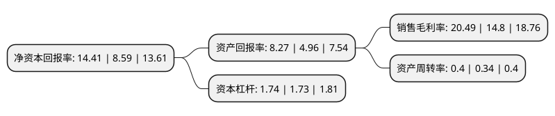

> 本页面由自动化程序生成于 2022年5月20日 01:30
> 内容可能存在错误，如有bug请提交issue至：https://github.com/Eroleice/doc-pi/issues
{.is-warning}

# 上市公司基本情况

## 基本资料

安徽恒源煤电股份有限公司（以下简称“恒源煤电”）成立于2000年12月29日，淮北市。于2004年08月17日在上交所主板上市。

恒源煤电注册资本120,000.488万元，煤炭开采，洗选加工和销售以下是详细信息：

- 公司名称: 安徽恒源煤电股份有限公司
- 股票代码: 600971.SH
- 所在地: 安徽 - 淮北市
- 成立日期: 2000年12月29日
- 注册资本: 120,000.488万元
- 法定代表人: 焦殿志
- 主营业务: 煤炭开采，洗选加工和销售
- 公司官网: www.ahhymd.com.cn
- 公司介绍: 公司主要从事煤炭开采、洗选加工、销售等业务，是安徽省第一家上市的煤炭企业。公司煤种齐全，主要有贫瘦煤、1/3焦煤、气肥煤、无烟煤、主焦煤等；煤炭产品主要有混煤、洗末煤、冶炼精煤等；煤炭质量优良，低硫、低磷、低灰、高发热量，有“绿色环保”能源的美称，广泛应用于电力、冶金、石化、建材、炼焦、高炉喷吹、民用等领域，是理想的动力用煤和生活用煤。多年来，公司产品畅销华东地区及江西等省，深受客户信赖。公司区位优势明显，交通运输便利，京沪、陇海、京九等三大铁路干线贯穿矿区，京福、连霍、合徐等高速公路和206、104国道从矿区经过，水路可通过淮河、京杭大运河、长江达江入海。

## 股东及高管情况

上市公司第一大股东为安徽省皖北煤电集团有限责任公司，持股659,538,889股，占比54.96%，为上市公司实际控制人。

截至2022年03月31日，上市公司的前十大股东中，共有3名自然人股东，1名机构股东，4个产品账户，2个海外主体，其中5%以上大股东共有1名。上市公司前十大股东明细如下：

> 截至2022年03月31日，上市公司前十大股东信息如下：

| 股东名称 | 持股数量（股） | 持股比例 |
| --- | --- | --- |
| 安徽省皖北煤电集团有限责任公司 | 659,538,889 | 54.96% |
| 招商银行股份有限公司-上证红利交易型开放式指数证券投资基金 | 51,338,345 | 4.28% |
| 香港中央结算有限公司(陆股通) | 29,864,558 | 2.49% |
| 中国工商银行股份有限公司-富国中证红利指数增强型证券投资基金 | 9,795,720 | 0.82% |
| 钟允溪 | 9,720,380 | 0.81% |
| 中国银行股份有限公司-招商中证煤炭等权指数分级证券投资基金 | 6,308,219 | 0.53% |
| UBS AG | 5,292,110 | 0.44% |
| 中国建设银行股份有限公司-大成中证红利指数证券投资基金 | 5,151,461 | 0.43% |
| 周涛 | 5,109,675 | 0.43% |
| 金军椋 | 4,140,847 | 0.35% |

## 利润表分析

上市公司2021年总收入为67.49亿元，净利润为13.82亿元，实现盈利。

## 杜邦分析

> 数据列示周期：2021年 | 2020年 | 2019年
{.is-info}

上市公司的净资产收益率在近一年有所上升，上升幅度为67.75%，其变化情况分解如下：
- 上市公司的销售毛利率在近一年上升了38.45%，可能是生产效率的提升、商品原材料价格下跌或商品价格的上涨所致。
- 上市公司的资产周转率在近一年上升了17.65%，可能是源自于更快的销售回款或库存管理效果提升。
- 上市公司的财务杠杆比率在近一年上升了0.58%，可能是增加负债扩大生产规模。

