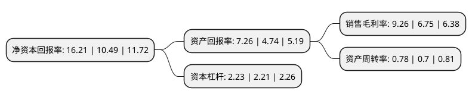

> 本页面由自动化程序生成于 2022年5月20日 01:30
> 内容可能存在错误，如有bug请提交issue至：https://github.com/Eroleice/doc-pi/issues
{.is-warning}

# 上市公司基本情况

## 基本资料

开滦能源化工股份有限公司（以下简称“开滦股份”）成立于2001年06月30日，唐山市。于2004年06月02日在上交所主板上市。

开滦股份注册资本158,779.985万元，煤炭及伴生资源开采，原煤洗选加工，煤炭批发，炼焦及其产品的生产销售。以下是详细信息：

- 公司名称: 开滦能源化工股份有限公司
- 股票代码: 600997.SH
- 所在地: 河北 - 唐山市
- 成立日期: 2001年06月30日
- 注册资本: 158,779.985万元
- 法定代表人: 刘宝珠
- 主营业务: 煤炭及伴生资源开采，原煤洗选加工，煤炭批发，炼焦及其产品的生产销售
- 公司官网: www.kkcc.com.cn
- 公司介绍: 公司的主要业务包括煤炭开采、原煤洗选加工、炼焦及煤化工产品的生产销售，主要产品包括洗精煤、焦炭以及甲醇、纯苯等化工产品。目前，公司构建了煤炭、煤化工、新材料和新能源三大产业链条。公司炼焦肥煤除销售给宝钢、鞍钢等客户外，部分供给煤化工子公司，炼焦副产品焦炉煤气用于生产甲醇，粗焦油、粗苯用于深加工。在此基础上，公司稳步推进聚甲醛、己二酸、甲醇汽油项目建设，通过充分发挥自身的资源优势和规模化循环经济优势，向精细化工、合成材料和新能源领域延伸，形成了“以煤为基、以焦为辅、以化为主”的产业格局。公司地处华北重要的炼焦精煤基地、钢铁生产基地和煤炭焦炭集散地，拥有良好的区位优势、资源优势和相对完善的产业链条。

## 股东及高管情况

上市公司第一大股东为开滦(集团)有限责任公司，持股732,262,656股，占比46.12%，为上市公司实际控制人。

截至2022年03月31日，上市公司的前十大股东中，共有4名自然人股东，3名机构股东，2个产品账户，1个海外主体，其中5%以上大股东共有2名。上市公司前十大股东明细如下：

> 截至2022年03月31日，上市公司前十大股东信息如下：

| 股东名称 | 持股数量（股） | 持股比例 |
| --- | --- | --- |
| 开滦(集团)有限责任公司 | 732,262,656 | 46.12% |
| 中国信达资产管理股份有限公司 | 337,313,606 | 21.24% |
| 高华-汇丰-GOLDMAN,SACHS & CO.LLC | 8,496,124 | 0.54% |
| 曲玉梅 | 7,281,800 | 0.46% |
| 阳珍楚 | 6,898,800 | 0.43% |
| 招商中证煤炭等权指数分级证券投资基金 | 6,001,206 | 0.38% |
| 孙英豪 | 4,779,100 | 0.3% |
| 上海宝钢国际经济贸易有限公司 | 4,660,000 | 0.29% |
| 孙秀成 | 4,620,797 | 0.29% |
| 国泰中证煤炭交易型开放式指数证券投资基金 | 4,488,990 | 0.28% |

## 利润表分析

上市公司2021年总收入为223.53亿元，净利润为20.7亿元，实现盈利。

## 杜邦分析

> 数据列示周期：2021年 | 2020年 | 2019年
{.is-info}

上市公司的净资产收益率在近一年有所上升，上升幅度为54.53%，其变化情况分解如下：
- 上市公司的销售毛利率在近一年上升了37.19%，可能是生产效率的提升、商品原材料价格下跌或商品价格的上涨所致。
- 上市公司的资产周转率在近一年上升了11.43%，可能是源自于更快的销售回款或库存管理效果提升。
- 上市公司的财务杠杆比率在近一年上升了0.9%，可能是增加负债扩大生产规模。

