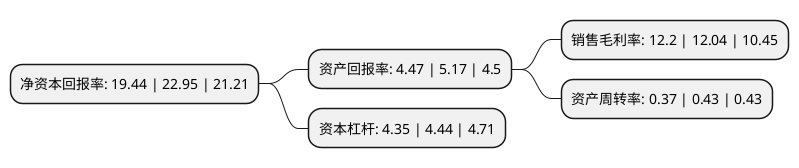

> 本页面由自动化程序生成于 2022年5月20日 01:30
> 内容可能存在错误，如有bug请提交issue至：https://github.com/Eroleice/doc-pi/issues
{.is-warning}

# 上市公司基本情况

## 基本资料

晋能控股山西煤业股份有限公司（以下简称“晋控煤业”）成立于2001年07月25日，大同市。于2006年06月23日在上交所主板上市。

晋控煤业注册资本167,370万元，主要产品:筛分煤以下是详细信息：

- 公司名称: 晋能控股山西煤业股份有限公司
- 股票代码: 601001.SH
- 所在地: 山西 - 大同市
- 成立日期: 2001年07月25日
- 注册资本: 167,370万元
- 法定代表人: 王存权
- 主营业务: 主要产品:筛分煤
- 公司官网: www.dtmy.com.cn/www.dtcoalmine.com
- 公司介绍: 公司是一家主要从事煤炭生产及销售业务的知名企业。公司以开采优质动力煤炭闻名，是国内最有品牌认知度的煤种，其煤质具有低灰、低硫、高发热量等特点，在煤炭市场具有良好的信誉，拥有较稳定的客户基础以及持续增长的下游需求，广泛应用于发电、建材、玻璃、冶金等行业。公司具有较强的技术优势，与国内多家知名科研院所建立了长期的战略合作关系，形成了多项科技成果。石炭系塔山矿综采放顶煤技术开创了我国特厚煤层综放技术的先例。

## 股东及高管情况

上市公司第一大股东为晋能控股煤业集团有限公司，持股961,632,508股，占比57.46%，为上市公司实际控制人。

截至2022年03月31日，上市公司的前十大股东中，共有1名自然人股东，3名机构股东，5个产品账户，1名其他股东，其中5%以上大股东共有1名。上市公司前十大股东明细如下：

> 截至2022年03月31日，上市公司前十大股东信息如下：

| 股东名称 | 持股数量（股） | 持股比例 |
| --- | --- | --- |
| 晋能控股煤业集团有限公司 | 961,632,508 | 57.46% |
| 河北港口集团有限公司 | 26,592,080 | 1.59% |
| 中国工商银行股份有限公司-广发多因子灵活配置混合型证券投资基金 | 26,537,319 | 1.59% |
| 中国工商银行股份有限公司-广发瑞誉一年持有期混合型证券投资基金 | 11,705,119 | 0.7% |
| 中国农业银行股份有限公司-大成新锐产业混合型证券投资基金 | 9,481,500 | 0.57% |
| 法国兴业银行 | 6,231,021 | 0.37% |
| 恒大人寿保险有限公司-分红B | 6,030,443 | 0.36% |
| 广发证券股份有限公司-大成睿景灵活配置混合型证券投资基金 | 5,643,991 | 0.34% |
| 肖志 | 5,547,504 | 0.33% |
| 中国银行股份有限公司-大成景气精选六个月持有期混合型证券投资基金 | 5,489,300 | 0.33% |

## 利润表分析

上市公司2021年总收入为182.65亿元，净利润为63.36亿元，实现盈利。

## 杜邦分析

> 数据列示周期：2020年 | 2019年 | 2018年
{.is-info}

上市公司的净资产收益率在近一年有所下降，下降幅度为-15.29%，其变化情况分解如下：
- 上市公司的销售毛利率在近一年上升了1.33%，可能是生产效率的提升、商品原材料价格下跌或商品价格的上涨所致。
- 上市公司的资产周转率在近一年下降了-13.95%，可能是源自于更慢的销售回款或库存管理效果下降。
- 上市公司的财务杠杆比率在近一年下降了-2.03%，可能是减少负债降低财务费用。

