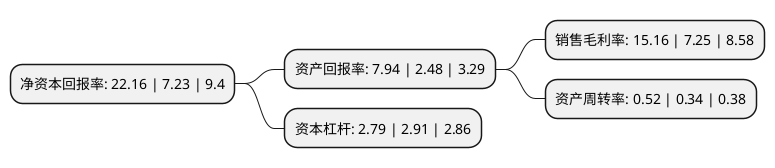

> 本页面由自动化程序生成于 2022年5月20日 01:31
> 内容可能存在错误，如有bug请提交issue至：https://github.com/Eroleice/doc-pi/issues
{.is-warning}

# 上市公司基本情况

## 基本资料

山西潞安环保能源开发股份有限公司（以下简称“潞安环能”）成立于2001年07月19日，长治市。于2006年09月22日在上交所主板上市。

潞安环能注册资本299,140.92万元，主营业务:原煤开采，煤炭洗选，煤焦冶炼;主要产品为混煤，洗精煤，喷吹煤，洗混块等。以下是详细信息：

- 公司名称: 山西潞安环保能源开发股份有限公司
- 股票代码: 601699.SH
- 所在地: 山西 - 长治市
- 成立日期: 2001年07月19日
- 注册资本: 299,140.92万元
- 法定代表人: 王志清
- 主营业务: 主营业务:原煤开采，煤炭洗选，煤焦冶炼;主要产品为混煤，洗精煤，喷吹煤，洗混块等
- 公司官网: www.luanhn.com
- 公司介绍: 公司位于山西省东南部上党盆地北缘，所辖煤田属沁水煤田东部边缘中段，矿区地理位置优越，交通便利。公司主营业务包括原煤开采、煤炭洗选、煤焦冶炼；洁净煤技术的开发与利用；煤层气开发；煤炭的综合利用等、地质勘探等。公司所属各矿均为行业特级高产高效矿井，综合机械化程度达到100%，原煤核定生产能力为1860万吨。煤炭产品属特低硫、低磷、低灰、高发热量的优质动力煤和炼焦配煤，主要有混煤、洗精煤、喷吹煤、洗混块等4大类煤炭产品以及焦炭产品，主要应用于发电、动力、炼焦、钢铁行业。

## 股东及高管情况

上市公司第一大股东为山西潞安矿业(集团)有限责任公司，持股1,847,683,312股，占比61.77%，为上市公司实际控制人。

截至2022年03月31日，上市公司的前十大股东中，共有4名自然人股东，4名机构股东，1个产品账户，1个海外主体，其中5%以上大股东共有1名。上市公司前十大股东明细如下：

> 截至2022年03月31日，上市公司前十大股东信息如下：

| 股东名称 | 持股数量（股） | 持股比例 |
| --- | --- | --- |
| 山西潞安矿业(集团)有限责任公司 | 1,847,683,312 | 61.77% |
| 香港中央结算有限公司(陆股通) | 108,865,241 | 3.64% |
| 山西潞安工程有限公司 | 30,420,000 | 1.02% |
| 宣俊杰 | 28,724,700 | 0.96% |
| 山东港口日照港集团有限公司 | 24,146,911 | 0.81% |
| 上海宝钢国际经济贸易有限公司 | 15,353,385 | 0.51% |
| 广发基金管理有限公司-社保基金四二零组合 | 14,498,660 | 0.48% |
| 李国辉 | 13,030,740 | 0.44% |
| 高淑贞 | 11,922,600 | 0.4% |
| 杨柳 | 11,567,100 | 0.39% |

## 利润表分析

上市公司2021年总收入为451.47亿元，净利润为68.42亿元，实现盈利。

## 杜邦分析

> 数据列示周期：2021年 | 2020年 | 2019年
{.is-info}

上市公司的净资产收益率在近一年有所上升，上升幅度为206.5%，其变化情况分解如下：
- 上市公司的销售毛利率在近一年上升了109.1%，可能是生产效率的提升、商品原材料价格下跌或商品价格的上涨所致。
- 上市公司的资产周转率在近一年上升了52.94%，可能是源自于更快的销售回款或库存管理效果提升。
- 上市公司的财务杠杆比率在近一年下降了-4.12%，可能是减少负债降低财务费用。

