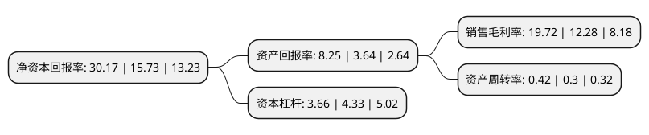

> 本页面由自动化程序生成于 2022年5月20日 01:31
> 内容可能存在错误，如有bug请提交issue至：https://github.com/Eroleice/doc-pi/issues
{.is-warning}

# 上市公司基本情况

## 基本资料

中煤新集能源股份有限公司（以下简称“新集能源”）成立于1997年12月01日，淮南市。于2007年12月19日在上交所主板上市。

新集能源注册资本259,054.18万元，主要产品为动力煤。主营业务:煤炭采掘，洗选和销售。以下是详细信息：

- 公司名称: 中煤新集能源股份有限公司
- 股票代码: 601918.SH
- 所在地: 安徽 - 淮南市
- 成立日期: 1997年12月01日
- 注册资本: 259,054.18万元
- 法定代表人: 杨伯达
- 主营业务: 主要产品为动力煤主营业务:煤炭采掘，洗选和销售
- 公司官网: xinji.chinacoal.com
- 公司介绍: 公司是由国家开发投资公司、国华能源有限公司、安徽新集煤电(集团)有限公司于1997年12月发起设立，并于2007年12月在上交所首发上市。2016年12月，经国务院国资委批复，国投公司将持有的公司30.31%股份无偿划转至中煤集团，中煤集团成为公司控股股东。公司是一家以煤炭采选为主、煤电并举的企业，是全国重点企业之一。公司主营业务是煤炭开采、洗选和火力发电。

## 股东及高管情况

上市公司第一大股东为中国中煤能源集团有限公司，持股785,292,157股，占比30.31%，为上市公司实际控制人。

截至2022年03月31日，上市公司的前十大股东中，共有4名自然人股东，3名机构股东，2个产品账户，1个海外主体，其中5%以上大股东共有3名。上市公司前十大股东明细如下：

> 截至2022年03月31日，上市公司前十大股东信息如下：

| 股东名称 | 持股数量（股） | 持股比例 |
| --- | --- | --- |
| 中国中煤能源集团有限公司 | 785,292,157 | 30.31% |
| 国华能源有限公司 | 196,707,787 | 7.59% |
| 安徽新集煤电(集团)有限公司 | 134,902,860 | 5.21% |
| 国元证券股份有限公司约定购回式证券交易专用证券账户 | 51,000,000 | 1.97% |
| 李强 | 18,493,324 | 0.71% |
| 徐宏亮 | 17,324,816 | 0.67% |
| 史爱昭 | 15,415,900 | 0.6% |
| 陆仁宝 | 14,896,780 | 0.58% |
| UBS AG | 12,629,358 | 0.49% |
| 中国工商银行股份有限公司-国泰中证煤炭交易型开放式指数证券投资基金 | 9,840,623 | 0.38% |

## 利润表分析

上市公司2021年总收入为124.88亿元，净利润为24.63亿元，实现盈利。

## 杜邦分析

> 数据列示周期：2021年 | 2020年 | 2019年
{.is-info}

上市公司的净资产收益率在近一年有所上升，上升幅度为91.8%，其变化情况分解如下：
- 上市公司的销售毛利率在近一年上升了60.59%，可能是生产效率的提升、商品原材料价格下跌或商品价格的上涨所致。
- 上市公司的资产周转率在近一年上升了40%，可能是源自于更快的销售回款或库存管理效果提升。
- 上市公司的财务杠杆比率在近一年下降了-15.47%，可能是减少负债降低财务费用。

