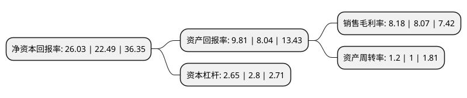

> 本页面由自动化程序生成于 2022年5月20日 01:03
> 内容可能存在错误，如有bug请提交issue至：https://github.com/Eroleice/doc-pi/issues
{.is-warning}

# 上市公司基本情况

## 基本资料

中信泰富特钢集团股份有限公司（以下简称“中信特钢”）成立于1993年05月18日，黄石市。于1997年03月26日在深交所主板上市。

中信特钢注册资本504,714.343万元，主要产品:齿轮钢，轴承钢，弹簧钢，工模具钢，高温合金钢，高速工具钢等特殊钢材。主要业务:钢铁冶炼，钢材轧制，金属改制，压延加工，钢铁材料检测等。以下是详细信息：

- 公司名称: 中信泰富特钢集团股份有限公司
- 股票代码: 000708.SZ
- 所在地: 湖北 - 黄石市
- 成立日期: 1993年05月18日
- 注册资本: 504,714.343万元
- 法定代表人: 钱刚
- 主营业务: 主要产品:齿轮钢，轴承钢，弹簧钢，工模具钢，高温合金钢，高速工具钢等特殊钢材钢铁冶炼，钢材轧制，金属改制，压延加工，钢铁材料检测等
- 公司官网: www.citicsteel.com
- 公司介绍: 公司是一家大型特殊钢铁企业，是全球钢种覆盖面大、涵盖品种全、产品类别多的精品特殊钢生产基地。公司主要生产齿轮钢、轴承钢、弹簧钢、工模具钢、高温合金、高速工具钢等特殊钢材，生产产品主要向汽车、石油、化工、煤炭、电力、机械制造、铁路运输等行业以及航海、航空、航天等领域提供服务，产品畅销国内外，远销世界五大洲各个国家和地区。公司全面深化质量管理体系建设，通过了ISO9001、ISO/TS16949、ISO/TS29001质量管理体系认证。轴承钢荣获国家金质奖、弹簧扁钢荣获国家银质奖，多项产品获国家冶金产品实物质量金杯奖，多种系列产品评为中国高新技术产品。公司被认定为国家企业技术中心，科技实力雄厚，模铸、连铸轴承钢的多个系列攻关项目取得突破，得到国际高端客户认证、认可。

## 股东及高管情况

上市公司第一大股东为中信泰富特钢投资有限公司，持股3,787,987,284股，占比75.05%，为上市公司实际控制人。

截至2022年03月31日，上市公司的前十大股东中，共有6名机构股东，3个产品账户，1个海外主体，其中5%以上大股东共有1名。上市公司前十大股东明细如下：

> 截至2022年03月31日，上市公司前十大股东信息如下：

| 股东名称 | 持股数量（股） | 持股比例 |
| --- | --- | --- |
| 中信泰富特钢投资有限公司 | 3,787,987,284 | 75.05% |
| 湖北新冶钢有限公司 | 228,854,000 | 4.53% |
| 中信泰富(中国)投资有限公司 | 215,251,416 | 4.26% |
| 安吉信泰企业管理合伙企业(有限合伙) | 208,305,222 | 4.13% |
| 安吉冶泰企业管理合伙企业(有限合伙) | 81,210,239 | 1.61% |
| 安吉扬泰企业管理合伙企业(有限合伙) | 76,264,810 | 1.51% |
| 香港中央结算有限公司(陆股通) | 58,182,656 | 1.15% |
| 中国建设银行股份有限公司-博时主题行业混合型证券投资基金(LOF) | 22,298,404 | 0.44% |
| 全国社保基金一零八组合 | 21,716,378 | 0.43% |
| 博时基金管理有限公司-社保基金16011组合 | 15,998,794 | 0.32% |

## 利润表分析

上市公司2021年总收入为973.32亿元，净利润为79.6亿元，实现盈利。

## 杜邦分析

> 数据列示周期：2021年 | 2020年 | 2019年
{.is-info}

上市公司的净资产收益率在近一年有所上升，上升幅度为15.74%，其变化情况分解如下：
- 上市公司的销售毛利率在近一年上升了1.36%，可能是生产效率的提升、商品原材料价格下跌或商品价格的上涨所致。
- 上市公司的资产周转率在近一年上升了20%，可能是源自于更快的销售回款或库存管理效果提升。
- 上市公司的财务杠杆比率在近一年下降了-5.36%，可能是减少负债降低财务费用。

