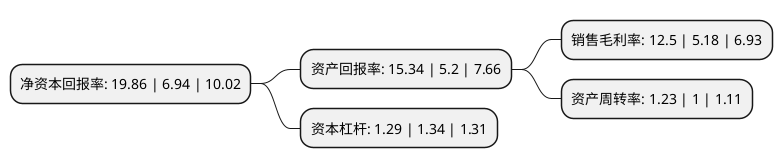

> 本页面由自动化程序生成于 2022年5月20日 01:11
> 内容可能存在错误，如有bug请提交issue至：https://github.com/Eroleice/doc-pi/issues
{.is-warning}

# 上市公司基本情况

## 基本资料

永兴特种材料科技股份有限公司（以下简称“永兴材料”）成立于2000年07月19日，湖州市。于2015年05月15日在深交所中小板上市。

永兴材料注册资本40,595.015万元，公司主要从事不锈钢棒材，线材产品的研发，生产和销售。公司产品主要是奥氏体不锈钢，奥氏体-铁素体双相不锈钢管坯和线材，不仅可以按照国家标准(GB)组织生产，还可按照发达国家的标准组织生产，比如德国标准(DIN)，美国标准(ASTM，ASME)，欧盟标准(EN)，日本标准(JIS)等，公司可根据客户的特殊要求进行定制化生产。以下是详细信息：

- 公司名称: 永兴特种材料科技股份有限公司
- 股票代码: 002756.SZ
- 所在地: 浙江 - 湖州市
- 成立日期: 2000年07月19日
- 注册资本: 40,595.015万元
- 法定代表人: 高兴江
- 主营业务: 公司主要从事不锈钢棒材，线材产品的研发，生产和销售公司产品主要是奥氏体不锈钢，奥氏体-铁素体双相不锈钢管坯和线材，不仅可以按照国家标准(GB)组织生产，还可按照发达国家的标准组织生产，比如德国标准(DIN)，美国标准(ASTM，ASME)，欧盟标准(EN)，日本标准(JIS)等，公司可根据客户的特殊要求进行定制化生产
- 公司官网: www.yongxingbxg.com
- 公司介绍: 公司是一家专业从事高品质不锈钢和镍基铁镍基合金棒线材研发和生产的公司，产品主要应用于石油化工、高压锅炉、核电能源、装备制造、航空航天等工业领域，是中国不锈钢棒线材龙头企业，不锈钢棒线材国内市场占有率连续多年名列前茅。公司主要从事高品质不锈钢棒线材及特殊合金材料的研发、生产和销售。公司的生产体系主要包括炼钢系统、特种冶金、热轧热锻、热处理和精整系统组成，并配套有与生产设施相匹配的原料准备、动力、环保及资源综合利用辅助系统。产品主要应用于石油化工、电站高压锅炉、核电能源、装备制造、航空航天、海洋工程、军工等工业领域。公司坚持绿色智能制造，致力于资源节约和环境保护，以不锈废钢为主要原料，采用电弧炉初炼、炉外精炼、连铸或模铸、连轧或锻造“四位一体”的短流程生产工艺组织生产。先后通过了国家特种设备制造许可证(压力管道)、ISO9001、ISO14001、OHSAS18001、IATF16949、GB/T23331、美国石油协会API-Q1、德国莱茵TüV、中国船级社CCS、挪威船级社DNV、英国劳氏船级社LR和美国船级社ABS等认证。公司荣获全国五一劳动奖章、全国钢铁工业先进集体，位列浙江省工业行业龙头骨干企业、浙江省制造业百强企业、湖州市金象企业。

## 股东及高管情况

上市公司第一大股东为高兴江，持股148,115,543股，占比36.49%，为上市公司实际控制人。

截至2022年03月31日，上市公司的前十大股东中，共有5名自然人股东，1名机构股东，3个产品账户，1个海外主体，其中5%以上大股东共有2名。上市公司前十大股东明细如下：

> 截至2022年03月31日，上市公司前十大股东信息如下：

| 股东名称 | 持股数量（股） | 持股比例 |
| --- | --- | --- |
| 高兴江 | 148,115,543 | 36.49% |
| 浙江久立特材科技股份有限公司 | 36,000,000 | 8.87% |
| 中国建设银行股份有限公司-华夏能源革新股票型证券投资基金 | 10,363,535 | 2.55% |
| 香港中央结算有限公司(陆股通) | 7,844,103 | 1.93% |
| 周桂荣 | 5,999,900 | 1.48% |
| 杨辉 | 5,413,000 | 1.33% |
| 中国银行股份有限公司-国投瑞银新能源混合型证券投资基金 | 5,231,074 | 1.29% |
| 顾建强 | 5,000,000 | 1.23% |
| 邱建荣 | 4,541,000 | 1.12% |
| 中国银行股份有限公司-国投瑞银产业趋势混合型证券投资基金 | 3,167,555 | 0.78% |

## 利润表分析

上市公司2021年总收入为71.99亿元，净利润为9亿元，实现盈利。

## 杜邦分析

> 数据列示周期：2021年 | 2020年 | 2019年
{.is-info}

上市公司的净资产收益率在近一年有所上升，上升幅度为186.17%，其变化情况分解如下：
- 上市公司的销售毛利率在近一年上升了141.31%，可能是生产效率的提升、商品原材料价格下跌或商品价格的上涨所致。
- 上市公司的资产周转率在近一年上升了23%，可能是源自于更快的销售回款或库存管理效果提升。
- 上市公司的财务杠杆比率在近一年下降了-3.73%，可能是减少负债降低财务费用。

