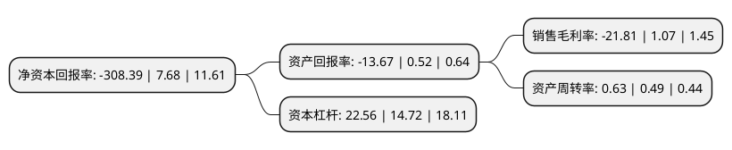

> 本页面由自动化程序生成于 2022年5月20日 01:24
> 内容可能存在错误，如有bug请提交issue至：https://github.com/Eroleice/doc-pi/issues
{.is-warning}

# 上市公司基本情况

## 基本资料

西宁特殊钢股份有限公司（以下简称“西宁特钢”）成立于1997年10月08日，西宁市。于1997年10月15日在上交所主板上市。

西宁特钢注册资本104,511.825万元，主要产品:碳结钢，碳工钢，合结钢，合工钢，轴承钢，模具钢，不锈钢，弹簧钢八大类。主营业务:从事特殊钢的冶炼和金属压延加工业务。以下是详细信息：

- 公司名称: 西宁特殊钢股份有限公司
- 股票代码: 600117.SH
- 所在地: 青海 - 西宁市
- 成立日期: 1997年10月08日
- 注册资本: 104,511.825万元
- 法定代表人: 张伯影
- 主营业务: 主要产品:碳结钢，碳工钢，合结钢，合工钢，轴承钢，模具钢，不锈钢，弹簧钢八大类主营业务:从事特殊钢的冶炼和金属压延加工业务
- 公司官网: www.xntg.com
- 公司介绍: 公司是中国西部地区最大的资源型特殊钢生产基地，是国家级创新型企业、国家军工产品配套企业。公司是集“钢铁制造、煤炭焦化、铁多金属、地产开发”四大产业板块为主体的资源综合开发型钢铁联合企业集团，是中国四大特钢企业集团之一。公司产品广泛应用于汽车、铁路、船舶、石油化工、矿山机械、兵器装备及航空航天等行业。曾荣获中国首次载人交会对接任务天宫一号、神州九号和长征二号F研制配套物资供应商、中国航天突出贡献供应商、0910工程突出贡献奖、冶金产品实物质量金杯奖等多个省部级以上荣誉称号。

## 股东及高管情况

上市公司第一大股东为西宁特殊钢集团有限责任公司，持股369,669,184股，占比35.37%，为上市公司实际控制人。

截至2022年05月09日，上市公司的前十大股东中，共有2名自然人股东，8名机构股东，其中5%以上大股东共有8名。上市公司前十大股东明细如下：

> 截至2022年05月09日，上市公司前十大股东信息如下：

| 股东名称 | 持股数量（股） | 持股比例 |
| --- | --- | --- |
| 西宁特殊钢集团有限责任公司 | 369,669,184 | 35.37% |
| 西宁特殊钢集团有限责任公司 | 369,669,184 | 35.37% |
| 青海省物产集团有限公司 | 100,000,000 | 9.57% |
| 青海机电国有控股有限公司 | 100,000,000 | 9.57% |
| 青海机电国有控股有限公司 | 100,000,000 | 9.57% |
| 青海省物产集团有限公司 | 100,000,000 | 9.57% |
| 北京恒溢永晟企业管理中心(有限合伙) | 67,506,400 | 6.46% |
| 北京恒溢永晟企业管理中心(有限合伙) | 67,148,800 | 6.425% |
| 王亚丽 | 4,270,000 | 0.41% |
| 张爱江 | 2,821,600 | 0.27% |

## 利润表分析

上市公司2021年总收入为122.29亿元，净利润为-26.67亿元，**未实现盈利**。

## 杜邦分析

> 数据列示周期：2021年 | 2020年 | 2019年
{.is-info}

上市公司的净资产收益率在近一年有所下降，下降幅度为-4115.49%，其变化情况分解如下：
- 上市公司的销售毛利率在近一年下降了-2138.32%，可能是生产效率的下降、商品原材料价格上涨或商品价格的下跌所致。
- 上市公司的资产周转率在近一年上升了28.57%，可能是源自于更快的销售回款或库存管理效果提升。
- 上市公司的财务杠杆比率在近一年上升了53.26%，可能是增加负债扩大生产规模。

